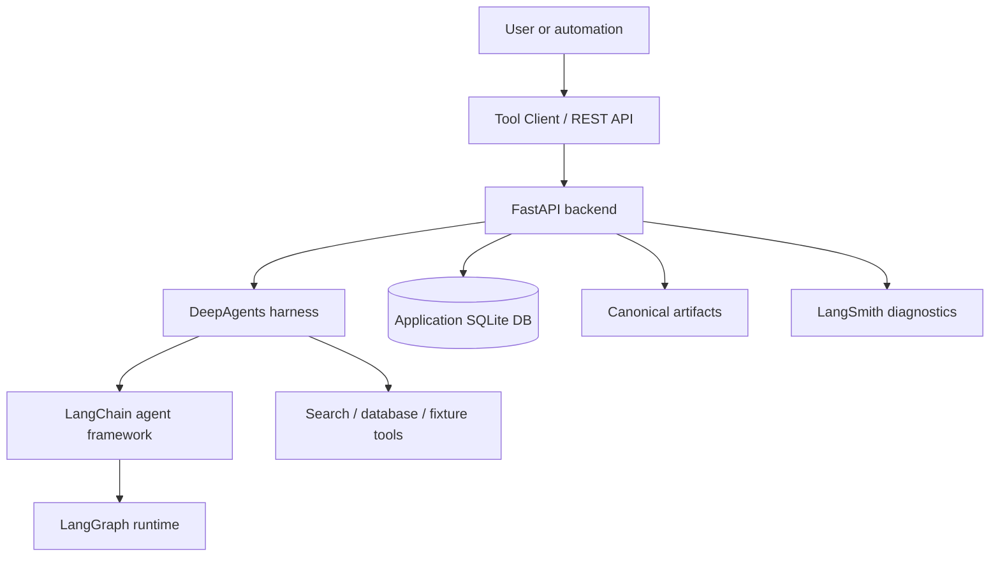

[English](./README.md) | [中文](./README_CN.md)

# Decision Research Agent

Decision Research Agent is a long-running research service that turns
source-backed findings into bounded, reviewable decision artifacts. It uses
LangChain as the agent framework, DeepAgents as the research harness, LangGraph
as the durable workflow runtime, and LangSmith as privacy-first diagnostics.

Terminology contract:

- LangChain = Agent Framework
- DeepAgents = research harness
- LangGraph = durable workflow runtime
- LangSmith = privacy-first tracing/evaluation
- Application DB = business authority

The active repository, runtime configuration, Tool Client, Docker defaults, and
health service identifier use `decision-research-agent`.

## What It Does

- Runs research through canonical `run_id` scoped execution.
- Persists ResearchRun, EvidenceLedger, review, verification, publication, and
  canonical result state in the application database.
- Produces bounded result artifacts through `GET /api/runs/{run_id}/result`.
- Supports Talent Hiring Signal as the first benchmarked research profile.
- Provides controlled durable review and evidence verification workflows behind
  explicit feature flags.

The repository currently ships backend, API, CLI, tests, docs, and operational
scripts. It does not ship a frontend; a future UI can consume the existing API
and WebSocket contracts.

## Architecture



Service-owned state remains the authority for business decisions. LangSmith is
used for diagnostics, not as the ResearchRun or EvidenceLedger ledger.

## Quick Start

Clone the repository, create a local environment file, install the pinned
runtime, start the backend, check health, then create a run and retrieve its
canonical result.

```bash
git clone https://github.com/iTao-AI/decision-research-agent.git
cd decision-research-agent
cp .env.example .env
python3.11 -m venv .venv
source .venv/bin/activate
pip install --no-deps -r constraints.txt
python api/server.py
```

Health:

```bash
curl --fail --silent http://127.0.0.1:8000/health
```

Expected response:

```json
{"status":"ok","service":"decision-research-agent"}
```

## Tool Client

```bash
python tools/decision_research_agent_tool.py healthcheck
python tools/decision_research_agent_tool.py doctor

python tools/decision_research_agent_tool.py run \
  --query "Research question" \
  --thread-id "demo-thread" \
  --wait

python tools/decision_research_agent_tool.py result \
  --run-id "$RUN_ID"
```

Configuration:

```dotenv
DECISION_RESEARCH_AGENT_URL=http://127.0.0.1:8000
DECISION_RESEARCH_AGENT_API_KEY=
DECISION_RESEARCH_AGENT_TIMEOUT_SECONDS=10
DECISION_RESEARCH_AGENT_DB_PATH=data/decision_research_agent.db
DECISION_RESEARCH_AGENT_CHECKPOINT_DB_PATH=data/review_checkpoints.db
```

## Core API

- `GET /health`
- `POST /api/runs`
- `GET /api/runs/{run_id}`
- `GET /api/runs/{run_id}/result`
- `GET /api/telemetry/runs/{run_id}`
- `GET /api/token-usage/runs/{run_id}`
- `WebSocket /ws/runs/{run_id}`

Controlled review and evidence verification endpoints are documented in
[API Contract](docs/reference/api-contract.md).

## Controlled Features

### Controlled Durable Review

Durable review is disabled by default:

```dotenv
DECISION_RESEARCH_AGENT_ENABLE_DURABLE_HITL=false
```

### Controlled Evidence Verification

Evidence verification is disabled by default:

```dotenv
DECISION_RESEARCH_AGENT_ENABLE_EVIDENCE_VERIFICATION=false
```

Both features are supported only within the documented single-node SQLite
boundary unless a later rollout expands the deployment model.

## Verification

Current release work keeps verification evidence in PRs and operator reports.
Useful local checks:

```bash
python -m pytest -q
python scripts/check_canonical_identity.py --root .
python tools/decision_research_agent_tool.py doctor
```

## Documentation

- [Documentation Index](docs/README.md)
- [Agent Integration](docs/AGENT_INTEGRATION.md)
- [API Contract](docs/reference/api-contract.md)
- [Data Models](docs/reference/data-models.md)
- [v0.1.0 Release Notes](docs/releases/v0.1.0.md)
- [Controlled Review Workflow](docs/operations/controlled-review-workflow.md)
- [Evidence Verification Workflow](docs/operations/evidence-verification-workflow.md)

## Known Boundaries

- v0.1.0 is a backend-and-CLI release.
- No bundled frontend is shipped in this release.
- React deferred: a future React UI can consume the canonical API and result
  contract without reintroducing a parallel runtime.
- Markdown-only delivery: canonical research results are returned as Markdown
  artifacts through the result endpoint.
- Durable review and evidence verification are feature-flagged controlled
  workflows, not public multi-user production features.
- Evidence verification records human decisions and deterministic snapshots; it
  does not perform automatic source retrieval or LLM verification.
- Historical evidence, archived plans, and archived OpenSpec records may retain
  their original wording as immutable project history.

## License

MIT. See [LICENSE](./LICENSE).
