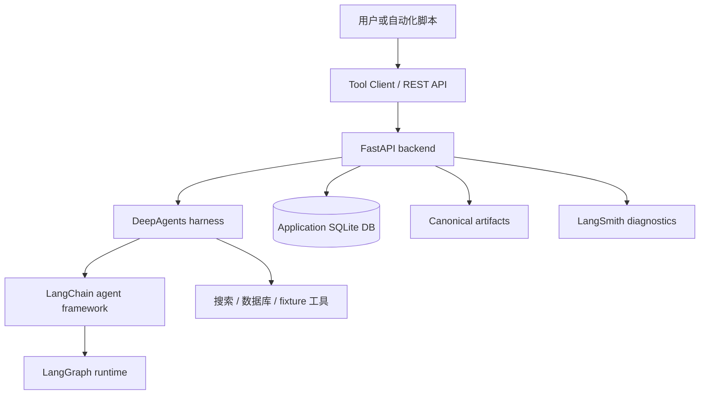

[English](./README.md) | [中文](./README_CN.md)

# Decision Research Agent

Decision Research Agent 是一个长任务研究服务：围绕来源证据生成有界、可审查、可交付的决策研究结果。项目使用 LangChain 作为 Agent Framework，DeepAgents 作为研究 harness，LangGraph 作为 durable workflow runtime，LangSmith 作为隐私优先诊断工具。

术语契约：

- LangChain = Agent Framework
- DeepAgents = research harness
- LangGraph = durable workflow runtime
- LangSmith = privacy-first tracing/evaluation
- Application DB = business authority

当前仓库、运行时配置、Tool Client、Docker 默认值和 health service ID 均使用 `decision-research-agent`。

## 当前能力

- 使用 canonical `run_id` 执行研究任务。
- 在应用数据库中持久化 ResearchRun、EvidenceLedger、review、verification、publication 和 canonical result 状态。
- 通过 `GET /api/runs/{run_id}/result` 暴露有界交付 artifact。
- 以 Talent Hiring Signal 作为首个已验证 benchmark profile。
- 通过显式 feature flag 提供受控 durable review 和 evidence verification workflow。

本仓库当前发布 backend、API、CLI、测试、文档和运维脚本。不随仓库发布前端；后续 UI 可直接消费现有 API 与 WebSocket 契约。

## 架构



服务端持久化状态是业务事实源。LangSmith 用于诊断，不替代 ResearchRun 或 EvidenceLedger。

## 快速开始

先 clone 仓库、创建本地 `.env`、按 constraints 安装依赖、启动后端，再做
healthcheck、doctor、创建 run 并读取 canonical result。

```bash
git clone https://github.com/iTao-AI/decision-research-agent.git
cd decision-research-agent
cp .env.example .env
python3.11 -m venv .venv
source .venv/bin/activate
pip install --no-deps -r constraints.txt
python api/server.py
```

健康检查：

```bash
curl --fail --silent http://127.0.0.1:8000/health
```

预期响应：

```json
{"status":"ok","service":"decision-research-agent"}
```

## Tool Client

```bash
python tools/decision_research_agent_tool.py healthcheck
python tools/decision_research_agent_tool.py doctor

python tools/decision_research_agent_tool.py run \
  --query "Research question" \
  --thread-id "demo-thread" \
  --wait

python tools/decision_research_agent_tool.py result \
  --run-id "$RUN_ID"
```

配置项：

```dotenv
DECISION_RESEARCH_AGENT_URL=http://127.0.0.1:8000
DECISION_RESEARCH_AGENT_API_KEY=
DECISION_RESEARCH_AGENT_TIMEOUT_SECONDS=10
DECISION_RESEARCH_AGENT_DB_PATH=data/decision_research_agent.db
DECISION_RESEARCH_AGENT_CHECKPOINT_DB_PATH=data/review_checkpoints.db
```

## 核心 API

- `GET /health`
- `POST /api/runs`
- `GET /api/runs/{run_id}`
- `GET /api/runs/{run_id}/result`
- `GET /api/telemetry/runs/{run_id}`
- `GET /api/token-usage/runs/{run_id}`
- `WebSocket /ws/runs/{run_id}`

受控 review 与 evidence verification endpoints 见 [API Contract](docs/reference/api-contract.md)。

## 受控功能

Durable review 默认关闭：

```dotenv
DECISION_RESEARCH_AGENT_ENABLE_DURABLE_HITL=false
```

Evidence verification 默认关闭：

```dotenv
DECISION_RESEARCH_AGENT_ENABLE_EVIDENCE_VERIFICATION=false
```

除非后续 rollout 扩展部署模型，否则这两个功能仅支持文档中定义的单节点 SQLite 边界。

## 验证

常用本地检查：

```bash
python -m pytest -q
python scripts/check_canonical_identity.py --root .
python tools/decision_research_agent_tool.py doctor
```

## 文档

- [Documentation Index](docs/README.md)
- [Agent Integration](docs/AGENT_INTEGRATION.md)
- [API Contract](docs/reference/api-contract.md)
- [Data Models](docs/reference/data-models.md)
- [v0.1.0 Release Notes](docs/releases/v0.1.0.md)
- [Controlled Review Workflow](docs/operations/controlled-review-workflow.md)
- [Evidence Verification Workflow](docs/operations/evidence-verification-workflow.md)

## 已知边界

- v0.1.0 是 backend-and-CLI release。
- 本版本不随仓库发布前端。
- React deferred：未来 React UI 应消费 canonical API 与 result contract，不重新引入并行 runtime。
- Markdown-only delivery：canonical 研究结果通过 result endpoint 返回 Markdown artifact。
- Durable review 与 evidence verification 是受控 feature-flag workflow，不是公开多用户生产功能。
- Evidence verification 记录人工决策和确定性 snapshot；不自动检索来源，也不使用 LLM 做证据核验。
- 历史 evidence、归档 plan 和归档 OpenSpec 可以保留原始表述，作为不可变项目历史。

## License

MIT. See [LICENSE](./LICENSE).
