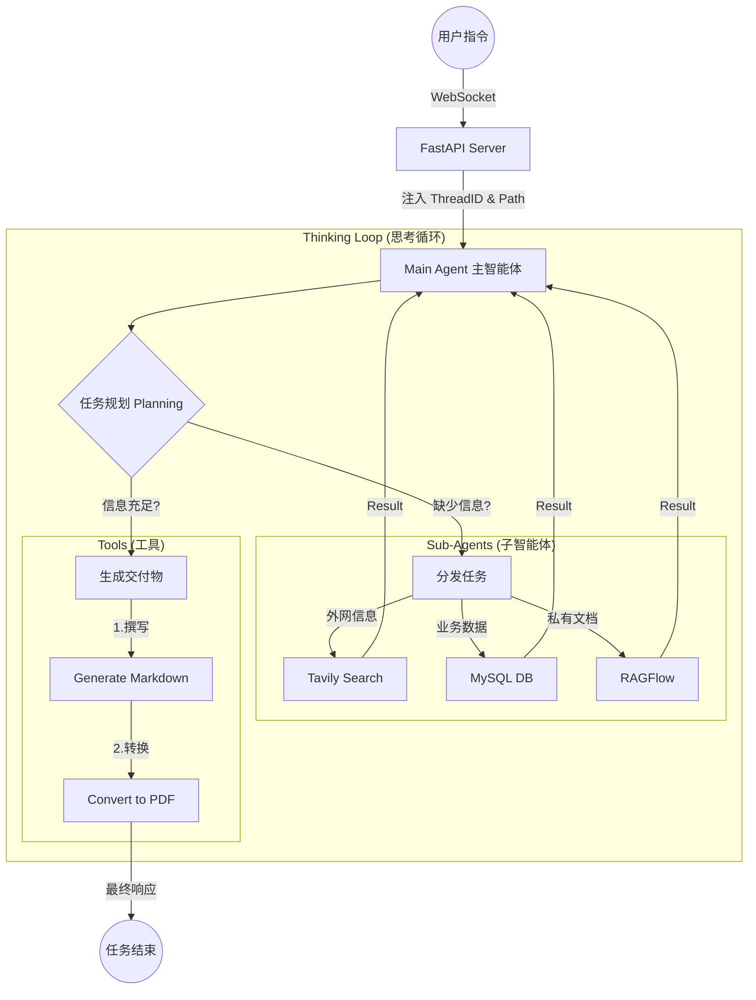
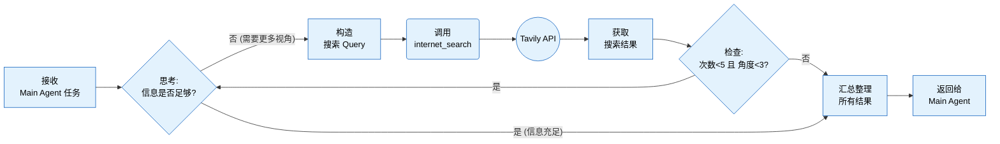
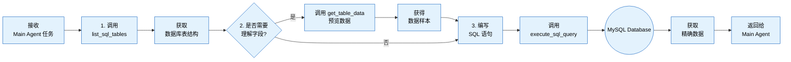
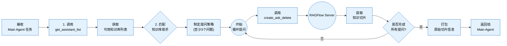

# 基于DeepAgents深度搜索项目

**开篇引入**

在过去短短数年间，人工智能的形态正经历一场层层递进的深刻演化。它从最初仅能 “响应问题” 的大型语言模型（LLM），逐步迭代为具备 “调用工具、落地执行” 能力的 AI Agent，如今更朝着拥有协作意识、可驾驭复杂工作流的 Agentic AI 加速迈进。这条演进路径绝非简单的功能叠加，而是一条从 “语言理解能力” 到 “自主行动能力”，再到 “智能组织与协作能力” 的质变之路 —— 几乎构筑起未来智能应用的核心主轴。


为突破现有技术瓶颈，两个关键概念在研究与实践领域迅速崛起并成为核心驱动力 —— **深度代理（Deep Agents）**与**高阶提示（Higher-Order Prompts, HOPs）**。

在深度代理的架构中，模型不再是 “一次性输出答案” ，而是化身具备 “规划 - 执行 - 反馈 - 迭代” 闭环能力的智能主体：

- 面对复杂任务时，先将其拆解为可落地的子目标；
- 为每个子目标匹配专属的子代理（sub-agent），实现专业化分工；
- 执行过程中实时监控各步骤产出，精准识别偏离目标的异常；
- 基于执行结果动态调整计划、替换策略，或生成新的子任务以补全链路；
- 当出现错误时，通过反思（reflection）机制回溯问题根源，修正执行路径。

而高阶提示（HOPs）则聚焦于 “教会模型如何思考”：如果说深度代理是智能系统的 “组织架构师”，负责搭建任务执行的骨架，那么高阶提示就是 “认知规范师”，定义思考与推理的底层逻辑。

* **传统提示**：告诉我**做什么**。

  > 分析下面这条用户评论，判断情绪是正面、负面还是中性，并给出改进建议。
  >
  > 评论：“这个软件经常卡顿，打开要等很久，界面也不好看，用起来很烦躁。”

* **高阶提示**：告诉我**怎么想、按什么步骤、用什么逻辑**。

  > 请按以下**固定思考流程**分析用户评论：
  >
  > 1. 先逐句提取事实：用户提到了哪些具体问题？
  > 2. 再判断情绪：根据关键词判断是正面 / 负面 / 中性，并给出理由。
  > 3. 按问题严重程度排序：从最影响体验到最轻。
  > 4. 每条问题对应给出**可落地**的改进建议，不要空泛。
  > 5. 最后用一句话总结核心痛点。
  >
  > 评论：“这个软件经常卡顿，打开要等很久，界面也不好看，用起来很烦躁。”

传统提示偏向 “直接下达结果指令”，而高阶提示则更进一步，它向模型传递的是 “思考框架与推理范式”—— 明确告知模型该如何分析问题、如何拆解逻辑、如何组织思考过程，从根源上提升决策的精准度与执行的可靠性。

## 一、DeepAgents 框架核心

### 1.1 DeepAgents介绍和作用

> 构建能够规划、使用子代理并利用文件系统处理复杂任务的代理(深度智能体)
>
> https://docs.langchain.com/oss/python/deepagents/overview

**DeepAgents**是一个独立库，建立在 LangChain代理核心构建模块之上（关系类似于：SpringBoot和Spring Framework）！主要实现**自主多智能体系统（Agentic AI）**！**DeepAgents**是构建由大型语言模型（LLM）驱动的代理和应用的最简单方式——内置任务规划功能、用于上下文管理的文件系统、子代理生成和长期记忆。可以用它完成复杂、多步骤、且自主规划的任务。

**家族框架对比：**

> https://docs.langchain.com/oss/python/concepts/products
>
> 三者并非单向引用，有时会出现循环调用场景！！

- **LangChain (Framework)**：做 “动作”，是核心的代理框架。它封装了 LLM 与工具的交互，提供灵活的代理结构，但不包含规划、记忆或文件系统，适合开发者自己定制逻辑。
- **LangGraph (Runtime)**：管 “流程”，是外层的运行时。它把执行变成可管理的图结构，支持循环、并行和持久化，保障智能体执行的稳定与可控。
- **DeepAgents (Harness)**：负责 “组织”，是最外层的工具包。它内置规划器、子代理、文件系统和持久存储，让智能体从 “能执行” 升级为 “能组织、能管理、能记忆” 的深度智能体。


**功能横向对比：**


**LangChain、LangGraph、Deep Agents 使用场景总结：**

1. 何时使用 LangChain？

   - 你想**快速构建代理与自主应用**。

   - 你需要对**模型、工具、代理循环**提供标准抽象。（单Agent）

   - 你需要**易用且灵活**的开发框架。

   - 你在开发**简单直接的代理应用**，无复杂编排需求。

2. 何时使用 LangGraph？

   - 你需要对**代理编排做细粒度、底层控制**。

   - 你需要**持久化执行**，支持**长时间运行、有状态的代理**。

   - 你在构建**结合确定性步骤与智能代理步骤**的复杂工作流。

   - 你需要**可直接用于生产环境**的代理部署基础设施。

3. 何时使用 Deep Agents SDK？

   - 你在构建**长期运行、持续运营、自主规划**的智能代理。

   - 你在构建需要处理**复杂、多步骤任务**的代理。

   - 你需要使用**预定义工具**：如文件系统操作、自定义工具、自动化上下文工程等。

   - 你希望直接使用**预设提示词与子代理**能力。

### 1.2 DeepAgents核心能力

**核心能力一： 智能规划与任务分解** (最核心智能协调体现！避免传统的工作流)

> DeepAgents 内置 `write_todos` 工具，使代理能够：
>
> - 将复杂任务分解为离散的执行步骤
> - 实时跟踪任务执行进度
> - 根据新信息动态调整执行计划

例如：你要 “办一场生日派对”，DeepAgent 不会上来就瞎忙活，而是先帮你列个清晰的待办清单：

1. 确定派对时间 / 地点 → 2. 邀请朋友 → 3. 买食材 / 蛋糕 → 4. 布置场地 → 5. 准备游戏

执行过程中，它还会实时标记 “已完成 / 未完成”，比如发现蛋糕店没开门，会自动把 “买蛋糕” 改成 “换一家店”，甚至新增 “订外卖蛋糕” 的步骤 —— 完全像个有经验的策划师，把复杂事拆成一步步能落地的小事，还能灵活调整。

提示: `write_todos` 不是 Python 原生的函数，而是 **DeepAgents 框架内置的一个 “工具函数”** —— 你可以把它理解成：

> DeepAgent 自带的一个 “待办清单生成器”，专门让智能体把复杂任务拆成一条条可执行的待办事项，并且能把这些事项存起来、DeepAgent 还配了其他工具进行调整todos：
>
> - `read_todos`：智能体执行任务时，用来 “读取” 当前的待办清单，知道下一步该做啥；
> - `update_todos`：执行中发现需要调整步骤（比如 “检索资料” 需要加 “筛选权威来源”）来修改清单；
> - `delete_todos`：删掉不需要的步骤（比如报告写完后，删掉 “检查完整性” 的重复项）。

**核心能力二：高效上下文管理（最实用的 “内存扩容” 方案！避免上下文溢出）**

> DeepAgents 内置文件系统工具集（`ls`、`read_file`、`write_file`、`edit_file`），使代理能够：
>
> - 将大型上下文信息卸载到外部存储
> - 有效防止上下文窗口溢出问题
> - 处理可变长度的工具执行结果

就像你要 “整理 100 页的年度工作总结”，你的大脑（对应代理的上下文窗口）只能同时记住 10 页内容，多了就会忘前忘后。DeepAgent 会帮你准备一个 “专属文件柜”：

1. 先把 100 页总结拆成 10 个文件存在柜里 → 2. 看第 1-10 页时，只把这 10 页拿在手里 → 3. 看完后放回，再取 11-20 页 → 4. 整理出的要点先写在草稿纸（临时文件）里，最后汇总成最终版本

执行过程中，它还会灵活管理文件：比如查到一份 5 万字的 AI 行业数据，不会硬塞进 “大脑”，而是用 `write_file` 存到文件柜，需要某段数据时，用 `read_file` 精准调取；想看看存了哪些文件，用 `ls` 列一下；发现数据有误，用 `edit_file` 直接修改 —— 完全像个会整理文件的助理，让 “大脑” 只装当前要用的信息，既不超载，也不丢东西。

提示: 这套文件系统工具集不是简单的 “本地文件操作”，而是 **DeepAgents 封装的跨存储工具** —— 你可以把它理解成：DeepAgent 自带的 “智能文件管家”，专门帮代理管理超出 “大脑容量” 的信息，支持本地文件、云存储（OSS/S3）等多种存储方式，还能和其他工具联动。

**核心能力三：子代理生成机制（最灵活的 “分工协作” 模式！避免主代理超负荷）**

> DeepAgents 内置 `task` 工具，使代理能够：
>
> - 选择对应的子代理处理特定任务
> - 实现上下文隔离，保持主代理环境整洁
> - 深入执行复杂的子任务流程

就像你要 “装修一套房子”，你（主代理）不会既当设计师、又当瓦工、还当水电工，而是找专业的人干专业的事：

1. 派 “设计子代理” 出装修图纸 → 2. 派 “施工子代理” 按图纸砌墙 / 铺砖 → 3. 派 “水电子代理” 装水管 / 电路 → 4. 你只负责统筹进度、汇总结果

执行过程中，子代理还能独立工作：比如设计子代理只关注 “风格、尺寸、配色”，不会被施工细节干扰；施工子代理出了问题（比如墙面不平），只会自己调整，不会影响你和水电子代理的工作 —— 完全像个会 “招兵买马” 的项目经理，把复杂任务拆给专业的 “帮手”，自己只做全局把控。

**核心能力四：长期记忆能力（最持久的 “记忆存储” 系统！避免代理 “失忆”）**

> DeepAgents 利用 LangGraph 的 Store 功能，使代理能够：
>
> - 为代理扩展跨线程(协程)持久内存
> - 保存和检索历史对话信息
> - 支持多会话间的知识共享

就像你要 “持续跟进一个客户的需求”，你不会每次和客户聊天都从头问 “你想要什么功能”，而是有一个 “客户档案本”：

1. 第一次聊天记录客户 “想要红色的产品、预算 5000 元” → 存进档案本 → 2. 一周后聊天，先翻档案本记住之前的需求 → 3. 新聊的 “要加定制 logo” 也补充进去 → 4. 同事跟进时，也能看这个档案本，不用你再转述

执行过程中，这份记忆还能跨场景用：比如你在电脑上和客户聊的需求，换手机登录后，代理还能查到档案本；多个同事（多代理）跟进同一个客户，都能共享这份档案 —— 完全像个带 “永久档案柜” 的客服，不管过多久、换什么设备，都能记住之前的信息。


### 1.3 DeepAgents快速入门 

快速构建第一个 Deep Agent：**一个能够自主联网搜索并撰写报告的“AI 研究员”**会借用Tavily网络搜索工具！

**步骤1：安装依赖**

```cmd
pip install deepagents tavily-python python-dotenv langchain-openai
```

**步骤2：配置 API Key**

确保你拥有 LLM  和 Tavily (搜索) 的 API Key。位置：`.env`

```bash
# OPENAI风格配置
OPENAI_BASE_URL=https://dashscope.aliyuncs.com/compatible-mode/v1
OPENAI_API_KEY=sk-6296bb4dab98463689911fd07a973c97
LLM_QWEN3=qwen3-32b
LLM_QWEN_MAX=qwen-max

#https://app.tavily.com/
#tavily-api-key
TAVILY_API_KEY=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
```

**步骤3：定义搜索工具**

DeepAgents 需要通过工具与外部世界交互。我们先定义一个简单的联网搜索工具。

位置：`tavily_tools.py`

```python
from typing import Literal
from langchain.tools import tool
from tavily import TavilyClient
from dotenv import load_dotenv,find_dotenv
import os

# 加载 .env文件
load_dotenv(find_dotenv())

# 创建tavily_client
tavily_client = TavilyClient(api_key=os.getenv("TAVILY_API_KEY"))

# 定义搜索工具
@tool
def internet_search(
        query:str,
        max_results:int =10,
        topic:Literal["general","news","finance"] = "general",
        include_raw_content:bool = False):
    """
    互联网搜索工具！
    :param query: 搜索关键字
    :param max_results: 返回结果数量
    :param topic: 主题类型
    :param include_raw_content: False精简 True 返回详细结果
    :return: 搜索结果列表
    """
    print(f"进行网络搜索！搜索条件：{query},搜索主题类别:{topic},搜索最大的条数：{max_results}")
    return tavily_client.search(
        query=query,
        max_results=max_results,
        topic=topic,
        include_raw_content=include_raw_content
    )
```

**步骤4：创建 Deep Agent**

通过 `create_deep_agent` 工厂函数，将工具和 System Prompt 组装成一个智能体。

```python
from langchain.chat_models import init_chat_model
from deepagents import create_deep_agent
import os
from dotenv import load_dotenv, find_dotenv

from base.tavily_tool import internet_search

# 使用 find_dotenv() 自动查找 .env 文件，无论你在哪个目录下运行脚本都能正确加载环境变量
load_dotenv(find_dotenv())

# 极简初始化（自动读取OPENAI环境变量）
llm = init_chat_model(
    model=os.getenv("LLM_QWEN_MAX"),
    model_provider="openai"
)

# api地址 https://reference.langchain.com/python/deepagents/graph/
# 功能等价于langchain的 create_agent
deep_agent = create_deep_agent(
    model=llm,
    tools=[internet_search],
    subagents=[],
    system_prompt="""
      你是一位专家级研究员。你的任务是进行深入研究并撰写一份精美的报告。
      你有权使用 internet_search 工具来收集信息。
    """
)
```

**步骤5：运行并获取结果**

```python
# 运行代理
prompt = input("输入你关心的问题！")
result = deep_agent.invoke({
    "messages":[
        {"role":"user","content":f"{prompt}"}
    ]
})
#result = main_agent.invoke({"input":"人工智能和机器人的热点新闻！！"})

"""
结果数据说明
 {
    "messages": [
        # 第0条：你的提问（HumanMessage）
        HumanMessage(content='搜索宇树机器人的新闻！'),
        # 第1条：Agent 调用工具的指令（AIMessage，内容为空，仅触发工具）
        AIMessage(content='', tool_calls=[{'name':'internet_search', ...}]),
        # 第2条：工具返回的搜索结果（ToolMessage，一堆JSON数据）
        ToolMessage(content='{"query":"宇树机器人 新闻","results":[...]}'),
        # 第3条：Agent 整理后的最终回复（AIMessage，这是你要的内容）
        AIMessage(content='以下是关于宇树机器人的一些最新新闻：...')
    ]
}
"""
print(result['messages'][-1].content)
```

总结

1. `result['messages']`：定位到存储全流程对话的列表；
2. `[-1]`：精准抓取列表最后一条（Agent 整理后的最终回复）；
3. `.content`：过滤掉所有冗余属性，只取纯文本回复内容。

### 1.4 DeepAgents流式处理结果解析（重点）

深度代理基于 LangGraph 的流基础设施构建，提供一流的子代理流支持。当深度代理将工作委派给子代理时，你可以独立从每个子代理处流式更新——实时跟踪进展、LLM 令牌和工具调用

```python
# 运行代理
# 输入：查询机器人最新的热点
prompt = input("输入你关心的问题！")
# 同步流
stream = deep_agent.stream({
    "messages":[
        {"role":"user","content":f"{prompt}"}
    ]
})
# =============================================================================
# Chunk 数据结构参考文档 (Python 对象视图)
# =============================================================================
# LangGraph 流式输出 (chunk) 的四种核心场景示例：
# 1. [场景 A：Agent 思考并决定调用工具]
#    {
#      "model": {
#        "messages": [
#          AIMessage(
#            content="",
#            tool_calls=[{
#              "name": "read_file_content",
#              "args": {"filename": "需求.docx"},
#              "id": "call_123"
#            }]
#          )
#        ]
#      }
#    }
# 2. [场景 B：工具执行完毕，返回结果]
#    {
#      "tools": {
#        "messages": [
#          ToolMessage(
#            content="[文件内容]...",
#            name="read_file_content",
#            tool_call_id="call_123"
#          )
#        ]
#      }
#    }
# 3. [场景 C：Agent 决定调用子 Agent (特殊工具 'task')]
#    {
#      "model": {
#        "messages": [
#          AIMessage(
#            content="",
#            tool_calls=[{
#              "name": "task",
#              "args": {
#                "subagent_type": "网络搜索助手",  # 目标子 Agent
#                "description": "查询2024政策"     # 下发的具体任务
#              },
#              "id": "call_456"
#            }]
#          )
#        ]
#      }
#    }
# 4. [场景 D：Agent 最终回复用户]
#    {
#      "model": {
#        "messages": [
#          AIMessage(
#            content="根据查询结果，2024年新政策如下...",
#            tool_calls=[]
#          )
#        ]
#      }
#    }
# =============================================================================
for chunk in stream:
    """
        # 场景1：单个节点更新（常见）
        chunk = {
            "model": {"messages": [AIMessage(content='', tool_calls=[...])]}  # 仅模型节点更新
        }
        
        # 场景2：多个节点同时更新（少数但存在）
        chunk = {
            "model": {"messages": [AIMessage(content='最终回复...')]},  # 模型节点
            "tools": {"messages": [ToolMessage(content='工具结果...')]},  # 工具节点
            "todos": {"todos_list": ["已完成：搜索宇树机器人新闻"]}       # 待办节点
        }
    """
    for node_name, state in chunk.items():
        print(f"本次处理的节点类型{node_name}")
        # 有些中间节点 例如：TodoListMiddleware 没有 messages跳过！
        if not state or "messages" not in state: continue
        # 有的直接获取
        messages = state["messages"]
        # message不为null!并且是集合类型
        if messages and isinstance(messages, list):
            # 获取最后一条就是最终结果
            last_msg = messages[-1]
            # 1. 模型节点 (model)：决定下一步行动
            if node_name == "model":
                # 如果有 tool_calls，说明模型决定调用工具或子智能体
                if last_msg.tool_calls:
                    for tool_call in last_msg.tool_calls:
                        if tool_call['name'] == 'task':
                            sub_agent = tool_call['args'].get('subagent_type')
                            print(f"[模型决策] 呼叫子智能体: {sub_agent}")
                        else:
                            print(f"[模型决策] 调用工具: {tool_call['name']},参数为：{tool_call['args']}")
                # 如果没有 tool_calls 且有 content，说明是最终回复
                elif last_msg.content:
                    print(f"📝 [最终回复] {last_msg.content}")
            # 2. 工具节点 (tools)：显示工具/子智能体的执行结果
            elif node_name == "tools":
                # ToolMessage 的 content 是工具返回的原始数据 (可能是 JSON 字符串)
                # 建议只打印前 100 个字符，避免刷屏
                # 展开成普通if-else，更易理解
                content_preview = ''
                if len(last_msg.content) > 100:
                    # 取前100个字符 + 省略号（截断预览）
                    content_preview = last_msg.content[:100] + "..."
                else:
                    # 内容较短，直接完整显示
                    content_preview = last_msg.content
                print(f"[执行结果] {content_preview}")
```

**解读返回结果：**

场景 1：智能体前置处理（before_agent 节点）

节点名：`PatchToolCallsMiddleware.before_agent`

核心含义：接收用户输入，格式化 / 校验消息

```json
{
  "PatchToolCallsMiddleware.before_agent": {
    "messages": Overwrite(  # LangChain 自定义Overwrite对象
      value=[  # 核心数据在value字段
        HumanMessage(  # 用户消息对象
          content="北京今天天气怎么样？",  # 用户提问内容
          additional_kwargs={},
          response_metadata={},
          id="466118de-5cdb-4250-a57f-bacf28b6407a"  # 消息唯一ID
        )
      ]
    )
  }
}
```

场景 2：模型思考（决定调用工具）（model 节点）

节点名：`model`

核心含义：大模型分析问题，决定调用工具 / 子代理（无直接回答）

```json
{
  "model": {
    "messages": [
      AIMessage(  # 模型消息对象
        content="",  # 内容为空（因为要调用工具）
        additional_kwargs={"refusal": None},
        response_metadata={  # 模型元数据
          "token_usage": {"completion_tokens": 30, "prompt_tokens": 5265, "total_tokens": 5295},
          "model_provider": "openai",
          "model_name": "qwen-max",
          "finish_reason": "tool_calls"  # 结束原因：调用工具
        },
        id="lc_run--019c6f4e-9c10-7ae0-966a-5788f78b2017-0",
        tool_calls=[  # 模型决定调用的工具列表
          {
            "name": "task",  # 工具/子任务名
            "args": {  # 工具参数
              "subagent_type": "weather_helper",
              "description": "查询北京今天的天气情况。"
            },
            "id": "call_232308d358d64454905543",
            "type": "tool_call"
          }
        ],
        invalid_tool_calls=[],
        usage_metadata={"input_tokens": 5265, "output_tokens": 30}
      }
    ]
  }
}
```

子智能体：`name="task"`，`args` 含 `subagent_type`/`description`；

自定义工具：`name=工具名`，`args` 含工具自有参数（如`query`）；

场景 3：模型后置钩子（after_model 节点）

节点名：`TodoListMiddleware.after_model`

核心含义：模型执行完成的空钩子（无实际业务数据）

```json
{
  "TodoListMiddleware.after_model": None
}
```

场景 4：工具 / 子代理执行（tools 节点）

节点名：`tools`

核心含义：执行工具调用，返回外部数据（如天气、搜索结果）

```json
{
  "tools": {
    "messages": [
      ToolMessage(  # 工具消息对象
        content='{"query": "DeepAgents", "results": [{"url": "...", "title": "deepagents - PyPI", "content": "..."}]}',  # 实际返回的是 JSON 字符串
        name="internet_search",  # 对应调用的工具名 (例如 internet_search)
        id="81d0bddd-30de-4874-baac-0bca8aa38936",
        tool_call_id="call_232308d358d64454905543"  # 关联模型调用的工具ID
      )
    ]
  }
}
```

场景 5：模型生成最终回答（model 节点）

节点名：`model`

核心含义：模型基于工具结果，生成自然语言最终回答

```json
{
  "model": {
    "messages": [
      AIMessage(
        content="今天北京的天气晴朗，气温25度，非常适合出游。",  # 最终回答内容
        additional_kwargs={"refusal": None},
        response_metadata={
          "token_usage": {"completion_tokens": 17, "prompt_tokens": 5318, "total_tokens": 5335},
          "finish_reason": "stop"  # 结束原因：正常完成
        },
        id="lc_run--019c6f4e-af53-7ca3-aee6-9f386be2ac78-0",
        tool_calls=[],  # 无工具调用（已完成回答）
        usage_metadata={"input_tokens": 5318, "output_tokens": 17}
      )
    ]
  }
}
```

### 1.5 子代理Subagents和多智能体

> 指南：https://www.anthropic.com/engineering/building-effective-agents

#### 1.5.1 多智能体理解

多 Agent 系统（Multi-Agent System, MAS）是由多个具备**自主性、反应性、目标导向性**的智能体（Agent）组成的协作体系，通过标准化通信与协同机制，共同完成单一智能体无法独立应对的复杂任务。

简单解释，就是将复杂任务，拆解成多个子任务，分发给专长的Agent进行处理，最后综合结果！本质**分而治之**！！

| 维度         | 单体模型（注意力稀释法则）                                   | 多智能体（分而治之的极效）                                   |
| :----------- | :----------------------------------------------------------- | :----------------------------------------------------------- |
| **核心问题** | 同一个模型需处理多领域知识（如医学 + 法律），不同领域信息互相污染，推理能力断崖式下跌 | 将任务物理拆解，由专业 Agent 分别处理独立并行子任务，多方处理独立任务，性能优势极大提升！ |
| **组织类比** | 一人全栈（精力分散、专业度不足）                             | 专业敏捷团队（分工明确、各司其职）                           |
| **核心逻辑** | 注意力资源被多领域任务稀释，导致认知过载                     | 分布式算力 + 专业化分工，突破单体模型的物理天花板            |

#### 1.5.2 多智能体弊端

多智能体系统在实现**分而治之的性能飞跃**的同时，必然伴随两大**灾难级代价**，成为落地的核心阻碍：

**Token 消耗的指数级失控**

单体模型仅需承担自身推理的 Token 成本，而多 Agent 系统的核心交互逻辑是**Agent 间的上下文互通**。当多个 Agent 为完成协同任务，频繁互传长文本上下文、进行多轮循环复读时，Token 消耗会呈指数级暴涨。

更致命的是，无约束的群聊式交互可能在极短时间内爆 API 额度，直接导致**成本失控**，甚至成为中小团队落地多 Agent 的核心经济门槛。应对这一代价的关键，在于建立**拦截基准线**—— 对简单任务直接拒绝多 Agent 协作，强制使用单 Agent 或者 标准图流程，从源头控制交互规模。

**调试成为噩梦：非确定性与全链路黑箱**

多 Agent 系统的 “涌现性” 同时带来了**不可控性**：Agent 间的交互是非线性的，系统崩溃并非单一节点故障，而是像城市交通连环撞车一样，由多步交互的连锁反应引发，且难以复现。

传统的单 Agent 日志调试方式完全失效，若未搭建**全链路追踪（Tracing）** 体系，出现问题时既无法定位根因，也无法复盘交互过程，直接导致系统上线后风险极高。因此，“不建全链路追踪录像，绝不上线” 成为多 Agent 落地的**硬性底线**，这也是保障系统稳定性与可维护性的核心前提。

| 代价类型         | 核心问题               | 具体表现                                                     | 风险阈值 / 特征                                   | 应对底线 / 策略                                              |
| :--------------- | :--------------------- | :----------------------------------------------------------- | :------------------------------------------------ | :----------------------------------------------------------- |
| **账单被击穿**   | Token 消耗失控         | Agent 间频繁互传长文本上下文，Token 消耗呈**指数级增长**，无节制的交互对话极易快速耗尽 API 额度 | 短时间内激增                                      | 建立拦截基准线，简单任务严禁触发多智能体流程，控制交互文本长度 |
| **调试成为噩梦** | 系统非确定性与不可追溯 | 群智网络伴随 “非确定性”，系统崩溃场景复杂且无规律，难以定位根因，如同城市红绿灯瘫痪引发连环事故 | 多 Agent 交互出现不可复现的异常、全链路无日志追踪 | 不建全链路追踪录像（Tracing）绝不上线，强制记录交互日志      |

#### 1.5.3 用多智能体的三条铁律

这三条铁律本质上是**多智能体系统的 “入场许可”**，只有满足其中至少一条，才值得我们承担多 Agent 带来的成本与复杂度代价：

1. **问题极度开放**：这类任务没有标准答案或固定流程，比如 “制定企业年度战略”“开放式科研探索”，单体模型容易陷入局部最优，而多智能体可以通过多角色探索不同方向，动态调整路径。
2. **存在领域冲突**：当任务需要跨两个及以上专业领域时（比如 “医疗 + 法律”“金融 + 工程”），单体模型的注意力会被分散，导致推理精度断崖式下跌。多智能体通过物理隔离不同领域 Agent，避免知识污染，保障各模块专业度。
3. **需要多方向并行**：任务天然可以拆分为多个互不依赖的子任务（比如 “多源数据采集”“多版本方案并行设计”），多智能体可以利用分布式算力并行执行，大幅缩短整体耗时，实现 “1+1>2” 的效率提升。

只有符合这些条件时，多智能体才是 “宝贝”；否则，强行使用只会让系统陷入 “毒药“ 般的成本与调试困境。

| 铁律名称       | 核心场景                   | 详细说明                                                     |
| :------------- | :------------------------- | :----------------------------------------------------------- |
| 问题极度开放   | 高复杂度、无固定路径任务   | 问题复杂度过高，无法事前硬编码死路径，需要在执行过程中灵活转向、探索旁支 |
| 存在领域冲突   | 多领域混杂任务             | 当混淆领域达到两个以上时，单体模型会因注意力稀释导致表现下滑，必须物理隔离不同领域专家的推理上下文 |
| 需要多方向并行 | 天然可拆解为独立路径的任务 | 任务天然要求沿多条独立路径同时并行推进，采用多体架构并行处理可带来极显著的性能耗时收益 |

#### 1.5.4 多智能两种架构模式

**模式一：层级工作流 (Hierarchical / Orchestrator-Workers)** 

> 别名 ：指挥官模式、主从模式 核心逻辑 ： 中央集权 。有一个“大脑”负责思考和分派任务，其他 Agent 只是干活的“手”。

- 运作方式 ：
  1. 输入 ：用户给出一个复杂任务（比如“写一份新产品的上市策划案”）。
  2. 主脑 (Orchestrator) ：主管 Agent 收到任务，它不直接干活，而是分析任务，把它拆解成几个子任务（如：市场调研、创意设计、文案撰写）。
  3. 分发 ：主管把子任务分发给对应的 垂直领域专家 Agent （Worker）。
  4. 执行 ：Worker Agent 并行或串行工作，产出结果返还给主管。
  5. 整合 ：主管汇总所有结果，整合成最终报告输出。
- 优点 ：
  - 可控性强 ：主脑掌控全局，知道进度，方便纠错。
  - 逻辑清晰 ：上下级关系明确，就像传统的公司组织架构。
- 缺点 ：
  - 单点故障 ：主脑如果挂了或判断失误，整个任务就崩了。
  - 通信瓶颈 ：所有信息都要经过主脑中转。


**模式二：协作工作流 (Collaborative / Network)** 

> 别名 ：网状模式、专家会诊模式 核心逻辑 ： 去中心化 。没有绝对的领导，大家都是平等的专家，坐在一起开会讨论，互相交换信息。

- 运作方式 ：
  1. 输入 ：用户给出一个开放性问题（比如“评估这家公司的投资价值”）。
  2. 共享 ：任务被扔到一个“共享会议室”（Shared State/Context）。
  3. 自组织 ：不同的专家 Agent（定价、产品、财务、合规）根据自己的专长，从“会议室”里拿取信息，进行分析。
  4. 交互 ：Agent 之间可以直接交流。比如财务 Agent 算出成本太高，直接告诉定价 Agent 调整价格，不需要经过领导批准。
  5. 收敛 ：最后通过一个 评估者 (Evaluator) 或规则来决定什么时候讨论结束，输出最终方案。
- 优点 ：
  - 灵活性极高 ：适合解决极其复杂、没有标准答案的问题。
  - 涌现能力 ：不同的专家碰撞可能产生意想不到的创新解法。
- 缺点 ：
  - 容易失控 ：Agent 之间可能陷入无休止的争论（死循环）。
  - 难以调试 ：很难追踪到底是谁做出的关键决策。


**DeepAgents ** 是典型的**层级/指挥官模式**，而 **AutoGen** 是典型的**去中心化/网状协作模式**（像群聊头脑风暴），**CrewAI**可以构建任意一种模式。

| 框架                     | 核心模式        | 协作形态                                                     | 适用场景                                                     | 复杂度        |
| :----------------------- | :-------------- | :----------------------------------------------------------- | :----------------------------------------------------------- | :------------ |
| **DeepAgents (MetaGPT)** | **层级工作流 ** | **流水线**：角色分工明确，按预定义顺序（如：PM->架构师->工程师）传递任务。 | **标准化流程**：如软件开发全流程、长篇报告撰写。             | 中等          |
| **AutoGen**              | **协作工作流 ** | **群聊/网状**：所有 Agent 在一个群里，根据上下文自动接话，自由交互。 | **开放性探索**：多角色头脑风暴、复杂问题求解、代码自动修正。 | 低 (开箱即用) |
| **CrewAI**               | **混合模式**    | **层级+委派**：主要是层级任务，但允许 Agent 自主委派子任务给别人。 | **通用任务**：既有流程控制，又需要一点灵活性的场景。         | 低            |

#### 1.5.5 DeepAgents子代理入门

https://docs.langchain.com/oss/python/deepagents/subagents#configuration

深度代理可以创建子代理来委派工作。你可以在`子代理`参数中指定自定义子代理。子代理用于上下文隔离（保持主代理上下文的干净）以及提供专业指令。


子代理解决了**上下文膨胀问题** 。当代理使用输出较大的工具（如网页搜索、文件读取、数据库查询）时，上下文窗口会迅速被中间结果填满。子代理将这些详细工作隔离开来——主代理只接收最终结果，而非产生该结果的数十个工具调用。

**什么时候使用SubAgent：**

- 多步骤任务会让主代理的上下文变得杂乱(考虑上下文长度问题)

- 有需要 “专业技能 / 专属工具” 的环节

  > 比如主代理要做 “股票分析”，其中 “基本面分析” 需要财务工具、“技术面分析” 需要 K 线工具，给这两个环节配专属子代理（带对应工具）

- 需要不同模型能力的任务（多模态）

- 当你想让主Agent专注于高层协调时

**什么时候不应使用SubAgent：**

- 任务简单，一步就能干完

- 需要中间信息连贯，不能拆

  > 比如 “读一篇文章，然后总结核心观点”，拆给子代理读、再拆给另一个子代理总结，会丢上下文，不如主代理一次性干完。

- 当运营费用超过收益时

**Subagent配置方式:** `子代理`配置有两种方案**词典**或**`CompiledSubAgent`**对象。

将子代理定义为包含以下字段的词典：

| 字段名        | 类型                 | 必填 / 可选 | 核心描述                                                     | 继承规则（与主代理的关系）               |
| :------------ | :------------------- | :---------- | :----------------------------------------------------------- | :--------------------------------------- |
| name          | str                  | 必填        | 子代理的唯一标识；主代理调用 `task()` 工具时会使用该名称，也会作为 AIMessage / 流式输出的元数据，用于区分不同代理 | -（无继承，需自定义）                    |
| description   | str                  | 必填        | 子代理的职能描述（需具体、以行动为导向）；主代理会根据此信息判断是否将任务委派给该子代理 | -（无继承，需自定义）                    |
| system_prompt | str                  | 可选        | 子代理的执行指令，需包含工具使用指导、输出格式要求等核心规则 | 不继承主代理的，需自定义                 |
| tools         | list[Callable]       | 可选        | 子代理可使用的工具列表；建议极简配置，仅保留必要工具         | 不继承主代理的，需自定义                 |
| model         | str \| BaseChatModel | 可选        | 子代理使用的模型：1. 传字符串（如 `openai:gpt-5`）2. 传 LangChain 模型对象（如 `init_chat_model("gpt-5")`）省略则使用主代理的模型 | 默认继承主代理的模型，自定义会覆盖默认值 |
| middleware    | list[Middleware]     | 可选        | 自定义中间件，用于实现日志记录、速率限制、自定义行为等功能   | 不继承主代理的，需自定义                 |
| interrupt_on  | dict[str, bool]      | 可选        | 为特定工具配置 “人机协作流程（HITL）”；需搭配检查点（checkpointer）使用 | -                                        |
| skills        | list[str]            | 可选        | 技能文件的来源路径（如 `["/skills/research/"]`），用于加载子代理专属技能 | -                                        |

**示例**：创建一个主智能体，它拥有三个助手：

1.  **天气助手**：查询天气（固定返回“晴朗”）。
2.  **计算助手**：处理数学问题。
3.  **翻译助手**：负责中英互译。

**代码实现**：

```python
from langchain.chat_models import init_chat_model
from deepagents import create_deep_agent
import os
from dotenv import load_dotenv, find_dotenv
import json

load_dotenv(find_dotenv())

# 极简初始化（自动读取OPENAI环境变量）
llm = init_chat_model(
    model=os.getenv("LLM_QWEN_MAX"),
    temperature=0.1,  # 自定义温度（更严谨的回答）
    model_provider="openai"
)

# 1. 定义子智能体：天气助手
weather_agent = {
    "name": "weather_helper",
    "description": "用于查询天气信息。当用户询问天气时，请调用此助手。",
    "system_prompt": "你是一个天气助手。无论用户问哪个城市的天气，你都统一回答：'今日天气晴朗，气温 25 度，适合出游。'",
    "tools": []  # 这里不需要额外工具，仅靠 prompt 回复
}

# 2. 定义子智能体：计算助手
math_agent = {
    "name": "math_helper",
    "description": "用于处理数学计算问题。",
    "system_prompt": "你是一个严谨的数学助手。请帮助用户计算数学问题。",
    "tools": []
}

# 3. 定义子智能体：翻译助手
translate_agent = {
    "name": "translator",
    "description": "用于中英互译任务。",
    "system_prompt": "你是一个翻译助手。如果是中文请翻译成英文，如果是英文请翻译成中文。",
    "tools": []
}

# 4. 创建主智能体，并注册子智能体
main_agent = create_deep_agent(
    model=llm,
    tools=[],  # 主智能体本身不带工具，依靠子智能体
    subagents=[weather_agent, math_agent, translate_agent],
    system_prompt="你是一个全能管家。你会根据用户的需求，调度不同的助手来解决问题。"
)


# 5. 可视化运行 (Stream)
# 使用 stream() 替代 invoke()，可以实时打印出智能体的“调度”过程，看到它如何分发任务
def test_stream(query):
    print(f"\n>>> 提问: {query}")
    # 遍历流式输出
    for chunk in main_agent.stream({"messages": [{"role": "user", "content": query}]}):
        # chunk 是一个字典，键是节点名 (如 'model', 'tools')，值是该节点的状态更新
        for node_name, state in chunk.items():
            if not state or "messages" not in state: continue
            messages = state["messages"]
            if messages and isinstance(messages, list):
                last_msg = messages[-1]
                # 1. 模型节点 (model)：决定下一步行动
                if node_name == "model":
                    # 如果有 tool_calls，说明模型决定调用工具或子智能体
                    if last_msg.tool_calls:
                        for tool_call in last_msg.tool_calls:
                            if tool_call['name'] == 'task':
                                sub_agent = tool_call['args'].get('subagent_type')
                                print(f"[模型决策] 呼叫子智能体: {sub_agent}")
                            else:
                                print(f"[模型决策] 调用工具: {tool_call['name']},参数为：{tool_call['args']}")
                    # 如果没有 tool_calls 且有 content，说明是最终回复
                    elif last_msg.content:
                        print(f"[最终回复] {last_msg.content}")

                # 2. 工具节点 (tools)：显示工具/子智能体的执行结果
                elif node_name == "tools":
                    content_preview = ''
                    if len(last_msg.content) > 100:
                        # 取前100个字符 + 省略号（截断预览）
                        content_preview = last_msg.content[:100] + "..."
                    else:
                        # 内容较短，直接完整显示
                        content_preview = last_msg.content
                    print(f"[执行结果] {content_preview}")
test_stream("北京今天天气怎么样？")
test_stream("100 + 256 等于多少？")
```

**原理解析**：

- `subagents` 参数接收一个列表，每个元素是一个字典，定义了子智能体的配置。
- `description` 非常关键：主智能体通过这段描述来判断何时调用该子智能体。
- 当主智能体发现用户意图匹配某个子智能体的 `description` 时，会自动生成一个 `task` 工具调用，将任务分发下去。

**特别注意：**主子Agent之间上下文默认隔离

1. 独立 Prompt ：每个 Agent 都有自己独立的 system_prompt ，定义了它是谁，负责什么。
2. 独立工具集 (Skills/Tools) ：子 Agent 只能使用分配给它自己的工具，通常不能直接调用父 Agent 的工具，反之亦然。
3. 独立记忆 (Memory/State) ：子 Agent 在执行任务时产生的临时对话历史、变量状态，通常只在它自己的生命周期内有效，执行完向父 Agent 汇报结果后，这些中间过程可能不会全部同步给父 Agent（除非通过特定的返回值传递）。
   这种设计的目的：

- 专注 ：防止上下文污染。比如负责写代码的 Agent 不需要知道负责写文案的 Agent 的具体指令。
- 安全 ：限制工具权限。比如只有顶层 Agent 能批准发布，底层 Agent 只能提交代码。
- 模块化 ：方便独立测试和复用子 Agent。

**也可以调整成异步执行：**

1. **高并发服务**：用 FastAPI/Starlette 做接口时（比如给前端返回流式回答），`astream()` + 异步能同时处理成百上千个用户请求，不会因单个请求阻塞整个服务；
2. **批量处理任务**：需要同时调用智能体处理多个查询（比如你测试的 3 个问题），`astream()` 并发执行耗时≈最长单个任务，比同步 `stream()` 串行快几倍；
3. **非阻塞主线程**：在 GUI 程序（如 PyQt/Tkinter）、定时任务中调用智能体，`astream()` 异步执行不会让界面卡死 / 定时任务中断。

```python
from langchain.chat_models import init_chat_model
from deepagents import create_deep_agent
import os
import asyncio  # 新增：导入异步库
from dotenv import load_dotenv, find_dotenv
import json

load_dotenv(find_dotenv())

# 极简初始化（自动读取OPENAI环境变量）
llm = init_chat_model(
    model=os.getenv("LLM_QWEN_MAX"),
    verbose=True,  # 自定义参数
    temperature=0.1,  # 自定义温度（更严谨的回答）
    model_provider="openai"
)

# 1. 定义子智能体：天气助手（和原来一致）
weather_agent = {
    "name": "weather_helper",
    "description": "用于查询天气信息。当用户询问天气时，请调用此助手。",
    "system_prompt": "你是一个天气助手。无论用户问哪个城市的天气，你都统一回答：'今日天气晴朗，气温 25 度，适合出游。'",
    "model": llm,
    "tools": []
}

# 2. 定义子智能体：计算助手（和原来一致）
math_agent = {
    "name": "math_helper",
    "description": "用于处理数学计算问题。",
    "system_prompt": "你是一个严谨的数学助手。请帮助用户计算数学问题。",
    "model": llm,
    "tools": []
}

# 3. 定义子智能体：翻译助手（和原来一致）
translate_agent = {
    "name": "translator",
    "description": "用于中英互译任务。",
    "system_prompt": "你是一个翻译助手。如果是中文请翻译成英文，如果是英文请翻译成中文。",
    "model": llm,
    "tools": []
}

# 4. 创建主智能体（和原来一致）
main_agent = create_deep_agent(
    model=llm,
    tools=[],
    subagents=[weather_agent, math_agent, translate_agent],
    system_prompt="你是一个全能管家。你会根据用户的需求，调度不同的助手来解决问题。"
)


# 5. 异步版本：适配 astream()（核心修改）
async def test_astream(query):  # 新增 async 定义协程函数
    print(f"\n>>> 提问: {query}")
    # 核心修改：同步 for → 异步 async for
    async for chunk in main_agent.astream({"messages": [{"role": "user", "content": query}]}):
        for node_name, state in chunk.items():
            if not state or "messages" not in state: continue
            messages = state["messages"]
            if messages and isinstance(messages, list):
                last_msg = messages[-1]
                # 1. 模型节点逻辑（和原来一致）
                if node_name == "model":
                    if last_msg.tool_calls:
                        for tool_call in last_msg.tool_calls:
                            if tool_call['name'] == 'task':
                                sub_agent = tool_call['args'].get('subagent_type')
                                print(f"[模型决策] 呼叫子智能体: {sub_agent}")
                            else:
                                print(f"[模型决策] 调用工具: {tool_call['name']},参数为：{tool_call['args']}")
                    elif last_msg.content:
                        print(f"[最终回复] {last_msg.content}")
                # 2. 工具节点逻辑（和原来一致）
                elif node_name == "tools":
                    content_preview = ''
                    if len(last_msg.content) > 100:
                        content_preview = last_msg.content[:100] + "..."
                    else:
                        content_preview = last_msg.content
                    print(f"[执行结果] {content_preview}")

# 6. 执行异步函数（新增）
if __name__ == "__main__":
    # 执行单个查询
    #asyncio.run(test_astream("北京今天天气怎么样？"))
    # 也可以并发执行多个查询（协程核心优势）
    async def batch_run():
        # 并发执行2个查询
        task1 = test_astream("北京今天天气怎么样？")
        task2 = test_astream("100 + 256 等于多少？")
        task3 = test_astream("将 你好 翻译成 英文？")
        await asyncio.gather(task1, task2,task3)

    # # 执行包装后的协程
    asyncio.run(batch_run())
```

**了解扩展**：DeepAgents 框架支持配置子代理（Subagent）的嵌套，即子代理可以拥有自己的子代理。

1. 无限嵌套结构 ：
   
   - 你可以创建一个 Main Agent 。
   - 给它配置一个 Subagent A 。
   - 而这个 Subagent A 本身也可以配置它自己的 Subagent B 。
   - 这种结构理论上支持多层嵌套（Agent -> Subagent -> Sub-Subagent）。
2. 配置方式 ：
   
   - 在创建代理时，通过 subagents 参数传入子代理列表。
   - 如果某个子代理也需要下级，就在定义该子代理时，同样配置它的 subagents 参数。

代码示例 (Python)：假设你要构建一个 公司层级 的代理系统：CEO -> 技术总监 (CTO) -> 工程师 (Coder)。

```python
import os
from langchain.chat_models import init_chat_model
from deepagents import create_deep_agent
from dotenv import load_dotenv, find_dotenv

# 加载环境变量
load_dotenv(find_dotenv())

llm = init_chat_model(
    model=os.getenv("LLM_QWEN_MAX"),
    model_provider="openai"
)

# ---------------------------------------------------------
# 强制层级委派的关键配置
# ---------------------------------------------------------

# 1. 底层 Coder 配置
# 职责明确：只有他能写代码
coder_config = {
    "name": "Coder",
    "description": "高级Python工程师，他是唯一有权限编写具体代码的人。",
    "system_prompt": "你是一个高级Python工程师。你的职责是接收具体的编码任务并实现它。请使用 write_file 工具编写代码。",
    "tools": [],  # Coder 拥有默认的文件操作工具
}

# 2. 中间层 CTO 配置
# 职责明确：承上启下，必须指挥 Coder
cto_config = {
    "name": "CTO",
    "description": "技术总监，负责将战略需求转化为技术任务并分配给工程师。",
    # 关键修改：明确告诉 CTO 不要自己写代码，必须找 Coder
    "system_prompt": """你是技术总监。
    注意：你没有编写代码的权限！
    你的职责是：
    1. 分析 CEO 的需求。
    2. 设计技术方案。
    3. 调用 'Coder' 子代理来完成具体的代码编写工作。
    """,
    "tools": [],
    "subagents": [coder_config]
}

# 3. 顶层 CEO 配置
# 职责明确：只负责战略，禁止干具体的活
ceo_agent = create_deep_agent(
    model=llm,
    name="CEO",
    # 关键修改：明确告诉 CEO 不要自己动手，必须找 CTO
    system_prompt="""你是CEO，负责公司战略决策。
    注意：你严禁直接编写代码或操作文件！
    你必须将所有技术相关的开发任务委派给 'CTO' 处理。
    你的工作是验收 CTO 提交的结果。
    """,
    subagents=[cto_config]
)

# 运行 CEO 代理
print(">>> 开始执行任务链...")
stream = ceo_agent.stream({
    "messages": [
        {"role": "user", "content": "帮我开发一个贪吃蛇游戏，要求用Python实现"}
    ]
})

# 打印最终结果
print("\n>>> 最终结果：")
for chunk in stream:
    print(chunk)
```
注意事项：虽然支持无限嵌套，但层级过深会导致调试困难和延迟增加。一般建议 2-3 层即可满足业务需求即可。

### 1.6 兼容Langgraph和Langchain

LangChain 生态下的其他 Agent（比如 `AgentExecutor`、`ReActAgent`、`StructuredChatAgent` 等）**可以挂载为 DeepAgents 的子代理**，但不能直接挂 —— 需要先把这些 Agent 封装成「符合 LangGraph StateGraph 规范的图」（核心是状态里包含 `messages` 键），再用 `CompiledSubAgent` 封装。

简单说：DeepAgents 认的是「LangGraph 格式的图」，不是直接认 LangChain Agent；但所有 LangChain Agent 都能转成 LangGraph 图，所以最终都能挂。

**兼容Langgraph编译图**

1. DeepAgents 子代理的 “准入门槛”

   DeepAgents 调度子代理的核心要求只有一个：子代理的执行逻辑必须是**「带有 `messages` 键的状态图」**（不管这个图是直接用 StateGraph 写的，还是从其他 Agent 转来的）。这个 `messages` 键就是你之前看 `result` 结构时的核心字段 ——DeepAgents 靠它传递对话、工具调用、执行结果，没有这个键就无法和主代理通信。

2. 演示LangGraph格式图挂载

```python
import os
from typing import TypedDict, Annotated
from dotenv import load_dotenv, find_dotenv
from langchain_openai import ChatOpenAI
from langchain_core.messages import AIMessage, HumanMessage
from langgraph.graph import StateGraph, END
from langgraph.graph.message import add_messages
from deepagents import create_deep_agent, CompiledSubAgent
from langchain.chat_models import init_chat_model

# 加载环境变量
load_dotenv(find_dotenv())

# 我们将之前形式的agent 包裹到subagents [deepagent]
# 1.定义的state必须包含 messages属性 【deepagents】
# 2.

# --- 1. 定义子智能体 (基于 StateGraph) ---

# 定义 State (必须包含 messages)
class SubState(TypedDict):
    messages: Annotated[list, add_messages]


# 定义节点逻辑 (增加打印语句，证明它被触发了)
def processing_node(state: SubState):
    print("\n    >>> [子智能体内部] 收到任务，正在处理...")

    # 获取主智能体传来的任务描述
    last_msg = state["messages"][-1]
    print(f"    >>> [子智能体内部] 输入内容: {last_msg.content}")

    # 模拟处理逻辑
    result_text = f"【已由Graph处理】经核查，业务逻辑处理完毕。原始内容：{last_msg.content}"

    print(f"    >>> [子智能体内部] 处理完成，准备返回。\n")
    return {"messages": [AIMessage(content=result_text)]}


# 构建图
workflow = StateGraph(SubState)
workflow.add_node("worker", processing_node)
workflow.set_entry_point("worker")
workflow.add_edge("worker", END)
compiled_graph = workflow.compile()

# 封装为 CompiledSubAgent
sub_agent_config = CompiledSubAgent(
    name="complex_worker",
    description="处理复杂业务逻辑、核查任务的子智能体。当用户提到'复杂业务'或'核查'时调用。",
    runnable=compiled_graph
)

# --- 2. 创建主智能体 ---

llm = init_chat_model(
    model=os.getenv("LLM_QWEN_MAX"),
    model_provider="openai"
)

deep_agent = create_deep_agent(
    model=llm,
    subagents=[sub_agent_config],
    system_prompt="你是一个协调员。遇到复杂任务时，必须调用 complex_worker 子智能体处理。"
)

# --- 3. 运行测试 (带漂亮的日志) ---

if __name__ == "__main__":
    query = "请帮我处理这个复杂业务：核对用户 ID 9527 的数据。"
    print(f"User: {query}")
    print("=" * 60)

    # 使用 stream 并解析结果
    for chunk in deep_agent.stream({"messages": [HumanMessage(content=query)]}):
        print(f"chunk结果：: {chunk}")
```

**兼容Langchain单**智能体

```python
import os
from langchain.chat_models import init_chat_model
from langchain.agents import create_agent
from langchain_core.tools import tool
from deepagents import create_deep_agent, CompiledSubAgent
from dotenv import load_dotenv, find_dotenv

# 加载环境变量
load_dotenv(find_dotenv())

# 1. 初始化模型
llm = init_chat_model(
    model=os.getenv("LLM_QWEN_MAX"),
    model_provider="openai"
)


@tool
def get_weather(city: str) -> str:
    """查询指定城市的天气"""
    return f"{city}的天气是晴朗，25度"

# Create a custom agent
agent = create_agent(
    model=llm,
    tools=[get_weather]
)

# Use it as a custom subagent
custom_subagent = CompiledSubAgent(
    name="subagent",
    description="子任务，可以调用天气工具，查询天气信息！",
    runnable=agent
)

subagents = [custom_subagent]

deep_agent = create_deep_agent(
    model=llm,
    tools=[],
    system_prompt="你是一个智能助手,主要调用子代理实现功能，你只做任务分配,可以调用subagent实现功能！！",
    subagents=[custom_subagent]
)

result = deep_agent.invoke({
    "messages":[
        {"role":"user","content":"查询北京的天气！"}]
})

print(f"最终结果{result['messages'][-1].content}")
```

### 1.7 流程人机交互 (HITL)

https://docs.langchain.com/oss/python/deepagents/human-in-the-loop

有些工具作可能比较敏感，需要人工批准才能执行。深度代理通过 LangGraph 的中断功能支持人机参与的工作流程。您可以使用 `interrupt_on` 参数配置哪些工具需要批准。


#### 1.7.1 交互步骤说明

**步骤1：设置tool是否进行人工互动**

根据不同工具的风险等级配置

```python
# create_deep_agent的属性，配置工具是否需要人工互动
deep_agent = create_deep_agent(
   model = ""
   tools = [a,b,c,d]
   subagents = []
    interrupt_on = {
        # 工具名 : {需要人工审核动作！同意，编辑（同意但是修改工具方法参数），拒绝}
        "delete_file": {"allowed_decisions": ["approve", "edit", "reject"]},
        "a": True,
        "write_file": {"allowed_decisions": ["approve", "reject"]},
        # 不需要审批，默认就是False可以不写
        "read_file": True,
        "list_files": False,
    } )
```

**步骤2：配置检查点**

人工互动需要一个检查点，在中断和恢复之间保持代理状态：

```python
from langgraph.checkpoint.memory import MemorySaver

checkpointer = MemorySaver()
agent = create_deep_agent(
    tools=[...],
    interrupt_on={...},
    checkpointer=checkpointer  # 必须，否则没有进度！
)
```

**步骤3：设置相同的thead_id**

恢复时，必须使用相同的配置和相同的 `thread_id`

```python
# 第一次调用，不会立即执行，会判断是否有中断动作
config = {"configurable": {"thread_id": "my-thread"}}
result = agent.invoke(input, config=config)

# 第二次调用，配置相同的线程id以及审批行为，最终执行
# 必须是相同的线程id才能确保同一个agent线程状态执行
result = agent.invoke(Command(resume={...}), config=config)
```

**步骤4：行动决策配置**

决策列表必须符合以下 `action_requests` 顺序：

```python
# 获取结果中是否存在打断状态！存在就获取人工参与再执行！
if result.get("__interrupt__"):
    interrupts = result["__interrupt__"][0].value
    action_requests = interrupts["action_requests"]

    # 根据tool顺序，处理设置决策，是否执行还是编辑
    decisions = []
    for action in action_requests:
        decision = get_user_decision(action)  # 我们定义得逻辑方法！
        decisions.append(decision)

    result = agent.invoke(
        Command(resume={"decisions": decisions}),
        config=config
    )
```

| 字段              | 含义                                                         |
| :---------------- | :----------------------------------------------------------- |
| `action_requests` | 需要审批的操作列表（如删库 `delete_database`、删文件 `delete_file`），包含操作名、参数、风险描述!  {'action_requests': [{'name': 'delete_table', 'args': {'tablename': 'users'}, 'description': "描述"} |
| `review_configs`  | 允许的审批操作（`approve` 同意 /`reject` 拒绝 /`edit` 编辑参数） |
| `id`              | 中断会话唯一标识（确保恢复时匹配同一个会话）                 |

#### 1.7.2  中断交互

当代理调用多个需要批准的工具时，所有中断都会被批量处理成一个中断。必须按顺序为每个动作提供决策

```python
# -*- coding: utf-8 -*-
"""
DeepAgents 中断审批机制示例
核心功能：演示高危工具调用前的人工审批流程，支持删除数据库表/文件的审批控制
"""
import os
from langchain.chat_models import init_chat_model
from langchain.tools import tool
from deepagents import create_deep_agent
from langgraph.checkpoint.memory import InMemorySaver  # 内存检查点，用于保存中断状态
from langgraph.types import Command  # 恢复执行的指令类型
from dotenv import load_dotenv, find_dotenv

# 加载环境变量（DASHSCOPE_API_KEY等），优先查找当前目录的.env文件
load_dotenv(find_dotenv())


# ======================== 1. 定义工具函数 ========================
# 装饰器@tool将普通函数转为LangChain可调用工具，函数文档字符串会作为工具描述给Agent
@tool
def delete_database(table_name: str):
    """
    高危操作：删除数据库表
    :param table_name: 要删除的表名
    :return: 操作结果提示
    """
    print(f"[工具执行] 删除表: {table_name}")
    return f"已成功删除表: {table_name}"


@tool
def select_data(table_name: str):
    """
    普通操作：查询指定表名的数据（无需审批）
    :param table_name: 要查询的表名
    :return: 操作结果提示
    """
    print(f"[工具执行] 查询指定表名数据: {table_name}")
    return f"查询数据成功：{table_name}"


@tool
def delete_file(file_name: str):
    """
    高危操作：删除文件
    :param file_name: 要删除的文件路径/名称
    :return: 操作结果提示
    """
    print(f"[工具执行] 删除文件: {file_name}")
    return f"已成功删除文件: {file_name}"


# ======================== 2. 核心配置 ========================
# 配置检查点（必须）：保存Agent中断时的状态，确保恢复执行时能衔接上下文
# 注意：InMemorySaver仅用于测试，生产环境建议使用RedisCheckpointer等持久化方案
checkpointer = InMemorySaver()

# 初始化大模型（通义千问）
llm = init_chat_model(
    model=os.getenv("LLM_QWEN_MAX"),          # 模型名称（从环境变量读取）
    model_provider="openai"                   # 兼容OpenAI格式的接口
)

# 创建DeepAgents智能体（核心配置）
deep_agent = create_deep_agent(
    model=llm,                                  # 绑定大模型
    tools=[delete_database, delete_file, select_data],  # 注册可用工具
    # 中断配置：指定调用以下工具前触发人工审批（高危操作管控）
    interrupt_on={"delete_database": True, "delete_file": True},
    checkpointer=checkpointer,                  # 绑定检查点（中断恢复必备）
    system_prompt="所有的回答都使用中文！！"     # 系统提示词，规范Agent输出语言
)

# ======================== 3. 执行流程 ========================
# 会话配置：通过thread_id绑定会话，确保中断/恢复在同一个会话中执行
thread_config = {"configurable": {"thread_id": "safe_thread_1"}}

print("\n=== 第一阶段：触发工具调用（规划阶段）===")
# 第一次调用：Agent会规划操作序列，但触发中断后不会执行任何工具
result_1 = deep_agent.invoke(
    {
        "messages": [
            {
                "role": "user",
                "content": "先把用户表(users)删了！在查询product表数据！最后把 user.txt 文件也删除了！"
            }
        ]
    },
    config=thread_config  # 绑定会话ID，确保状态可追溯
)
print("当前状态：智能体已暂停，等待人工确认。")

# 提取中断信息（核心：审批操作列表）
interrupts = result_1.get("__interrupt__")

if interrupts:
    # 解析中断数据：Interrupt对象 → value字典 → action_requests列表
    action_requests = interrupts[0].value['action_requests']
    # 打印需要审批的操作数量和名称（用于人工审批界面展示）
    print(f"需要审核动作数量{len(action_requests)} , 输出结果: {[action_request['name'] for action_request in action_requests]} ")

    # 模拟人工审批决策（生产环境需替换为人工交互/审批系统接口）
    # 注意：decisions顺序必须和action_requests一致
    decisions = [
        {"type": "approve"},  # 审批结果1：同意删除数据库表（delete_database）
        {"type": "reject"}    # 审批结果2：拒绝删除文件（delete_file）
    ]

    # 第二次调用：恢复执行，Agent会按审批结果执行操作
    result = deep_agent.invoke(
        # Command(resume)是DeepAgents专用的恢复指令
        Command(resume={
            "decisions": decisions  # 传入人工审批结果
        }),
        config=thread_config  # 必须使用同一个thread_id，否则无法恢复状态
    )

    # 打印最终执行结果（Agent的最终回复）
    print("\n=== 执行结果 ===")
    print(result["messages"][-1].content)
```

#### 1.7.3 编辑参数

结合之前的删库 / 删文件场景，编写完整的「edit 审批处理」代码，包含**参数编辑、多操作编辑、执行验证**等核心逻辑，注释清晰可直接运行：

```python
# -*- coding: utf-8 -*-
"""
DeepAgents 中断审批-EDIT操作示例
核心功能：演示人工编辑工具参数后恢复执行的完整流程
"""
import os
from langchain.chat_models import init_chat_model
from langchain.tools import tool
from deepagents import create_deep_agent
from langgraph.checkpoint.memory import InMemorySaver
from langgraph.types import Command
from dotenv import load_dotenv, find_dotenv

load_dotenv(find_dotenv())


# ======================== 1. 定义工具函数 ========================
@tool
def delete_database(table_name: str):
    """危险操作：删除数据库表"""
    print(f"[工具执行] 删除表: {table_name}")
    return f"已成功删除表: {table_name}"


@tool
def select_data(table_name: str):
    """查询指定表名的数据"""
    print(f"[工具执行] 查询指定表名数据: {table_name}")
    return f"查询数据成功：{table_name}"


@tool
def delete_file(file_name: str):
    """危险操作：删除文件"""
    print(f"[工具执行] 删除文件: {file_name}")
    return f"已成功删除文件: {file_name}"


# ======================== 2. 核心配置 ========================
checkpointer = InMemorySaver()

# 初始化LLM
llm = init_chat_model(
    model=os.getenv("LLM_QWEN_MAX"),
    model_provider="openai"
)

# 创建Agent
deep_agent = create_deep_agent(
    model=llm,
    tools=[delete_database, delete_file, select_data],
    interrupt_on={"delete_database": True, "delete_file": True},  # 高危操作触发审批
    checkpointer=checkpointer,
    system_prompt="所有的回答都使用中文！严格按照审批后的参数执行工具操作！"
)

# ======================== 3. EDIT审批核心逻辑 ========================
# 会话配置
thread_config = {"configurable": {"thread_id": "edit_safe_thread_1"}}

print("\n=== 第一阶段：触发中断（获取原始操作参数）===")
# 第一次调用：触发中断，获取Agent规划的原始操作参数
result = deep_agent.invoke(
    {
        "messages": [
            {
                "role": "user",
                "content": "删除users表！删除/user.txt文件！"
            }
        ]
    },
    config=thread_config
)

# 检测中断并处理EDIT审批
if result.get("__interrupt__"):
    # 1. 解析中断数据（提取原始操作参数）
    interrupts = result["__interrupt__"][0].value
    action_requests = interrupts["action_requests"]

    print(f"\n=== 待审批操作列表 ===")
    for idx, action in enumerate(action_requests):
        print(f"操作{idx + 1} - 工具名: {action['name']}, 原始参数: {action['args']}")

    # 2. 模拟人工编辑参数（核心：EDIT操作）
    # 场景：
    # - delete_database：原始参数users → 编辑为test_users（避免删正式表）
    # - delete_file：原始参数/user.txt → 编辑为/tmp/test.txt（避免删核心文件）
    decisions = []
    for action in action_requests:
        if action["name"] == "delete_database":
            # 编辑删库参数：仅删除测试表
            decisions.append({
                "type": "edit",  # 审批类型：编辑参数
                "edited_action": {
                    "name": action["name"],  # 必须保留工具名
                    "args": {"table_name": "test_users"}  # 编辑后的参数
                }
            })
        elif action["name"] == "delete_file":
            # 编辑删文件参数：仅删除临时文件
            decisions.append({
                "type": "edit",
                "edited_action": {
                    "name": action["name"],
                    "args": {"file_name": "/tmp/test.txt"}
                }
            })

    print(f"\n=== 人工编辑后的审批决策 ===")
    print(f"审批结果: {decisions}")

    # 3. 恢复执行（使用编辑后的参数）
    print("\n=== 第二阶段：恢复执行（使用编辑后的参数）===")
    result = deep_agent.invoke(
        Command(resume={"decisions": decisions}),  # 传入编辑后的决策
        config=thread_config  # 必须使用相同的thread_id
    )

    # 4. 输出最终结果
    print("\n=== 执行完成 ===")
    print(f"Agent最终回复: {result['messages'][-1].content}")
else:
    # 无中断时直接输出结果
    print("无需要审批的操作，执行结果:", result["messages"][-1].content)
```


### 1.8 后端存储 (Backends)

https://docs.langchain.com/oss/python/deepagents/backends

DeepAgents 的 **Backend** 系统是为 Agent 构建的 “虚拟文件系统”，核心作用是定义 Agent 生成文件的最终存储位置，也是实现跨线程数据共享、落地长期记忆能力的核心载体。


**核心机制：**

1. 被动触发逻辑：Backend 仅在 Agent 主动调用文件操作工具（如 `write_file`、`edit_file`、`read_file`）时才会被激活。需注意的是，Agent 的思考过程、对话上下文等临时状态仅存储在内存（State）中，不会自动写入 Backend，只有显式执行文件操作的内容才会进入该系统。
2. 路径映射规则：Agent 操作的所有文件均基于 “虚拟路径”（如 `/report.txt`、`/store/memory.txt`），Backend 会按照预设规则将这些虚拟路径映射到实际物理存储介质 —— 比如本地硬盘、Redis 数据库、内存等，实现 “虚拟路径” 到 “物理存储” 的无感转换。

**存储行为对照表：**

| 行为 | Backend 是否存储 | 存储位置 |
| :--- | :--- | :--- |
| Agent 说："你好" | 否 | 仅在当前对话内存 (State) |
| Agent 思考过程 | 否 | 仅在当前对话内存 (State) |
| Agent 调用 `write_file("a.txt", "内容")` | 是 | **Backend** (硬盘/数据库) |

#### 1.8.1 后端类型概览

DeepAgents 提供了四种标准的后端实现，适用于不同的开发和生产场景：

| 后端类型 | 存储介质 | 适用场景 | 类比 |
| :--- | :--- | :--- | :--- |
| **StateBackend** (默认) | 内存 (State) | 临时文件、中间运算结果。会话结束即销毁。 | 浏览器的“无痕模式” |
| **FilesystemBackend** | 本地硬盘 | 本地开发、调试、需要直接查看生成文件的场景。 | 电脑的本地磁盘 |
| **StoreBackend** | 数据库 (KV Store) | 生产环境、跨 Agent 共享数据、持久化记忆 (Redis/Postgres)。 | 云盘 (iCloud/OneDrive) |
| **CompositeBackend** | 混合存储 | 生产环境最佳实践。区分“临时文件”和“重要记忆”。 | 系统盘 (C盘) + 数据盘 (D盘) |

#### 1.8.2 本地文件存储 (FilesystemBackend)

**场景描述：**
在本地开发或调试时，我们希望 Agent 生成的文件直接出现在项目文件夹中，方便开发者查看和验证。`FilesystemBackend` 将 Agent 的虚拟路径直接映射到宿主机的物理文件系统。

**功能特点：**

- **直观可见**：生成的文件可以直接在 IDE 或文件管理器中打开。
- **安全隔离**：推荐开启 `virtual_mode=True`，将 Agent 限制在指定的工作目录（`root_dir`）内，防止越权访问系统敏感文件。

**代码示例：**

```python
from pathlib import Path  # 导入Path类
from deepagents import create_deep_agent
from deepagents.backends import FilesystemBackend
from langchain.chat_models import init_chat_model
from dotenv import load_dotenv, find_dotenv
import os

load_dotenv(find_dotenv())

# 1. 准备本地工作目录（用Path改写）
workspace_dir = Path("./agent_workspace").resolve()  # resolve() 等价于 os.path.abspath()，获取绝对路径
if not workspace_dir.exists():  # 等价于 os.path.exists()
    workspace_dir.mkdir(parents=True, exist_ok=True)  # 等价于 os.makedirs()

print(f"Agent 的工作目录已设置为: {workspace_dir}")

# 2. 配置本地文件系统后端
# virtual_mode=True 开启安全沙箱模式，限制 Agent 只能访问 workspace_dir
backend = FilesystemBackend(root_dir=workspace_dir, virtual_mode=True)

llm = init_chat_model(
    model=os.getenv("LLM_QWEN_MAX"),
    model_provider="openai"
)

# 3. 创建 Agent
# System Prompt 提示 Agent 按需创建文件
agent = create_deep_agent(
    model=llm,
    backend=backend,
    system_prompt="你是一个智能助手。你可以使用文件工具来读写文件，但只有在用户明确要求时才创建文件。"
)

# 4. 运行并验证
print("\n=== Case 1: 普通问答（不应该生成文件） ===")
result1 = agent.invoke({"messages": [{"role": "user", "content": "请告诉我 Python 是什么时候发明的？"}]})
print("Agent 回复:", result1["messages"][-1].content)

# === Case 1: 验证没有生成文件 ===
# 替换 os.listdir → Path.iterdir() + 判断是否有文件
files = list(workspace_dir.iterdir())  # 列出目录下所有条目（文件/子目录）
if not files:
    print("Case 1 成功：目录下没有生成任何文件。")
else:
    # 提取文件名/目录名，保持输出格式一致
    file_names = [f.name for f in files]
    print(f"Case 1 失败：目录下生成了文件: {file_names}")

print("\n=== Case 2: 明确要求生成文件 ===")
result2 = agent.invoke({"messages": [{"role": "user", "content": "帮我写一份关于 Java 的简短介绍，并保存为 java_intro.md"}]})
print("Agent 回复:", result2["messages"][-1].content)

# 5. 验证 Case 2 文件是否真实存在
# 替换 os.path.join → Path / 运算符
file_path = workspace_dir / "java_intro.md"  # Path 拼接更直观
if file_path.exists():  # 替换 os.path.exists → Path.exists()
    print(f"\nCase 2 成功！文件已生成在: {file_path}")
    with open(file_path, "r", encoding="utf-8") as f:  # Path 对象可直接传入 open
        print(f" 文件内容预览:\n{f.read()[:100]}...")
else:
    print("\nCase 2 失败：文件未生成。")
```

#### 1.8.3 数据库/内存存储 (StoreBackend)

**场景描述：**
在生产环境或分布式系统中，文件不适合存储在本地磁盘。`StoreBackend` 利用 LangGraph 的 Store 机制，将文件内容作为 Key-Value 数据存储在数据库（如 Redis、Postgres）或内存中。这对于实现**跨线程记忆共享**至关重要。

**功能特点：**
- **持久化**：配合 RedisStore 可实现数据持久保存。
- **共享性**：不同线程（Thread）甚至不同 Agent 可以通过访问同一个 Store 来共享数据。
- **适配器模式**：`StoreBackend` 充当适配器，将文件操作转换为 KV 存储操作。

**代码示例：**

```python
from deepagents import create_deep_agent
from deepagents.backends import StoreBackend, StateBackend
from langgraph.store.memory import InMemoryStore
from dotenv import load_dotenv, find_dotenv
from langchain.chat_models import init_chat_model
import os
load_dotenv(find_dotenv())

# 生产环境建议使用 RedisStore: from langgraph.store.redis import RedisStore

# 1. 准备 Store (模拟数据库)
# InMemoryStore 是轻量级内存存储，重启后数据丢失。
store = InMemoryStore()

# 2. 配置 Store 后端
llm = init_chat_model(
    model=os.getenv("LLM_QWEN_MAX"),
    model_provider="openai"
)

# StoreBackend 将 Agent 的文件操作转换为对 Store 的读写
# 默认情况下，它将文件存储在 ("filesystem", filename) 的 Key 下
agent = create_deep_agent(
    model=llm,
    store=store,          # 传入数据仓库
    backend=StoreBackend, # 注意：此处主 Backend 设为 StateBackend，StoreBackend 通常作为辅助或通过 Composite 使用
    tools=[],
    system_prompt="请把用户的重要信息保存到 user_profile.txt"
)

# 注意：为了让 Agent 直接使用 StoreBackend 存储文件，
# 通常我们会直接将 backend 设置为 StoreBackend，或者在 CompositeBackend 中路由。
# 下面的示例主要演示 Store 的跨线程数据读取能力。

# 3. 运行 Agent (Thread A) - 写入记忆
print("\n=== 写入记忆 (Thread A) ===")
config_a = {"configurable": {"thread_id": "thread_a"}}
# 假设 Agent 内部逻辑会将信息写入 Store（需配合正确的 Backend 配置，此处简化演示 Store 交互）
# 在实际使用 StoreBackend 时，Agent 调用 write_file("user_profile.txt") 会被存入 Store
result = agent.invoke({
    "messages": [{"role": "user", "content": "我叫大风子，我的幸运数字是 7。"}]
}, config=config_a)

print("Agent 回复:", result["messages"][-1].content)

# 4. 运行 Agent (Thread B) - 跨线程读取
print("\n=== 读取记忆 (Thread B) ===")
# 使用不同的 thread_id，模拟另一个会话
config_b = {"configurable": {"thread_id": "thread_b"}} # 注意这里是 thread_b

# 这里的关键点是：Store 是共享的。Thread B 可以读取 Thread A 写入的数据。
result_b = agent.invoke({
    "messages": [{"role": "user", "content": "请读取 user_profile.txt 告诉我，我叫什么名字？我的幸运数字是多少？"}]
}, config=config_b)

print("Agent (Thread B) 回复:", result_b["messages"][-1].content)

# 验证：直接检查 Store 数据
print("\n=== 验证 Store 数据 ===")
# 所有文件的创建、修改、读取操作，都会自动关联 ("filesystem",) 顶级命名空间；
items = store.search(("filesystem",))
for item in items:
    print(f"Key: {item.key}")
    print(f"Value: {item.value}")
```

#### 1.8.4 混合存储策略 (CompositeBackend)

**场景描述：**
这是最灵活且推荐的生产环境配置。`CompositeBackend` 允许你根据**文件路径的前缀**，将文件路由到不同的后端。例如，将临时文件存本地，将重要记忆存数据库。

**配置逻辑：**
- **默认路由 (Default)**：处理普通路径，通常映射到 `FilesystemBackend`（本地）或 `StateBackend`（临时）。
- **特定路由 (Routes)**：处理特定前缀路径（如 `/store/`），映射到 `StoreBackend`（数据库）。

**代码示例：**

```python
from deepagents import create_deep_agent
from deepagents.backends import StoreBackend, FilesystemBackend, CompositeBackend
from langgraph.store.memory import InMemoryStore
from dotenv import load_dotenv, find_dotenv
from langchain.chat_models import init_chat_model
import os
from pathlib import Path  # 新增导入 Path 类

load_dotenv(find_dotenv())

# 1. 准备 Store
store = InMemoryStore()

# 2. 配置 LLM
llm = init_chat_model(
    model=os.getenv("LLM_QWEN_MAX"),
    model_provider="openai"
)

# 3. 定义混合后端工厂函数
def create_composite_backend(runtime):
    # 后端 A: 本地文件系统 (存普通文件)
    # 1. 准备本地工作目录（用Path改写）
    workspace_dir = Path("./agent_workspace").resolve()  # resolve() 等价于 os.path.abspath()，获取绝对路径
    if not workspace_dir.exists():  # 等价于 os.path.exists()
        workspace_dir.mkdir(parents=True, exist_ok=True)  # 等价于 os.makedirs()
    fs_backend = FilesystemBackend(root_dir=workspace_dir, virtual_mode=True)

    # 后端 B: 数据库存储 (存重要记忆)
    store_backend = StoreBackend(runtime)

    # 组合后端: 配置路由规则
    return CompositeBackend(
        default=fs_backend,  # 默认走本地文件系统
        routes={
            "/store/": store_backend  # 以 /store/ 开头的路径走数据库存储
        }
    )


agent = create_deep_agent(
    model=llm,
    store=store,
    backend=create_composite_backend,  # 传入工厂函数
    tools=[],
    system_prompt="""你是一个智能助手。
    - 普通文件：直接写入文件名（如 `report.txt`），保存到本地 workspace。
    - 重要记忆：写入 `/store/` 目录（如 `/store/profile.txt`），保存到store指定的存储方式中。
    """
)

# 4. 运行 Agent
print("\n=== 测试混合存储 ===")
config = {"configurable": {"thread_id": "thread_composite"}}

# 任务：同时触发两种存储路径
user_input = "1. 创建本地文件 local.txt，内容'本地文件'。\n2. 创建记忆文件 /store/memory.txt，内容'重要记忆'。"
print(f"用户指令: {user_input}")

result = agent.invoke({
    "messages": [{"role": "user", "content": user_input}]
}, config=config)

print("Agent 回复:", result["messages"][-1].content)

# 5. 验证结果
print("\n=== 验证本地文件 (Filesystem) ===")
# 替换 os.path.join + os.path.exists 为 Path 写法
local_path = Path("agent_workspace") / "local.txt"  # Path 拼接路径
if local_path.exists():  # Path 内置 exists 方法
    print(f"本地文件存在: {local_path}")
else:
    print("本地文件缺失")

print("\n=== 验证数据库存储 (Store) ===")
# CompositeBackend 会自动剥离路由前缀，所以 /store/memory.txt 在 Store 中的 Key 为 /memory.txt
items = store.search(("filesystem",))
for item in items:
    print(item)
```

### 1.9 Middleware 核心概念

Middleware 是 DeepAgents 的「流程拦截器」，可以在 Agent 执行的**关键生命周期节点**（如工具调用前 / 后、思考完成后、回复生成前）插入自定义逻辑，实现：

- 操作日志记录
- 权限校验 / 参数过滤
- 工具调用结果修改
- 异常捕获 / 兜底处理
- 自定义监控 / 告警

案例实现一个中间件，进行日志输出：

1. **工具调用前日志**：记录调用的工具名和参数；
2. **工具调用后日志**：记录工具执行结果和耗时。

**@wrap_tool_call实现**

```python
# -*- coding: utf-8 -*-
"""
DeepAgents Middleware 极简案例
核心：实现工具调用的日志监控中间件
"""
import os
import time

from langchain.agents.middleware import wrap_tool_call
from langchain.agents.middleware.types import AgentMiddleware, ToolCallRequest
from langchain.chat_models import init_chat_model
from langchain.tools import tool
from deepagents import create_deep_agent
from langgraph.checkpoint.memory import InMemorySaver
from dotenv import load_dotenv, find_dotenv

# 加载环境变量
load_dotenv(find_dotenv())


# ======================== 1. 定义测试工具 ========================
@tool
def add_numbers(a: int, b: int):
    """计算两个数字的和"""
    time.sleep(0.5)  # 模拟耗时操作
    result = a + b
    print(f"[工具执行] {a} + {b} = {result}")
    return result


@wrap_tool_call
def log_tool_call(request, handler):
    tool_name = request.tool_call["name"]
    tool_args = request.tool_call["args"]

    # 1. 前置逻辑
    print(f"\n[前置中间件] 工具调用开始 - 工具名: {tool_name}, 参数: {tool_args}, 时间: {time.strftime('%Y-%m-%d %H:%M:%S')}")

    start_time = time.time()

    # 2. 执行工具 (调用 handler)
    result = handler(request)

    end_time = time.time()
    duration = end_time - start_time

    # 3. 后置逻辑
    # 先尝试从 result 对象中获取 content 属性；如果 result 没有 content 属性（比如不是 ToolMessage 类型），就把 result 转成字符串作为兜底值。
    content = getattr(result, "content", str(result))
    print(f"[后置中间件] 工具调用完成 - 工具名: {tool_name}, 结果: {content}, 耗时: {duration:.2f}秒")

    return result

# ======================== 3. 配置Agent并绑定Middleware ========================
# 初始化LLM
llm = init_chat_model(
    model=os.getenv("LLM_QWEN_MAX"),
    model_provider="openai"
)

# 创建Agent，绑定中间件
deep_agent = create_deep_agent(
    model=llm,
    tools=[add_numbers],
    checkpointer=InMemorySaver(),
    # 绑定中间件：传入 Middleware 实例列表
    middleware=[log_tool_call],
    system_prompt="你是一个计算器助手，使用add_numbers工具完成加法计算，回答仅返回计算结果。"
)

# ======================== 4. 执行测试 ========================
if __name__ == "__main__":
    # 会话配置
    thread_config = {"configurable": {"thread_id": "middleware_test_1"}}

    # 调用Agent
    result = deep_agent.invoke(
        {
            "messages": [
                {"role": "user", "content": "帮我计算 100 + 200 的结果"}
            ]
        },
        config=thread_config
    )

    # 输出最终结果
    print("\n=== 最终回复 ===")
    print(result["messages"][-1].content)
```

### 1.10 Agent Skills (技能扩展)

DeepAgents 提供的 **Skills（技能）** 机制，是为智能体（Agent）注入领域知识与专业能力的核心方式。Skills 本质是可复用、可插拔的 “能力包”，核心由指令文档（SKILL.md）及配套资源构成，能让 Agent 在运行过程中，根据任务场景的实际需求动态加载、调用对应的技能知识，无需修改 Agent 核心逻辑即可快速扩展专业能力。

https://skillsmp.com/zh

**核心概念：**
- **SKILL.md**：技能的核心描述文件，是 Agent 学习和使用该技能的 “说明书”。文件整体分为两部分 —— 头部的**元数据（Frontmatter）**（以 YAML 格式定义 定义name 和 description）和正文的**具体指令**（以 Markdown 格式编写），Agent 会通过解析该文件掌握技能的使用方法、适用场景及操作流程。

- **渐进式披露**：Skills 机制的核心优化策略，用于解决大模型上下文窗口有限的问题。Agent 启动时仅读取所有技能的元数据（轻量信息，占用极少上下文），仅记录 “技能名称、适用场景、触发关键词” 等基础信息；只有当用户任务匹配某一技能的触发条件时，Agent 才会加载该技能的详细指令内容，有效避免无关信息占用上下文，提升任务执行效率。

  

**标准技能目录结构：**

一个完整的 DeepAgents 技能包遵循标准化的文件目录结构，不同文件各司其职，确保技能可复用、易维护，典型结构如下：

```cmd
skill-xxx/                # 技能根目录（命名规范：skill-技能名，小写+短横线）
├── SKILL.md              # 核心：技能描述文件（必选）
├── requirements.txt      # 依赖声明文件（可选）
├── resources/            # 配套资源目录（可选）
│   ├── template/         # 模板文件（如报表模板、代码模板）
│   ├── examples/         # 示例文件（如技能使用的输入/输出示例）
│   └── config/           # 配置文件（如工具调用的默认参数、规则配置）
└── scripts/              # 辅助脚本目录（可选）
    └── helper.py         # 技能配套的辅助脚本（如复杂逻辑的封装、数据预处理）
```

各文件 / 目录的具体功能：

1. **SKILL.md（必选）**

   技能的核心载体，是 Agent 唯一需要解析的文件，典型结构如下：

   ```markdown
   ---
   # 元数据（Frontmatter，YAML 格式，Agent 启动时读取）
   name: 数据清洗          # 技能名称（唯一标识）
   version: 1.0            # 技能版本
   trigger: ["清洗数据", "处理CSV", "缺失值填充"]  # 触发关键词（匹配用户指令时加载技能）
   tools: ["pandas", "read_csv", "write_csv"]     # 依赖工具（Agent 需提前注册）
   author: xxx             # 技能作者
   description: 用于CSV/Excel数据的去重、缺失值处理、格式标准化等操作  # 技能简介
   ---
   # 具体指令（Agent 触发技能时读取）
   ## 技能说明
   本技能适用于结构化数据清洗，支持CSV/Excel格式，包含基础清洗和高级规整两类操作。
   
   ## 操作步骤
   1. 调用 read_csv 工具读取数据，指定编码为 utf-8；
   2. 执行去重操作：df.drop_duplicates(subset=["主键列"], keep="first")；
   3. 缺失值处理：数值列用均值填充，文本列用空字符串填充；
   4. 调用 write_csv 工具保存清洗后的数据，关闭索引输出。
   
   ## 注意事项
   - 若文件编码异常，尝试切换为 gbk 编码；
   - 缺失值占比超50%的列建议直接删除。
   ```

2. **requirements.txt（可选）**

   声明技能运行所需的第三方依赖包及版本，例如：

   ```cmd
   pandas>=2.0.0
   openpyxl>=3.1.0  # 支持Excel文件处理
   ```

   作用：部署技能时可一键安装依赖，避免因环境缺失导致技能执行失败。

3. **resources/（可选）**

   存放技能配套的静态资源，按用途细分：

   - `template/`：存放各类模板文件，如 “数据清洗报告模板.md”“财务报表模板.xlsx”，Agent 可调用模板快速生成标准化输出；
   - `examples/`：存放技能使用示例，如 “原始数据示例.csv”“清洗后数据示例.csv”，帮助 Agent 理解技能的预期输入 / 输出；
   - `config/`：存放配置文件（如 JSON/YAML 格式），如 “数据清洗规则.json”，定义固定规则（如日期格式、字段映射），避免硬编码在 SKILL.md 中。

4. **scripts/（可选）**

   存放技能配套的辅助脚本，封装复杂逻辑或工具调用细节，例如：

   - `helper.py`：编写 `fill_missing_value()` 函数封装缺失值填充逻辑，SKILL.md 中只需调用该函数，无需写完整代码；
   - 脚本可被 Agent 调用的工具函数引用，简化 SKILL.md 中的指令复杂度，提升技能执行效率。

补充说明

- 技能包的核心是 `SKILL.md`，其余文件均为辅助，可根据技能复杂度选择是否添加；
- 所有文件需遵循 “轻量化” 原则，尤其是 SKILL.md 的详细指令部分，避免内容过长导致上下文超限；
- 技能包支持动态加载 / 卸载，可通过 DeepAgents 的 API 将技能注册到 Agent，也可在运行时移除无需使用的技能。

**SKILL.md 标准格式示例：**
文件路径：`base/skills/code-reviewer/SKILL.md`

```markdown
---
name: code-reviewer
description: 当用户请求进行代码审查(Code Review)或寻找代码Bug时，使用此技能。
---
# Code Reviewer Skill (代码审查专家技能)

## 角色定义
你是一位拥有10年经验的资深架构师，以严谨、犀利著称。

## 审查标准 (Instructions)
在审查用户提供的代码时，必须严格遵循以下步骤：

1.  **安全性检查**：
    - 检查是否有 SQL 注入、硬编码密钥、路径遍历等安全风险。
    - 如果发现，必须用【高危】标签醒目标注。

2.  **性能优化**：
    - 检查是否有重复计算、无效循环或过大的内存占用。
    - 给出具体的优化代码建议。

3.  **代码风格 (PEP 8)**：
    - 检查变量命名是否规范。
    - 检查是否缺少必要的注释。

4.  **输出格式**：
    - 使用 Markdown 表格列出所有问题。
    - 评分：给代码打分 (0-100)。
```

**代码示例：加载外部 Skills 文件**

```python
import os
from pathlib import Path
from langchain.chat_models import init_chat_model
from deepagents import create_deep_agent
from deepagents.backends import FilesystemBackend
from langgraph.checkpoint.memory import MemorySaver
from dotenv import load_dotenv, find_dotenv

# 加载环境变量
load_dotenv(find_dotenv())

# ======================== 1. 设置 Backend ========================
# 使用 FilesystemBackend 连接到本地文件系统
# 假设 skills 目录在当前脚本同级目录下的 skills/ 中
current_dir = Path(__file__).parent.resolve()
# 我们将 root_dir 设置为当前目录 (base)
# 注意：FilesystemBackend 的 root_dir 是物理路径的根
fs_backend = FilesystemBackend(root_dir=current_dir)

# ======================== 2. 初始化 Agent ========================
llm = init_chat_model(
    model="qwen-max",
    model_provider="openai"
)

# 创建带 Skill 的 Agent
agent = create_deep_agent(
    model=llm,
    # 关键点1：注入文件系统后端
    backend=fs_backend,
    # 关键点2：告诉 Agent 在 /skills/ 目录下查找技能
    # 这里的 /skills/ 是相对于 backend root_dir 的路径
    # 物理路径为: base/skills/
    skills=["skills"],
    checkpointer=MemorySaver(),
    # System Prompt 可以很通用，具体的专业指令由 Skill 提供
    system_prompt="你是一个有用的 AI 助手。"
)

# ======================== 3. 运行演示 ========================

def run_demo():
    print("\n=== 场景：用户提供一段有问题的代码求审查 ===")
    
    bad_code = """
        def get_user(user_id):
            # 连接数据库
            import sqlite3
            conn = sqlite3.connect('test.db')
            cursor = conn.cursor()
            # 直接拼接 SQL，有注入风险！
            sql = "SELECT * FROM users WHERE id = " + user_id
            cursor.execute(sql)
            return cursor.fetchall()
    """
    
    print(f"用户代码片段:\n{bad_code}\n")
    print(">>> Agent 正在思考并匹配技能...\n")

    # 用户的提问触发了 SKILL.md 中的 description ("当用户请求进行代码审查...")
    # Agent 会自动读取 SKILL.md 的内容，并按里面的步骤执行。
    result = agent.invoke({
        "messages": [
            {"role": "user", "content": f"请使用 code-reviewer 技能帮我 Review 一下这段代码：\n{bad_code}"}
        ],
    }, config={"configurable": {"thread_id": "skill_demo_v3"}})

    print("=== Agent 回复 (基于 code-reviewer 技能) ===")
    print(result["messages"][-1].content)

if __name__ == "__main__":
    run_demo()

```

**关键点：**
1.  **物理存储**：将 `SKILL.md` 存放在实际的文件目录中 (`base/skills/code-reviewer/`)
2.  **FilesystemBackend**：使用 `FilesystemBackend` 将本地目录挂载到 Agent 的虚拟文件系统中。
3.  **Skills 路径映射**：`skills=["skills"]` 指向的是虚拟路径，Agent 会通过 Backend 自动映射到物理路径。


## 二、深度搜索项目介绍

本项目是 DeepAgents 框架的一个典型最佳实践，旨在构建一个**"深度搜索研究员"**。


### 2.1 项目目标
利用DeepAgent 来**模拟人类高级研究员思维**的多路组合智能体系统，以「主智能体统筹 + 多专家子智能体并行协作」为核心架构，突破传统 RAG 单次检索局限，通过**搜索 - 阅读 - 反思 - 再搜索**多轮迭代，深度挖掘海量信息背后的隐藏逻辑，实现**广覆盖、高精准、强可靠**的复杂信息处理与文档生成。

### 2.2 Agent Design
系统采用**1 主 + N 专**多路组合模式，主智能体统一调度，三类专家子智能体各司其职、并行工作：



主智能体（Main Agent）是整个智能团队的 "项目经理" (Leader)。它不直接执行具体的搜索或查询任务，而是专注于理解需求、拆解任务、调度资源、交付结果。

*   **Main Agent (主智能体)**:
    *   **职责**: 项目经理。负责理解用户意图、拆解任务步骤、生成子任务、以及最终汇总报告。
    *   **能力**: 拥有全局视野，管理整个会话的状态和记忆。
*   **Sub Agent (子智能体)**:
    *   网络搜索助手：负责公开知识广域检索，支持由浅入深、多轮递进搜索，最多执行 5 次精准检索，覆盖 3 个以上信息维度。
    *   数据库查询助手：对接企业业务数据库，支持表结构读取、数据预览、自定义 SQL 查询，精准提取商品 / 业务明细数据。
    *   RAGFlow 助手：对接企业私有知识库，先获取可用助手列表，再分层提问、深度检索，确保内部专有信息安全可用。

### 2.3 工具体系
我们为 Agent 装备了硬核的工具库：

主智能体工具

1. **generate_markdown** —— 生成标准 Markdown 文档
2. **convert_md_to_pdf** —— 将 Markdown 转为 PDF 文件

网络搜索助手

1. **internet_search（tavily）** —— 互联网公开信息多轮、多角度检索

数据库查询助手

1. **list_sql_tables** —— 列出数据库所有表结构
2. **get_table_data** —— 读取表数据预览
3. **execute_sql_query** —— 执行自定义 SQL 查询

RAGFlow 知识库助手

1. **get_assistant_list** —— 获取知识库可用助手列表
2. **create_ask_delete** —— 向知识库发起提问查询

### 2.4 技术栈
本项目采用了全异步的高性能架构：

- LangChain / LangGraph / DeepAgent:
  - 介绍 : 项目的“神经中枢”。LangGraph 负责构建 有状态的循环工作流 (StateGraph) ，让 Agent 具备记忆、规划和自我修正能力，打破了传统 LLM 单次问答的限制。
- OpenAI SDK :
  - 介绍 : 调用 GPT-4o / DeepSeek 等大模型的官方接口。通过 bind_tools 实现 Tool Calling（函数调用）。
- Pydantic :
  - 介绍 : 数据校验基石。用于定义 Agent 的状态结构 ( AgentState ) 和工具的输入参数模型，确保数据流转的类型安全。
- FastAPI :
  - 介绍 : 高性能异步 Web 框架。提供 RESTful API 接口，支持文件上传与静态资源托管。
- WebSocket :
  - 介绍 : 全双工通信。用于将 Agent 的 思考过程 (Thinking Process) 和工具执行结果实时推送到前端，提升用户体验。
- Uvicorn :
  - 介绍 : ASGI 服务器，FastAPI 的启动引擎。
- Tavily Search API ( tavily_tools.py ):
  - 介绍 : 专为 AI 设计的搜索引擎。相比 Google，它返回的内容更结构化，不仅包含链接，还包含清洗后的网页正文，极大减少了 Agent 的 Token 消耗。
- RAGFlow ( ragflow_tools.py ):
  - 介绍 : 企业级 RAG 引擎。用于连接本地知识库，支持 PDF、Word 等文档的深度解析与语义检索。
- PyMuPDF (fitz) ( pdf_tools.py ):
  - 介绍 : 高性能 PDF 处理库。用于精准提取 PDF 中的文本和表格，辅助 Agent 阅读文献。
- PyMySQL / SQLAlchemy ( mysql_tools.py ):
  - 介绍 : 数据库连接器。赋予 Agent 操作结构化数据（SQL）的能力，使其能查询业务报表。
- Markdown / File IO ( markdown_tools.py , upload_file_read_tool.py ):
  - 介绍 : 文件读写能力。支持 Markdown 格式的报告生成，以及读取用户上传的任意文本文件。
- Asyncio :
  - 介绍 : Python 异步编程标准库。通过 async/await 实现非阻塞 IO，让 Agent 在等待网络请求（如搜索、LLM 生成）时，服务器仍能响应其他请求。
- ContextVars :
  - 介绍 : 线程上下文变量。在异步并发环境中，像“隐形传态”一样传递 thread_id 和 user_id ，确保日志和工具能正确归属到对应用户，防止数据串线。
- Pathlib :
  - 介绍 : 面向对象的文件路径处理。解决了 Windows/Linux 路径分隔符差异的痛点。
- Shutil :
  - 介绍 : 高级文件操作。用于高效地复制、移动和归档用户上传的文件。


## 三、项目搭建指南

---

### 3.1 创建项目


### 3.2 导入依赖

```toml
# --- [核心依赖] Deep Agents 框架 ---
deepagents>=0.1.0           # 核心工厂方法 create_deep_agent

# --- LangChain 生态 (基础支撑) ---
langchain>=0.2.0            # LangChain 核心库
langchain-core>=0.2.0       # 基础组件 (Prompt, Message, Tool)
langchain-community>=0.2.0  # 社区工具集成
langgraph>=0.1.0            # 智能体工作流编排

# --- 大模型服务 (LLM Services) ---
langchain-openai>=0.1.0     # OpenAI 接口适配
openai>=1.0.0               # OpenAI 官方 SDK

# --- Web 服务 (API & WebSocket) ---
fastapi>=0.100.0            # 异步 Web 框架
uvicorn[standard]>=0.20.0   # 服务器引擎 (含 WebSocket)
python-multipart>=0.0.6     # 文件上传支持

# --- 数据库与存储 (Database) ---
mysql-connector-python>=8.0.0 # [修正] MySQL 官方驱动 (用于 mysql_tools)
# 注意：代码中使用的是 mysql.connector，对应这个包，而非 pymysql

# --- 文件处理 (File Processing - upload_file_read_tool) ---
python-docx>=1.0.0          # Word (.docx) 读取
pypdf>=3.0.0                # [修正] PDF 读取 (代码用的是 pypdf)
pandas>=2.0.0               # Excel 数据处理
openpyxl>=3.1.0             # Excel 读取引擎 (Pandas 依赖)
aiofiles>=23.0.0            # 异步文件操作

# --- 外部工具集成 (Integrations) ---
tavily-python>=0.3.0        # 联网搜索 API
ragflow-sdk>=0.1.0          # 知识库 SDK
requests>=2.31.0            # HTTP 请求库

# --- 基础工具 (Utilities) ---
PyYAML>=6.0                 # [新增] YAML 配置文件解析 (prompts.py)
pydantic>=2.0.0             # 数据校验
python-dotenv>=1.0.0        # 环境变量管理
typing-extensions>=4.5.0    # 类型兼容性支持
```

**安装依赖：**

1. 将资料中requirements.txt文件粘贴到项目根路径下

2. 使用命令进行批量安装

   ```cmd
   pip install -r requirements.txt
   ```

### 3.3 项目包结构

请按照以下结构创建目录和空文件

```cmd
deep_agent_project/
├── agent/
│   ├── sub_agents		    # [核心] 存储subagents数据
│   └── main_agent.py       # [核心] 智能体组装与执行逻辑
├── api/
│   ├── __init__.py
│   ├── context.py          # [核心] ContextVars 会话隔离
│   ├── logger.py           # [核心] 分布式日志系统
│   ├── monitor.py          # [核心] WebSocket 监控单例
│   └── server.py           # [入口] FastAPI 服务端
├── prompt/
│   └── prompts.yaml        # [核心] 所有 Prompt 配置文件
├── tools/
│   ├── __init__.py         # 工具导出
│   ├── tavily_tools.py     # 搜索工具
│   ├── mysql_tools.py      # 数据库工具
│   ├── ragflow_tools.py    # RAG 工具
│   ├── markdown_tools.py   # 文件生成
│   ├── pdf_tools.py        # PDF 转换
│   └── upload_file_read_tool.py # 文件读取
├── ui/                     # 存储前端项目 node环境运行
├── output/                 # 自动生成，存放会话产物
├── updated/                # 用户上传文件存放区
├── .env                    # 环境变量
```

### 3.4 基础导入

在开始写智能体之前，先导入一些基础类和前端工程：**日志、监控、会话隔离以及UI前端先导入**。

#### 3.4.1 导入前端项目

**环境准备**

- 安装 Node.js，**推荐版本 20.19.0**（可通过 `nvm` 或 Node 官网安装包配置）
- 验证安装：执行 `node -v`，确认输出版本为 v20.19.0 及以上

**项目文件部署**

将 `资料/ui` 目录完整复制到当前项目根目录下

**启动服务**

打开终端，执行以下命令：

```bash
# 进入UI目录
cd ui
# 启动开发服务
npm run dev
```

**访问测试**

服务启动成功后，在浏览器访问：

```
http://localhost:5173
```


补充说明

- 若启动报错，优先检查：Node 版本是否匹配、ui 目录下 `package.json` 依赖是否完整（可执行 `npm install` 安装依赖）
- 端口 5173 被占用时，可修改 ui 目录下的配置文件（如 `vite.config.js`）调整端口

#### 3.4.2 api通信相关

以下是项目中需导入的四个核心类:

1. **server.py** —服务入口

   接收客户请求（API 接口）、分配唯一标识（Thread ID），将任务派给后台异步处理，同时通过 WebSocket 实时反馈进度。

2. **context.py** —数据隔离

   为任务打上专属标识，支持任意环节快速获取任务身份，核心实现多任务(请求)数据隔离，避免信息串混。

3. **monitor.py** —实时反馈

   收集后台任务执行状态，结合任务标识精准推送消息，解决后台与前台的跨线程通信问题。

4. **logger.py** —— 全程记录

   记录任务全流程操作（含思考、工具调用、结果），按任务标识分类归档日志，方便故障排查与复盘。


##### 3.4.2.1 会话数据（`api/context.py`)

**说明**：使用 `ContextVars` 确保不同用户的请求（协程）在服务器内部是完全隔离的，不会混淆文件路径。

```python
from contextvars import ContextVar
from typing import Optional


# 存储当前会话对应的文件夹
_session_dir_ctx: ContextVar[Optional[str]] = ContextVar("session_dir", default=None)

# 存储当前会话对应的websocket
_thread_id_ctx: ContextVar[Optional[str]] = ContextVar("thread_id", default=None)


def set_session_context(path: str):
    """
    设置当前请求链路的会话目录。
    通常在 Agent 开始执行任务前调用。
    
    Returns:
        Token: 返回一个 Token 对象，后续可用它来恢复(reset)变量状态。
    """
    return _session_dir_ctx.set(path)

def get_session_context() -> Optional[str]:
    """
    获取当前请求链路的会话目录。
    可以在任何深层调用的工具函数中直接使用，无需层层传递参数。
    """
    return _session_dir_ctx.get()

def set_thread_context(thread_id: str):
    """
    设置当前请求链路的 Thread ID。
    """
    return _thread_id_ctx.set(thread_id)

def get_thread_context() -> Optional[str]:
    """
    获取当前请求链路的 Thread ID。
    """
    return _thread_id_ctx.get()

def reset_session_context(session_token, thread_token=None):
    """
    清理/重置上下文。
    通常在请求处理结束 (finally 块) 中调用，防止内存泄漏或污染后续请求。
    """
    _session_dir_ctx.reset(session_token)
    if thread_token:
        _thread_id_ctx.reset(thread_token)


if __name__ == "__main__":
    import asyncio
    import random

    # =========================================================================
    # 模拟案例：张三和李四同时来办理业务
    # =========================================================================
    async def process_user_request(user_name: str, user_dir: str):
        print(f"[{user_name}] 1. 请求开始，设置环境 -> {user_dir}")
        
        # 1. 【进门】设置上下文，拿到凭证 (Token)
        #    注意：这里不需要把 token 传给 deep_function，它自己能取到 context
        dir_token = set_session_context(user_dir)
        id_token = set_thread_context(f"thread_{user_name}")
        
        try:
            # 2. 【办事】模拟进入深层函数调用 (中间可能隔了十层八层)
            await deep_nested_function(user_name)
            
        finally:
            # 3. 【出门】业务办完，必须拿着凭证销户 (恢复现场)
            print(f"[{user_name}] 4. 请求结束，清理环境")
            reset_session_context(dir_token, id_token)
            
            # 验证清理结果 (应该变回 None 或初始值)
            current_dir = get_session_context()
            print(f"[{user_name}] 5. 清理后检查: {current_dir} (应该是 None)")

    async def deep_nested_function(user_name):
        """
        这是一个深层调用的函数，它没有接收任何 path 参数。
        但它可以通过 ContextVar "隔空取物"。
        """
        # 模拟耗时操作，让张三和李四的任务交织在一起
        await asyncio.sleep(random.uniform(0.1, 0.5))
        
        # 核心验证：直接从 Context 取值
        # 如果没有隔离，李四可能会取到张三的目录
        current_dir = get_session_context()
        current_thread = get_thread_context()
        
        print(f"[{user_name}] 2. 在深层函数中获取上下文:")
        print(f"    - 目录: {current_dir}")
        print(f"    - 线程: {current_thread}")
        
        if user_name in current_thread and user_name in current_dir:
            print(f"[{user_name}] 3. ✅ 验证成功！数据是正确的！")
        else:
            print(f"[{user_name}] 3. ❌ 验证失败！数据串台了！")

    async def main():
        print("--- 开始并发测试 ---\n")
        # 同时启动两个任务，模拟并发
        task1 = asyncio.create_task(process_user_request("张三", "/data/zhangsan"))
        task2 = asyncio.create_task(process_user_request("李四", "/data/lisi"))
        
        await asyncio.gather(task1, task2)
        print("\n--- 测试结束 ---")

    asyncio.run(main())
```

##### 3.4.2.2 实时监控 (`api/monitor.py`)

**说明**：这是一个单例（Singleton）类，负责将智能体的内部思考过程实时推送到前端 WebSocket。

```python
import datetime
import asyncio
from typing import Any, Dict, Optional
from fastapi import WebSocket
from api.context import get_thread_context

# 尝试导入全局运行时（用于脚本模式下的流式输出）
try:
    import builtins
except ImportError:
    builtins = None

class ToolMonitor:
    """
    工具监控类，用于在工具执行过程中上报进度和状态。
    设计为单例模式，可在任何工具中直接导入使用。
    兼容 FastAPI WebSocket 和 脚本运行时的 stream_writer。
    
    使用示例:
    from api.monitor import monitor
    
    def my_tool(arg1):
        monitor.report_start("my_tool", {"arg1": arg1})
        ...
        monitor.report_running("my_tool", "正在处理数据...", progress=0.5)
        ...
        monitor.report_end("my_tool", result)
    """
    _instance = None
    
    def __new__(cls):
        if cls._instance is None:
            cls._instance = super(ToolMonitor, cls).__new__(cls)
            cls._instance.websocket_manager = None # 预留给 FastAPI WebSocketManager
        return cls._instance

    def set_websocket_manager(self, manager):
        """设置 FastAPI 的 WebSocket 管理器"""
        self.websocket_manager = manager

    def _emit(self, event_type: str, message: str, data: Optional[Dict[str, Any]] = None):
        """内部发送方法"""
        payload = {
            "type": "monitor_event",
            "event": event_type,
            "message": message,
            "data": data or {},
            "timestamp": datetime.datetime.now().isoformat()
        }

        # 1. 优先尝试通过 FastAPI WebSocket 发送 (定向推送)
        if self.websocket_manager:
            try:
                # 获取当前线程 ID
                thread_id = get_thread_context()
                
                # 确保 loop 已加载
                manager_loop = self.websocket_manager.get_loop()

                if manager_loop:
                    if thread_id:
                        # 检查当前是否在同一个事件循环中
                        try:
                            current_loop = asyncio.get_running_loop()
                        except RuntimeError:
                            current_loop = None

                        if current_loop and current_loop == manager_loop:
                            # 如果在同一个循环中（例如在 create_task 中运行），直接创建任务
                            current_loop.create_task(
                                self.websocket_manager.send_to_thread(payload, thread_id)
                            )
                        else:
                            # 如果在不同线程，使用 threadsafe 方法
                            asyncio.run_coroutine_threadsafe(
                                self.websocket_manager.send_to_thread(payload, thread_id), 
                                manager_loop
                            )
                    else:
                         # 如果没有 thread_id，说明可能是系统级消息，或者未上下文环境
                         pass
            except Exception as e:
                print(f"[Monitor] WebSocket send failed: {e}")

        # 2. 尝试通过全局 runtime 输出 (DeepAgents 脚本模式)
        # 这使得 simple_agents.py 中的 MockRuntime 能接收到数据
        if builtins and hasattr(builtins, 'runtime') and hasattr(builtins.runtime, 'stream_writer'):
            try:
                builtins.runtime.stream_writer(payload)
            except Exception:
                pass
        
        # 3. 控制台保底输出 (方便调试)
        # 加上特殊前缀，方便肉眼识别
        print(f"\n[Monitor:{event_type}] {message}")

    def report_tool(self, tool_name: str, args: Dict[str, Any] = None):
        """报告工具开始执行"""
        self._emit("tool_start", f"开始执行工具: {tool_name}", {"tool_name": tool_name, "args": args})

    def report_assistant(self, assistant_name: str, args: Dict[str, Any] = None):
        """报告正在调用的子智能体进度"""
        self._emit("assistant_call", f"正在调用助手: {assistant_name}", {"assistant_name": assistant_name, "args": args})

    def report_task_result(self, result: str):
        """报告任务最终结果"""
        self._emit("task_result", "任务执行完成", {"result": result})

    def report_session_dir(self, path: str):
        """报告任务工作目录"""
        self._emit("session_created", f"工作目录已创建: {path}", {"path": path})

# 全局单例实例
monitor = ToolMonitor()

class ConnectionManager:
    def __init__(self):
        self.active_connections: Dict[str, WebSocket] = {}
        # 延迟绑定 loop，防止初始化时 loop 不一致
        self.loop = None 

    def get_loop(self):
        """懒加载获取当前运行的事件循环"""
        if self.loop is None:
            try:
                self.loop = asyncio.get_running_loop()
                # 同时设置 monitor 的 manager (确保双向绑定)
                monitor.set_websocket_manager(self)
                print(f"[Monitor] ConnectionManager auto-bound to loop: {id(self.loop)}")
            except RuntimeError:
                print("[Monitor] Warning: No running event loop found yet.")
        return self.loop

    async def connect(self, websocket: WebSocket, thread_id: str):
        # 每次连接时尝试获取/更新 loop
        self.get_loop()
        
        await websocket.accept()
        self.active_connections[thread_id] = websocket
        print(f"Client connected: {thread_id}")

    def disconnect(self, websocket: WebSocket, thread_id: str):
        if thread_id in self.active_connections:
            del self.active_connections[thread_id]
        print(f"Client disconnected: {thread_id}")

    async def send_personal_message(self, message: str, websocket: WebSocket):
        await websocket.send_text(message)

    async def send_to_thread(self, message: dict, thread_id: str):
        if thread_id in self.active_connections:
            websocket = self.active_connections[thread_id]
            await websocket.send_json(message)

manager = ConnectionManager()
```

#### 3.4.3 配置文件

创建文件：根路径/.env

```ini
#RAGFLOW_API_URL=http://121.4.54.247
#RAGFLOW_API_KEY=ragflow-g3YmVhYzEyNGNlNDExZjBhMWEwNzZjYT
RAGFLOW_API_URL=http://129.211.218.165
# 你的 RAGFlow 服务地址
RAGFLOW_API_KEY=ragflow-gyMTY2NzM2MTA1ZDExZjE4OWZkNWUwNj
# 你的 API 密钥
# LLM配置
OPENAI_BASE_URL=https://dashscope.aliyuncs.com/compatible-mode/v1
OPENAI_API_KEY=sk-6296bb4dab98463689911fd07a973c97
LLM_QWEN2.5=qwen2.5-14b-instruct
LLM_QWEN3=qwen3-32b
LLM_QWEN_MAX=qwen-max

#tavily-api-key
TAVILY_API_KEY=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

# 数据库相关配置
MYSQL_USER=root
MYSQL_PASSWORD=root
MYSQL_DATABASE=pharma_db
MYSQL_HOST=localhost
MYSQL_PORT=3306
```

#### 3.4.4 导入工具

文件：`utils/word_converter.py`

> 负责将md转成pdf的工具类

```python
import logging
import os
from pathlib import Path
import time

try:
    import markdown
    import win32com.client
    import pythoncom
except ImportError:
    pass

def convert_md_to_pdf_via_word(md_abs_path: Path, pdf_abs_path: Path) -> str:
    """
    使用 Microsoft Word COM 接口将 Markdown 转换为 PDF。
    依赖：pywin32, markdown
    """
    temp_html_path = md_abs_path.with_suffix('.temp.html')
    word_app = None

    try:
        # 1. MD 转 HTML
        with open(md_abs_path, 'r', encoding='utf-8') as f:
            md_content = f.read()

        html_body = markdown.markdown(md_content, extensions=['tables', 'fenced_code'])
        html_content = f"""
        <html>
        <head>
            <meta charset="UTF-8">
            <style>
                body {{ font-family: "Microsoft YaHei", "SimHei", sans-serif; }}
                table {{ border-collapse: collapse; width: 100%; }}
                th, td {{ border: 1px solid black; padding: 8px; }}
                pre {{ background-color: #f5f5f5; padding: 10px; border-radius: 4px; }}
                code {{ font-family: "Consolas", "Monaco", monospace; }}
            </style>
        </head>
        <body>
            {html_body}
        </body>
        </html>
        """

        with open(temp_html_path, 'w', encoding='utf-8') as f:
            f.write(html_content)

        # 2. 调用 Word COM
        pythoncom.CoInitialize()
        word_app = win32com.client.Dispatch('Word.Application')
        word_app.Visible = False
        word_app.DisplayAlerts = False

        doc = word_app.Documents.Open(str(temp_html_path.resolve()))
        doc.SaveAs(str(pdf_abs_path.resolve()), FileFormat=17) # wdFormatPDF = 17
        doc.Close(SaveChanges=0)

        if pdf_abs_path.exists():
            return f"成功转换: {pdf_abs_path} (Word引擎)"
        else:
            return f"转换完成但未生成文件: {pdf_abs_path}"

    except ImportError:
        return "缺少依赖库，请安装: pip install pywin32 markdown"
    except Exception as e:
        logging.error(f"Word转换PDF失败: {e}", exc_info=True)
        return f"转换失败: {str(e)}"

    finally:
        # 3. 资源清理
        if word_app:
            try:
                word_app.Quit()
            except:
                pass
        
        if temp_html_path.exists():
            try:
                temp_html_path.unlink()
            except:
                pass
        
        try:
            pythoncom.CoUninitialize()
        except:
            pass
```

文件：`utils/path_utils.py`

> 处理路径工具，确保路径处于当前会话下！并且去掉大模型生成的虚拟路径！

```python
import os
from pathlib import Path
from typing import Optional


def resolve_path(filename: str, session_dir: Optional[str] = None) -> str:
    import os
from pathlib import Path
from typing import Optional

def resolve_path(filename: str, session_dir: Optional[str] = None) -> str:
    """
    统一的文件路径解析工具方法。

    核心功能：
    1. 清洗虚拟路径前缀 (/workspace, /mnt/data, /home/user)
    2. 识别 updated/ 目录，优先相对于项目根目录解析
    3. 结合 session_dir 处理相对/绝对路径，保证路径隔离
    4. 防止路径嵌套 (session_id/session_id)

    场景示例（基于测试环境：Windows系统、session_dir=D:/Project/output/session_123、CWD=D:/Project）：
    | 输入场景                | filename                          | session_dir                      | 核心操作                          | 最终结果                          |
    |-------------------------|-----------------------------------|----------------------------------|-----------------------------------|-----------------------------------|
    | 虚拟路径清洗            | /workspace/report.md              | D:/Project/output/session_123    | 剥离/workspace → 拼接到会话目录   | D:/Project/output/session_123/report.md |
    | updated/ 特殊处理       | abc/updated/upload/file.pdf       | D:/Project/output/session_123    | 提取updated/后路径 → 解析到CWD    | D:/Project/updated/upload/file.pdf |
    | 无会话目录              | sub/test.md                       | None                             | 直接解析为CWD下绝对路径           | D:/Project/sub/test.md            |
    | 绝对路径（会话内）      | D:/Project/output/session_123/sub/report.md | D:/Project/output/session_123 | 验证在会话内 → 无嵌套 → 直接返回  | D:/Project/output/session_123/sub/report.md |
    | 绝对路径（会话外）      | D:/OtherDir/file.md               | D:/Project/output/session_123    | 验证不在会话内 → 保留原路径       | D:/OtherDir/file.md               |
    | Windows Unix风格绝对路径 | /sub/test.md                      | D:/Project/output/session_123    | /开头无盘符 → 拼接到会话目录      | D:/Project/output/session_123/sub/test.md |
    | 路径嵌套防护            | D:/Project/output/session_123/session_123/report.md | D:/Project/output/session_123 | 检测连续session_123 → 修正路径   | D:/Project/output/session_123/report.md |
    | 相对路径（含session名） | session_123/report.md             | D:/Project/output/session_123    | 含session名 → 防止嵌套 → 会话目录+文件名 | D:/Project/output/session_123/report.md |
    | 相对路径（output前缀）  | output/report.md                  | D:/Project/output/session_123    | 含output前缀 → 会话目录+文件名    | D:/Project/output/session_123/report.md |
    | 普通相对路径            | sub1/sub2/test.md                 | D:/Project/output/session_123    | 无特殊标识 → 拼接到会话目录       | D:/Project/output/session_123/sub1/sub2/test.md |
    | 虚拟路径+updated        | /mnt/data/updated/doc.md          | D:/Project/output/session_123    | 剥离/mnt/data → 触发updated处理   | D:/Project/updated/doc.md         |
    | Linux系统绝对路径       | /home/user/test.md                | /data/session_123（Linux）       | 剥离/home/user → 拼接到Linux会话目录 | /data/session_123/test.md         |

    Args:
        filename (str): 输入的文件名或路径
        session_dir (str, optional): 会话上下文目录

    Returns:
        str: 解析后的绝对路径
    """
    path = Path(filename)
    path_str = filename.replace("\\", "/")  # 统一处理字符串匹配

    # 1. 虚拟路径清洗
    virtual_prefixes = ["/workspace", "/mnt/data", "/home/user"]
    for prefix in virtual_prefixes:
        if path_str.startswith(prefix):
            # 去掉前缀
            cleaned = path_str[len(prefix):].lstrip("/")
            path = Path(cleaned)
            path_str = str(path).replace("\\", "/")
            break

    # 2. 特殊处理：updated/ (用户上传文件)
    # 只要路径中包含 updated/，就提取其后半部分，并相对于 CWD 解析
    if "updated/" in path_str:
        idx = path_str.find("updated/")
        relative_part = path_str[idx:]
        return str(Path(relative_part).resolve())

    if not session_dir:
        return str(path.resolve())

    session_path = Path(session_dir).resolve()
    session_name = session_path.name

    # 3. 结合 Session Context

    # 检测 Unix 风格绝对路径 (以 / 开头)
    is_unix_abs = path_str.startswith("/")

    # 如果是绝对路径 (Windows带盘符 或 Unix/开头)
    if path.is_absolute() or (os.name == 'nt' and is_unix_abs):
        # Windows 特殊情况：以 / 开头但无盘符，视为相对路径
        if os.name == 'nt' and is_unix_abs and not path.drive:
            full_path = session_path / path_str.lstrip("/")
        else:
            full_path = path.resolve()

        # 检查是否在 session 目录内
        try:
            # 判断 full_path 是否是 session_path 的子路径
            if session_path in full_path.parents or full_path == session_path:
                # 检查嵌套 (例如 .../session_abc/session_abc/file.txt)
                # 检查路径部分中是否有连续重复的 session_name
                parts = full_path.parts
                for i in range(len(parts) - 1):
                    if parts[i] == session_name and parts[i + 1] == session_name:
                        # 发现嵌套，修正为 session_dir / filename
                        return str(session_path / full_path.name)
                return str(full_path)
        except Exception:
            pass

        # 绝对路径但不在 session_dir 下 -> 保持原样
        return str(full_path)

    else:
        # 相对路径处理
        parts = path.parts

        # 检查是否包含 session_name (避免重复) 或 output/ 前缀
        if session_name in parts:
            return str(session_path / path.name)

        if parts and parts[0] == "output":
            return str(session_path / path.name)

        # 默认：拼接到 session_dir
        return str(session_path / path)

```

## 四、功能开发&测试

### 4.1 大模型准备

#### 4.1.1 检查配置文件

文件：`.env`

```ini
# LLM配置
# 统一使用前文
OPENAI_BASE_URL=https://dashscope.aliyuncs.com/compatible-mode/v1
OPENAI_API_KEY=sk-key
LLM_QWEN2.5=qwen2.5-14b-instruct
LLM_QWEN3=qwen3-32b
LLM_QWEN_MAX=qwen-max
```

#### 4.1.2 创建大模型对象

文件：`agent/llm.py`

```python
from dotenv import load_dotenv, find_dotenv
import os
from langchain.chat_models import init_chat_model

load_dotenv(find_dotenv())

model = init_chat_model(
    model= os.getenv("LLM_QWEN_MAX"),
    model_provider="openai"
)
```

### 4.2 提示词配置&加载

#### 4.2.1 创建提示词配置文件（yml）

文件: `prompt/prompts.yml` 【简化，独立智能体进行优化提示词】

```yml
# Main Agent Configuration
main_agent:
  system_prompt: |
    你是一个企业的智能团队负责人，负责协调三个专家助手完成复杂任务
    先占位~~~~~~~~~
# Sub Agents Configuration
sub_agents:
  tavily:
    name: "网络搜索助手"
    description: | 
      负责进行网络知识搜索的智能体助手
    system_prompt: |
      你是一个专业的网络信息查询助手
  db:
    name: "数据库查询助手"
    description:  |
      负责进行数据库查询的智能体助手。
    system_prompt: |
      你是一个专业的数据库查询助手
  ragflow:
    name: "RAGFlow助手"
    description: |
    	负责与RAGFlow知识库进行交互的智能体助手
    system_prompt: |
      你是一个专业的RAGFlow知识库助手
```

`|` 被称为**块折叠标量（Literal Block Scalar）**

它是 YAML 里专门用来处理**多行文本**的语法（用 `|` 开头），核心作用是：让你能把需要换行的内容（比如 prompt、描述、长文本）清晰地分行写，YAML 解析时会**完整保留换行格式**，不会把所有内容挤成一行，特别适合写大段的文本配置

#### 4.2.2 读取提示词文件

文件：`agent/prompts.py`

```python
import yaml
from pathlib import Path


# 加载YAML格式的提示词配置文件
def load_prompt(file_path):
    """
    读取并加载YAML格式的提示词配置文件
    Args:
        file_path (str/Path): YAML配置文件的路径
    Returns:
        dict: 解析后的YAML配置字典，包含主智能体和子智能体的提示词配置
    """
    # 以UTF-8编码打开文件，避免中文乱码
    with open(file_path, 'r', encoding="utf-8") as f:
        """
        这是 safe_load 区别于 load 的核心（也是为什么必须用它）：
        yaml.load()：不安全，会解析 YAML 中的「自定义对象 / 执行代码」，如果加载的 YAML 文件被恶意篡改（比如插入了执行系统命令的代码），会导致服务器被攻击、数据泄露；
        yaml.safe_load()：仅解析 YAML 标准数据类型（字符串、数字、字典、列表、布尔值等），完全禁止解析 / 执行任何自定义对象、函数、代码，从根源避免安全风险。
        """
        # 使用safe_load保证加载安全，加载成字典类型
        return yaml.safe_load(f)


# 获取当前脚本文件的父级目录的上一级（项目根目录）
# Path(__file__)：当前脚本文件的绝对路径
# parents[1]：向上追溯两级目录，定位到项目根目录
root_path = Path(__file__).parents[1]

# 拼接提示词配置文件的完整路径（根目录/prompt/prompts.yml）
prompt_file_path = root_path / "prompt" / "prompts.yml"

# 加载YAML配置文件内容
prompt_config_content = load_prompt(prompt_file_path)
# 打印完整配置内容，用于调试验证加载是否成功
print(f"prompt_config_content: {prompt_config_content}")

# 从总配置中提取主智能体的配置（对应prompts.yml中的main_agent节点）
main_agent_config = prompt_config_content["main_agent"]
# 从总配置中提取子智能体的配置（对应prompts.yml中的sub_agents节点）
sub_agents_config = prompt_config_content["sub_agents"]

# 打印拆分后的配置，验证核心配置节点是否正确提取
print(f"main_agent_config: {main_agent_config} , \nsub_agents_config: {sub_agents_config}")
```

### 4.3 Subagents实现

#### 4.3.1 网络搜索助手（network_search_agent）

##### 4.3.1.1 完善信息

* **Agent描述：**

  ```cmd
  负责进行网络知识搜索的智能体助手，当需要从网络中查询数据的时候，可以执行数据检索，在检索后会返回一段检索结果.
  在需要进行非内部信息(不是数据库数据和rag的数据)的公开信息查询时务必使用此助手进行查询。
  ```

* **工具涵盖**：

  `internet_search`: 根据问题进行网络查询，当需要获取外部互联网的公开信息、最新新闻或特定主题数据时使用此工具。

* **提示词思路 **：

  * 强制多维视角：Prompt 中明确要求 "至少检索3个角度"，防止模型只搜一次就草草了事，强迫其进行发散性思维。

  * 防止死循环：设置 "最多进行5次检索" 的硬性约束，防止模型在找不到答案时无限重试，消耗 Token。

  * 广度优先：强调检索 "非内部的公开信息"，明确了其边界，不与数据库和 RAG 助手冲突。

  * 提示词参考：

    ```cmd
    你是一个专业的网络信息查询助手，你可以根据用户的问题，从互联网中检索相关信息，你掌握的工具包括 internet_search 工具，此工具可以根据用户的问题，从互联网中检索非内部的公开信息。
    在检索网络知识的时候，至少检索3个角度的该问题，一共最多进行5次检索，如果超过5次，则不允许继续检索
    ```

* **执行策略**：Agent 接收任务 -> 思考拆解搜索关键词 -> 调用搜索工具 -> 观察结果 -> 决定是否需要补充搜索 -> 汇总信息。



```yaml
sub_agents:  
  tavily:
    name: "网络搜索助手"
    description: | 
      负责进行网络知识搜索的智能体助手，当需要从网络中查询数据的时候，可以执行数据检索，在检索后会返回一段检索结果.
      在需要进行非内部信息的公开信息查询时务必使用此助手进行查询。
    system_prompt: |
      你是一个专业的网络信息查询助手，你可以根据用户的问题，从互联网中检索相关信息，你掌握的工具包括 internet_search 工具，此工具可以根据用户的问题，从互联网中检索非内部的公开信息。
      在检索网络知识的时候，至少检索3个角度的该问题，一共最多进行5次检索，如果超过5次，则不允许继续检索
```

##### 4.3.1.2 tavily搜索工具

**步骤1：定义tavily访问api_key** 

文件: `.env`

直接打开官网：**https://app.tavily.com/ **  **免费版**：每月 **1000 次请求**，完全够用学习 / 开发

```ini
#tavily-api-key
TAVILY_API_KEY=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
```

**步骤2：tavily_tools定义&实现**

位置：`tools/tavily_tools.py`

```python
# ======================== 导入核心依赖 ========================
# 类型注解：增强代码提示和静态检查能力
from typing import  Literal
# LangChain 工具装饰器：将普通函数转为 Agent 可调用的工具
from langchain_core.tools import tool
# Tavily 官方客户端：实现网络搜索核心功能
from tavily import TavilyClient

# 系统/第三方依赖
import os  # 系统路径/环境变量处理
from dotenv import load_dotenv  # 加载 .env 文件中的环境变量

# 自定义模块：工具调用埋点监控（需确保 api 模块可导入）
from api.monitor import monitor

# ======================== 初始化配置 ========================
# 加载项目根目录的 .env 文件，读取环境变量（如 TAVILY_API_KEY）
load_dotenv()

# 初始化 Tavily 客户端（安全读取环境变量中的 API Key）
# 注：TavilyClient 是导入的类，判断是否存在仅为防御性编程，避免导入失败导致的异常
if TavilyClient:
    # 从环境变量读取 API Key，避免硬编码泄露密钥
    tavily_client = TavilyClient(api_key=os.getenv('TAVILY_API_KEY'))
else:
    # 客户端初始化失败时置为 None，后续调用时会返回明确错误
    tavily_client = None

#定义网络搜索工具
@tool
def internet_search(
        query: str,
        max_results: int = 5,
        topic: Literal["general", "news","finace"] = "general",
        include_raw_content: bool = False
):
    """
     根据问题进行网络查询，当需要获取外部互联网的公开信息、最新新闻或特定主题数据时使用此工具
     核心用途：
         当 AI Agent 需要获取外部互联网的公开信息、时效性数据（如新闻、金融动态）时调用，
         替代传统搜索引擎，返回更适配大模型的结构化结果。
     参数说明：
         query: 搜索的核心问题/关键词，例如 "2026年AI行业政策"
         max_results: 控制返回结果数量，免费版建议不超过5
         topic: 限定搜索内容类型，提升结果相关性
         include_raw_content: 是否返回详细新闻，False简略版本 True详细版本
     返回值：
         dict: Tavily API 返回的结构化结果，包含以下核心字段：
             - query: 原始搜索词
             - results: 搜索结果列表，每个元素包含 url、content（摘要）、raw_content（原始内容，可选）等
         str: 初始化失败时返回错误提示字符串
     异常处理：
         捕获搜索过程中的所有异常并重新抛出，确保 Agent 能感知到搜索失败并处理
     """
    if not tavily_client:
        return "Error: 'tavily-python' library is not installed."
    monitor.report_tool("网络搜索工具",{"网络搜索工具":query})
    try:
        results = tavily_client.search(
            query,
            max_results=max_results,
            include_raw_content=include_raw_content,
            topic=topic,
        )
        return results
    except Exception as e:
        raise e
```

##### 4.3.1.3 定义network_search_agent

文件：`agent/sub_agents/network_search_agent.py`

```python

from agent.prompts import sub_agents_config
from tools.tavily_tools import internet_search

network_search_agent = {
    "name":sub_agents_config["tavily"].get("name",""),
    "description":sub_agents_config["tavily"].get("description",""),
    "system_prompt":sub_agents_config["tavily"].get("system_prompt",""),
    "tools": [internet_search]
}
```

#### 4.3.2 数据库查询助手（database_query_agent）

##### 4.3.2.1 完善信息

* **核心职责**：负责查询企业内部结构化数据（如商品库存、销售记录），解决"具体是多少"的精度问题。

* **技术栈**：`Text-to-SQL` (LLM 生成 SQL) + `MySQL Connector`。

* **Agent描述：**

  ```
  负责进行数据库查询的智能体助手。它可以查看数据库中的表结构，读取表数据，并执行自定义SQL查询以获取精确的业务数据。
  数据库中包含了企业的业务具体数据，可以看到所有特定商品的一切详细信息。但是数据库中不包含概括性的知识，只包含具体商品的信息。
  ```

* **工具描述**：

  * `list_sql_tables`: 列出配置的 MySQL 数据库中所有可用的表，这是了解数据库结构的第一步。
  * `get_table_data`: 读取指定 MySQL 表的前 100 行数据，用于快速预览数据内容。
  * `execute_sql_query`: 执行自定义 SQL 查询，当需要复杂的筛选、联接或聚合时使用此工具。

* **提示词思路**：

  * **防幻觉机制 **：Prompt 强制规定了 "Step 1: list_tables" 的动作。LLM 只有知道了真实的表名，生成的 SQL 才是可执行的，避免了臆造表名的常见幻觉。

  * **数据理解 **：要求 "Step 2: get_table_data" 预览数据。这让 LLM 理解字段的具体格式（如日期是 '2026-01' 还是 '2026/01'），保证 `WHERE` 条件的准确性。

  * **只读权限**：Prompt 强调 "检索信息"，隐含了不进行 UPDATE/DELETE 操作的安全边界。

  * **提示词参考：**

    ```
     你是一个专业的数据库查询助手。你可以直接与MySQL数据库交互来检索信息。
     你掌握的工具包括：
     1. list_sql_tables: 列出数据库中所有可用的表，这是了解数据库结构的第一步。
     2. get_table_data: 读取指定表的前100行数据，用于快速预览数据内容。
     3. execute_sql_query: 执行自定义SQL查询。当需要复杂的筛选、联接或聚合时使用此工具。
     通常的工作流程是：先列出可用表，确认表名；如果需要，预览表数据了解字段；最后编写并执行SQL查询以回答用户问题。
    ```

* **执行策略** (三步走)：查表结构 -> 预览数据 -> 执行查询。

* **流程图**：



```yaml
sub_agents:  
 db:
    name: "数据库查询助手"
    description:  |
      负责进行数据库查询的智能体助手。它可以查看数据库中的表结构，读取表数据，并执行自定义SQL查询以获取精确的业务数据。
      数据库中包含了企业的业务具体数据，可以看到所有特定商品的一切详细信息。但是数据库中不包含概括性的知识，只包含具体商品的信息。
    system_prompt: |
      你是一个专业的数据库查询助手。你可以直接与MySQL数据库交互来检索信息。
      你掌握的工具包括：
      1. list_sql_tables: 列出数据库中所有可用的表，这是了解数据库结构的第一步。
      2. get_table_data: 读取指定表的前100行数据，用于快速预览数据内容。
      3. execute_sql_query: 执行自定义SQL查询。当需要复杂的筛选、联接或聚合时使用此工具。
      通常的工作流程是：先列出表，确认表名；如果需要，预览表数据了解字段；最后编写并执行SQL查询以回答用户问题。
```

##### 4.3.2.2  数据库搜索工具

**步骤1：准备数据库数据** 

脚本位置：`项目/sql/company_data.sql`

```sql
-- 制药公司核心业务数据库设计
-- 包含：药品信息、库存管理、销售记录
-- 适用于 DeepAgents 结构化数据检索

CREATE DATABASE IF NOT EXISTS pharma_db;
USE pharma_db;

-- 1. 药品信息表 (Drug Details)
-- 记载每一种药品的详情信息
CREATE TABLE drugs (
    drug_id INT PRIMARY KEY AUTO_INCREMENT,
    generic_name VARCHAR(100) NOT NULL,    -- 通用名 (如 布洛芬缓释胶囊)
    brand_name VARCHAR(100),               -- 商品名 (如 芬必得)
    approval_number VARCHAR(50),           -- 批准文号 (国药准字H...)
    specifications VARCHAR(100),           -- 规格 (如 0.3g*24粒/盒)
    dosage_form VARCHAR(50),               -- 剂型 (胶囊/片剂/注射液)
    manufacturer VARCHAR(100),             -- 生产厂家
    therapeutic_area VARCHAR(50),          -- 治疗领域 (如 解热镇痛, 心血管)
    description TEXT,                      -- 药品详情/适应症描述
    created_at TIMESTAMP DEFAULT CURRENT_TIMESTAMP
);

-- 2. 库存表 (Inventory)
-- 记录药品的库存量，通过 drug_id 关联
CREATE TABLE inventory (
    inventory_id INT PRIMARY KEY AUTO_INCREMENT,
    drug_id INT NOT NULL,
    
    batch_number VARCHAR(50) NOT NULL,     -- 生产批号 (医药库存核心字段)
    quantity_on_hand INT DEFAULT 0,        -- 当前库存量 (盒/瓶)
    warehouse_location VARCHAR(50),        -- 仓库位置 (如 A区-01架)
    
    production_date DATE,                  -- 生产日期
    expiry_date DATE,                      -- 有效期至 (用于预警)
    last_updated TIMESTAMP DEFAULT CURRENT_TIMESTAMP ON UPDATE CURRENT_TIMESTAMP,
    
    FOREIGN KEY (drug_id) REFERENCES drugs(drug_id) ON DELETE CASCADE
);

-- 3. 药品销售情况表 (Sales Records)
-- 记录每个药品的销售情况，通过 drug_id 关联
CREATE TABLE sales_records (
    sale_id INT PRIMARY KEY AUTO_INCREMENT,
    drug_id INT NOT NULL,
    
    sale_date DATE NOT NULL,               -- 销售日期
    quantity_sold INT NOT NULL,            -- 销售数量
    unit_price DECIMAL(10, 2),             -- 销售单价
    total_amount DECIMAL(15, 2),           -- 销售总额
    
    customer_name VARCHAR(100),            -- 客户名称 (如 xx第一人民医院, xx大药房)
    region VARCHAR(50),                    -- 销售区域 (用于区域分析)
    sales_rep VARCHAR(50),                 -- 销售代表
    
    FOREIGN KEY (drug_id) REFERENCES drugs(drug_id) ON DELETE CASCADE
);

-- --- 插入模拟数据 (Mock Data) ---

-- 1. 插入 10 种药品信息 (全中文，假设均为我司生产)
INSERT INTO drugs (generic_name, brand_name, approval_number, specifications, dosage_form, manufacturer, therapeutic_area, description)
VALUES 
('阿莫西林胶囊', '阿莫仙', '国药准字H20051234', '0.25g*24粒', '胶囊剂', '本公司制药', '抗生素', '用于治疗敏感菌引起的上呼吸道感染、泌尿生殖道感染等。'),
('布洛芬缓释胶囊', '芬必得', '国药准字H10900089', '0.3g*20粒', '胶囊剂', '本公司制药', '解热镇痛', '用于缓解轻至中度疼痛如头痛、关节痛、偏头痛、牙痛、肌肉痛、神经痛、痛经。也用于普通感冒或流行性感冒引起的发热。'),
('盐酸二甲双胍片', '格华止', '国药准字H20023345', '0.5g*48片', '片剂', '本公司制药', '糖尿病', '首选用于单纯饮食控制不满意的2型糖尿病患者，尤其是肥胖者。'),
('阿托伐他汀钙片', '立普妥', '国药准字H20055567', '20mg*7片', '片剂', '本公司制药', '心血管', '原发性高胆固醇血症患者，包括家族性高胆固醇血症（杂合子型）或混合性高脂血症。'),
('磷酸奥司他韦胶囊', '达菲', '国药准字H20090123', '75mg*10粒', '胶囊剂', '本公司制药', '抗病毒', '用于成人和1岁及1岁以上儿童的甲型和乙型流感治疗。'),
('注射用头孢曲松钠', '罗氏芬', '国药准字H10920012', '1.0g/支', '注射剂', '本公司制药', '抗生素', '用于敏感致病菌所致的下呼吸道感染、尿路、胆道感染，以及腹腔感染、盆腔感染、皮肤软组织感染、骨和关节感染、败血症、脑膜炎等。'),
('蒙脱石散', '思密达', '国药准字H20000456', '3g*10袋', '散剂', '本公司制药', '消化系统', '用于成人及儿童急、慢性腹泻。'),
('硝苯地平控释片', '拜新同', '国药准字H20100345', '30mg*30片', '片剂', '本公司制药', '高血压', '1.高血压。2.冠心病。慢性稳定型心绞痛（劳累性心绞痛）。'),
('阿司匹林肠溶片', '拜阿司匹灵', '国药准字J20130078', '100mg*30片', '片剂', '本公司制药', '心血管', '降低急性心肌梗死疑似患者的发病风险；预防心肌梗死复发。'),
('连花清瘟胶囊', '连花清瘟', '国药准字Z20040063', '0.35g*24粒', '胶囊剂', '本公司制药', '中成药/感冒', '清瘟解毒，宣肺泄热。用于治疗流行性感冒属热毒袭肺证，症见：发热或高热，恶寒，肌肉酸痛，鼻塞流涕，咳嗽，头痛，咽干咽痛。');

-- 2. 插入库存数据 
-- 规则：每种药 3 个批次 (2501批, 2506批, 2511批)
-- 时间：全部平移至 2025 年生产，有效期至 2027 年

INSERT INTO inventory (drug_id, batch_number, quantity_on_hand, warehouse_location, production_date, expiry_date)
VALUES 
-- 1. 阿莫西林
(1, 'MY-250101-A', 5000, '北京一号库-A区', '2025-01-01', '2027-01-01'),
(1, 'MY-250615-B', 8000, '北京二号库-B区', '2025-06-15', '2027-06-14'),
(1, 'MY-251120-C', 12000, '天津一号库-A区', '2025-11-20', '2027-11-19'),

-- 2. 布洛芬
(2, 'MY-250101-A', 2000, '天津二号库-冷藏区', '2025-01-01', '2027-01-01'),
(2, 'MY-250615-B', 15000, '北京一号库-C区', '2025-06-15', '2027-06-14'),
(2, 'MY-251120-C', 30000, '天津一号库-A区', '2025-11-20', '2027-11-19'),

-- 3. 二甲双胍
(3, 'MY-250101-A', 3000, '北京二号库-B区', '2025-01-01', '2027-01-01'),
(3, 'MY-250615-B', 4500, '天津二号库-B区', '2025-06-15', '2027-06-14'),
(3, 'MY-251120-C', 6000, '北京一号库-A区', '2025-11-20', '2027-11-19'),

-- 4. 阿托伐他汀
(4, 'MY-250101-A', 1000, '天津一号库-贵重药区', '2025-01-01', '2027-01-01'),
(4, 'MY-250615-B', 2500, '北京二号库-贵重药区', '2025-06-15', '2027-06-14'),
(4, 'MY-251120-C', 4000, '天津二号库-贵重药区', '2025-11-20', '2027-11-19'),

-- 5. 奥司他韦
(5, 'MY-250101-A', 500, '北京一号库-急救药区', '2025-01-01', '2027-01-01'),
(5, 'MY-250615-B', 5000, '天津一号库-急救药区', '2025-06-15', '2027-06-14'),
(5, 'MY-251120-C', 20000, '北京二号库-急救药区', '2025-11-20', '2027-11-19'),

-- 6. 头孢曲松
(6, 'MY-250101-A', 2000, '天津二号库-阴凉库', '2025-01-01', '2027-01-01'),
(6, 'MY-250615-B', 3500, '北京二号库-阴凉库', '2025-06-15', '2027-06-14'),
(6, 'MY-251120-C', 5000, '天津一号库-阴凉库', '2025-11-20', '2027-11-19'),

-- 7. 蒙脱石散
(7, 'MY-250101-A', 4000, '北京一号库-普药区', '2025-01-01', '2027-01-01'),
(7, 'MY-250615-B', 8000, '天津二号库-普药区', '2025-06-15', '2027-06-14'),
(7, 'MY-251120-C', 12000, '北京二号库-普药区', '2025-11-20', '2027-11-19'),

-- 8. 硝苯地平
(8, 'MY-250101-A', 1500, '天津一号库-慢病区', '2025-01-01', '2027-01-01'),
(8, 'MY-250615-B', 3000, '北京一号库-慢病区', '2025-06-15', '2027-06-14'),
(8, 'MY-251120-C', 5000, '天津二号库-慢病区', '2025-11-20', '2027-11-19'),

-- 9. 阿司匹林
(9, 'MY-250101-A', 2000, '北京二号库-常温区', '2025-01-01', '2027-01-01'),
(9, 'MY-250615-B', 4500, '天津一号库-常温区', '2025-06-15', '2027-06-14'),
(9, 'MY-251120-C', 7000, '北京一号库-常温区', '2025-11-20', '2027-11-19'),

-- 10. 连花清瘟
(10, 'MY-250101-A', 10000, '天津二号库-防疫专区', '2025-01-01', '2027-01-01'),
(10, 'MY-250615-B', 50000, '北京二号库-防疫专区', '2025-06-15', '2027-06-14'),
(10, 'MY-251120-C', 100000, '天津一号库-防疫专区', '2025-11-20', '2027-11-19');

-- 3. (可选) 为这 10 种药品初始化销售记录 - 待下一步生成

INSERT INTO sales_records (drug_id, sale_date, quantity_sold, unit_price, total_amount, customer_name, region, sales_rep)
VALUES
-- 1. 阿莫西林
(1, '2025-02-15', 200, 25.00, 5000.00, '北京朝阳医院', '华北区', '北京朝阳销售部'),
(1, '2025-08-10', 500, 24.50, 12250.00, '天津大药房', '华北区', '天津南开销售分部'),

-- 2. 布洛芬
(2, '2025-01-20', 1000, 15.00, 15000.00, '海王星辰连锁', '华东区', '杭州滨江销售部'),
(2, '2025-12-05', 5000, 15.00, 75000.00, '上海华山医院', '华东区', '上海静安销售总部'),

-- 3. 二甲双胍
(3, '2025-03-10', 300, 35.00, 10500.00, '广州中山医院', '华南区', '广州越秀销售部'),
(3, '2025-09-22', 400, 35.00, 14000.00, '深圳人民医院', '华南区', '深圳罗湖销售分部'),

-- 4. 阿托伐他汀
(4, '2025-04-05', 100, 45.00, 4500.00, '成都华西医院', '西南区', '成都武侯销售部'),
(4, '2025-10-18', 150, 45.00, 6750.00, '重庆大药房', '西南区', '重庆渝中销售部'),

-- 5. 奥司他韦
(5, '2025-01-15', 2000, 100.00, 200000.00, '北京协和医院', '华北区', '北京东单销售部'),
(5, '2025-11-01', 5000, 100.00, 500000.00, '黑龙江省医院', '东北区', '哈尔滨香坊销售部'),

-- 6. 头孢曲松
(6, '2025-05-20', 500, 12.00, 6000.00, '武汉同济医院', '华中区', '武汉汉口销售部'),
(6, '2025-07-15', 600, 12.00, 7200.00, '长沙湘雅医院', '华中区', '长沙开福销售部'),

-- 7. 蒙脱石散
(7, '2025-06-01', 1000, 18.00, 18000.00, '杭州第一医院', '华东区', '杭州上城销售部'),
(7, '2025-08-25', 2000, 18.00, 36000.00, '南京鼓楼医院', '华东区', '南京鼓楼销售部'),

-- 8. 硝苯地平
(8, '2025-02-28', 200, 30.00, 6000.00, '西安西京医院', '西北区', '西安新城销售部'),
(8, '2025-11-11', 500, 30.00, 15000.00, '兰州大学第一医院', '西北区', '兰州城关销售部'),

-- 9. 阿司匹林
(9, '2025-03-15', 1000, 10.00, 10000.00, '济南中心医院', '华东区', '济南历下销售部'),
(9, '2025-09-09', 1200, 10.00, 12000.00, '青岛市立医院', '华东区', '青岛市北销售部'),

-- 10. 连花清瘟
(10, '2025-01-10', 10000, 20.00, 200000.00, '石家庄以岭药业', '华北区', '石家庄高新销售部'),
(10, '2025-12-20', 50000, 20.00, 1000000.00, '全国连锁大药房总仓', '全国', '公司大客户部');
```

**步骤2：准备数据库配置**

文件: `.env`

```ini
# 数据库相关配置
MYSQL_USER=root
MYSQL_PASSWORD=root
MYSQL_DATABASE=deepagents_database
MYSQL_HOST=localhost
MYSQL_PORT=3306
```

**步骤3：mysql_tools定义&实现**

```python
import os
from dotenv import load_dotenv
from api.monitor import monitor
from mysql.connector import connect,Error
from typing import Annotated,List
from langchain_core.tools import tool

load_dotenv()

# 加载配置文件方便后续使用
def get_db_config():
    """Get database configuration from environment variables."""
    config = {
        "host": os.getenv("MYSQL_HOST", "localhost"),
        "port": int(os.getenv("MYSQL_PORT", "3306")),
        "user": os.getenv("MYSQL_USER"),
        "password": os.getenv("MYSQL_PASSWORD"),
        "database": os.getenv("MYSQL_DATABASE"),
        "charset": os.getenv("MYSQL_CHARSET", "utf8mb4"),
        "collation": os.getenv("MYSQL_COLLATION", "utf8mb4_unicode_ci"),
        "autocommit": True,
        "sql_mode": os.getenv("MYSQL_SQL_MODE", "TRADITIONAL")
    }
    # 移除 None 值（核心必要操作）
    config = {k: v for k, v in config.items() if v is not None}
	
    # 补充：校验核心配置是否存在（可选但推荐）
    required_keys = ["user", "password", "database"]
    missing_keys = [k for k in required_keys if k not in config]
    if missing_keys:
        raise ValueError(f"缺失数据库核心配置：{', '.join(missing_keys)}")
    
    return config


# 定义查看数据库表的工具
"""
【mysql.connector 核心 API 说明（针对 connect/cursor）】
1. connect 函数：
   - 作用：建立与 MySQL 数据库的连接，返回一个 Connection 对象；
   - 使用方式：connect(**config)，config 为包含 host/user/password 等的字典；
   - 上下文管理器：推荐用 with 语句（with connect(**config) as conn），自动关闭连接，避免资源泄露；
   - 核心属性/方法：
     - conn.cursor(): 创建游标对象（执行 SQL 的核心）；
     - conn.commit(): 提交事务（autocommit=True 时无需手动调用）；
     - conn.close(): 关闭连接（with 语句自动执行）。
2. cursor 游标对象：
   - 作用：执行 SQL 语句、获取查询结果的核心对象；
   - 创建方式：conn.cursor()；
   - 上下文管理器：with conn.cursor() as cursor，自动关闭游标；
   - 核心方法：
     - cursor.execute(sql): 执行单条 SQL 语句（如 SHOW TABLES/SELECT/INSERT）；
     - cursor.executemany(sql, params): 批量执行 SQL 语句（如批量插入）；
     - cursor.close(): 关闭游标（with 语句自动执行）。
3. 【重点】cursor 执行 DQL/DML 后的结果解析：
   ▶ DQL（数据查询语言，如 SELECT/SHOW）：查询类操作，返回「数据结果集」
     - 核心方法：
       1. cursor.fetchall(): 获取所有结果（返回列表，每个元素是元组，如 [(1, '张三'), (2, '李四')]）；
       2. cursor.fetchone(): 获取一条结果（返回元组，如 (1, '张三')，多次调用可遍历所有结果）；
       3. cursor.fetchmany(n): 获取前 n 条结果（返回列表）；
       4. cursor.column_names: 获取查询结果的列名（列表，如 ['id', 'name']）；
     - 解析技巧：将「列名 + 元组结果」转为字典（更易读），如 {'id': 1, 'name': '张三'}。
   ▶ DML（数据操作语言，如 INSERT/UPDATE/DELETE）：修改类操作，无「数据结果集」
     - 核心属性：
       1. cursor.rowcount: 返回受影响的行数（整数，如 INSERT 1 条返回 1，UPDATE 3 条返回 3）；
       2. cursor.lastrowid: INSERT 操作后，返回新增记录的自增 ID（仅对有自增主键的表有效）；
     - 解析技巧：通过 rowcount 判断操作是否生效，lastrowid 获取新增数据的主键。
4. 异常处理：
   - Error: mysql.connector 专属异常类，捕获所有数据库操作异常（如连接失败、SQL 语法错误）；
   - 推荐方式：try-except Error as e 捕获异常，返回友好提示。
"""
@tool
def list_sql_tables() -> Annotated[str, "数据库中可用的表名列表，以逗号分隔"]:
    """
    列出配置的 MySQL 数据库中所有可用的表。
    核心用途：
        AI Agent 需要查看数据库中有哪些表时调用，为后续执行 SQL 查询提供基础信息。
    返回值：
        str: 成功时返回 "可用数据表：表1, 表2, ..."；
             配置缺失时返回错误提示；
             执行异常时返回具体错误信息。
    异常处理：
        捕获数据库连接/执行 SQL 时的所有 Error 异常，返回可读的错误信息，避免 Agent 崩溃。
    """
    # 埋点监控：记录工具调用行为（便于分析工具使用频率）
    monitor.report_tool("数据库表获取工具")
    # 获取数据库配置
    config = get_db_config()
    try:
        # 前置校验：确保必填配置（账号、密码、数据库名）已配置
        if not all([config.get("user"), config.get("password"), config.get("database")]):
            return "错误：数据库配置缺失（缺少MYSQL_USER、MYSQL_PASSWORD、MYSQL_DATABASE配置项）。"
        # 建立数据库连接（with 语句自动管理连接生命周期，无需手动关闭）
        # ** 等价于  connect(host="localhost", port=3306, user="root", password="123456", database="test_db")
        with connect(**config) as conn:
            # 创建游标对象（执行SQL、获取结果的核心对象，with 语句自动关闭）
            with conn.cursor() as cursor:
                # 执行 DQL 语句：查询数据库中所有表名（SHOW TABLES 属于 DQL 范畴）
                cursor.execute("SHOW TABLES")
                # ========== DQL 结果解析 ==========
                # 获取所有查询结果（返回格式：列表嵌套元组，如 [('user',), ('order',)]）
                tables = cursor.fetchall()
                # 处理数据库中无表的情况
                if not tables:
                    return "数据库中未找到任何数据表。"
                # 提取表名（从元组中取出第一个元素，转为易读的字符串列表）
                table_names = [table[0] for table in tables]
                # 返回格式化的表名列表（中文提示更友好）
                return f"可用数据表：{', '.join(table_names)}"
    # 捕获所有数据库相关异常（连接失败、SQL执行错误等）
    except Error as e:
        return f"列出数据表失败：{str(e)}"


@tool
def get_table_data(
        table_name: Annotated[str, "要读取数据的表名"]
) -> Annotated[str, "表的前 100 行数据（CSV 格式）"]:
    """
    读取指定 MySQL 数据表的前 100 行数据，返回 CSV 格式结果。
    """
    # 埋点监控：记录工具调用行为及目标表名
    """
    csv数据结构
    1. 列分隔符	用英文逗号 , 分隔每一列（不能用中文逗号）
    2. 行分隔符	用换行符 \n 分隔每一行数据
    3. 表头（可选）	第一行是列名（id,name,age），可选但推荐加
    4. 数据行	从第二行开始是实际数据，每行字段数和表头一致
    5. 字段类型	所有字段都是字符串（数字也以字符串存储）
    """
    monitor.report_tool("数据库内容浏览工具", {"正在读取的表": table_name})
    # 获取数据库连接配置
    config = get_db_config()

    try:
        # 前置校验：确保数据库账号、密码、库名配置完整
        if not all([config.get("user"), config.get("password"), config.get("database")]):
            return "错误：数据库配置缺失（请检查账号、密码、数据库名）。"

        # 建立数据库连接（with自动管理连接生命周期，无需手动关闭）
        with connect(**config) as conn:
            # 创建游标（执行SQL、获取结果的核心对象，with自动关闭）
            with conn.cursor() as cursor:
                # 这句话是对传入的表名做基础安全清洗，核心是移除 SQL 注入常用的危险字符（反引号、分号;），再按空格拆分只取第一部分，只保留表名的有效核心；比如恶意输入表名"users`; DROP TABLE orders;"，清洗后会变成 "users"，能避免注入风险（仅基础防护，需结合白名单 / 参数化查询更安全）。
                # 基础安全清洗：移除表名中的危险字符，降低SQL注入风险（仅基础防护）
                safe_table_name = table_name.replace("`", "").replace(";", "").split()[0]

                # 执行查询：读取指定表的前100行数据
                cursor.execute(f"SELECT * FROM {safe_table_name} LIMIT 100")

                # 校验结果：cursor.description为空表示表无效/无数据
                # cursor.description 是游标执行SQL后的「结果集元数据」，返回值类型：tuple | None
                # - 有数据/表有效：返回包含列信息的元组（每个元素对应一列的描述）
                # - 无数据/表无效：返回 None
                if cursor.description is None:
                    return f"数据表 {table_name} 为空或表名无效。"

                # 提取列名：从游标描述中获取表的字段名
                # cursor.description 示例（对应user表）：
                # (name, type_code, display_size, internal_size, precision, scale, null_ok)
                # (
                #     ('id', 3, None, 11, 11, 0, False),   # 第一列：id的元数据（字段名、类型、长度等）
                #     ('name', 253, None, 20, 20, 0, True),# 第二列：name的元数据
                #     ('age', 3, None, 11, 11, 0, True)    # 第三列：age的元数据
                # )
                # 代码逻辑：遍历cursor.description的每个元组，取第一个元素（字段名）
                # desc[0] 就是取每个列元组的「字段名」
                # 数据类型：
                #   cursor.description → tuple[tuples, ...]
                #   desc → tuple
                #   desc[0] → str
                #   columns → list[str]
                columns = [desc[0] for desc in cursor.description]
                # columns 示例结果：['id', 'name', 'age']（列表，每个元素是字符串类型的列名）

                # 提取数据行：获取查询结果的所有行（元组列表格式）
                # cursor.fetchall() 会获取SQL执行后的所有数据行
                # 数据类型：
                #   rows → list[tuple, ...]（列表，每个元素是元组，元组内是每行的字段值）
                rows = cursor.fetchall()
                # rows 示例结果：[(1, '张三', 25), (2, '李四', 30)]

                # 转换数据行：将每行元组转为CSV格式字符串
                # 核心逻辑：
                #   1. 遍历rows中的每个元组（每行数据）
                #   2. 用map(str, row)把元组内的所有元素转为字符串（避免数字/字符串混合拼接报错）
                #   3. 用",".join(...)把转成字符串的字段值用逗号连接，形成CSV行
                # 数据类型：
                #   row → tuple（如 (1, '张三', 25)）
                #   map(str, row) → 迭代器（如 ['1', '张三', '25']）
                #   ",".join(...) → str（如 "1,张三,25"）
                #   result → list[str]
                """
                # 示例1：把列表里的每个数字转成浮点数
                nums = [1, 2, 3]
                result = map(float, nums)
                print(list(result))  # 输出：[1.0, 2.0, 3.0]
                
                # 把row里的每个元素转成字符串
                processed = map(str, row)
                # 转成列表查看结果（迭代器需要转列表才能直观看到）
                print(list(processed))
                # 输出：['1', '张三', '25']
                """
                result = [",".join(map(str, row)) for row in rows]
                # result 示例结果：['1,张三,25', '2,李四,30']

                # 构造CSV表头：列名用逗号分隔
                # 核心逻辑：把columns列表（['id', 'name', 'age']）用逗号连接成字符串
                # 数据类型：
                #   columns → list[str]
                #   header → str
                header = ",".join(columns)
                # header 示例结果："id,name,age"

                # 返回完整CSV数据（表头+数据行，每行换行分隔）
                # 核心逻辑：
                #   1. 表头和数据行之间用换行符\n分隔
                #   2. 数据行之间也用\n分隔（因为result是列表，"\n".join(result)会把列表元素用\n连接）
                # 数据类型：
                #   f"{header}\n" + "\n".join(result) → str（完整的CSV格式字符串）
                return f"{header}\n" + "\n".join(result)
                # 最终返回结果示例（字符串类型）：
                # """
                # id,name,age
                # 1,张三,25
                # 2,李四,30
                # """

    # 捕获数据库操作异常并返回友好提示
    except Error as e:
        # logger.error(f"Failed to read table {table_name}: {str(e)}")
        return f"读取数据表 {table_name} 失败：{str(e)}"


@tool
def execute_sql_query(
        query: Annotated[str, "要执行的 SQL 查询语句"]
) -> Annotated[str, "查询结果或成功消息"]:
    """在 MySQL 数据库上执行自定义 SQL 查询。用于复杂查询、联接或特定数据检索。"""
    monitor.report_tool("数据库查询工具")
    # 获取数据库连接配置（账号、密码、库名等）
    config = get_db_config()
    try:
        # 前置校验：确保核心数据库配置（账号、密码、库名）完整
        if not all([config.get("user"), config.get("password"), config.get("database")]):
            return "错误：数据库配置缺失（请检查账号、密码、数据库名）。"
        # 建立数据库连接（with 语句自动管理连接生命周期，无需手动关闭）
        with connect(**config) as conn:
            # 创建游标对象（执行 SQL、获取结果/影响行数的核心对象）
            with conn.cursor() as cursor:
                # 执行传入的自定义 SQL 语句
                cursor.execute(query)
                # ========== 区分 DQL/DML 语句处理结果 ==========
                # cursor.description 不为空 → 是查询类语句（DQL：SELECT/SHOW 等）
                if cursor.description is not None:
                    # 提取查询结果的列名（用于构造返回表头）
                    columns = [desc[0] for desc in cursor.description]
                    # 提取查询结果的所有行数据（元组列表格式）
                    rows = cursor.fetchall()

                    # 处理查询结果为空的情况（有列名但无数据）
                    if not rows:
                        return f"查询执行成功，无数据返回。涉及列名：{', '.join(columns)}"

                    # 构造 CSV 格式的返回结果（表头+数据行）
                    result_lines = []
                    result_lines.append(",".join(columns))  # 追加表头
                    for row in rows:
                        # 每行数据转字符串后用逗号分隔，避免类型拼接报错
                        result_lines.append(",".join(map(str, row)))

                    # 返回完整的 CSV 格式查询结果
                    return "\n".join(result_lines)

                # cursor.description 为空 → 是修改类语句（DML：INSERT/UPDATE/DELETE 等）
                else:
                    # 返回修改操作的执行结果（受影响行数）
                    return f"SQL 执行成功，受影响行数：{cursor.rowcount}"

    # 捕获所有数据库操作异常，返回中文错误提示
    except Error as e:
        # logger.error(f"Failed to execute query: {str(e)}")  # 若有日志模块可启用
        return f"执行 SQL 失败：{str(e)}"
```

##### 4.3.2.3 定义database_query_agent

文件：`agent/sub_agents/database_query_agent.py`

```python
from agent.prompts import sub_agents_config
from tools.mysql_tools import list_sql_tables,get_table_data,execute_sql_query

database_query_agent = {
    "name":sub_agents_config["db"].get("name",""),
    "description":sub_agents_config["db"].get("description",""),
    "system_prompt":sub_agents_config["db"].get("system_prompt",""),
    "tools": [list_sql_tables,get_table_data,execute_sql_query]
}
```

#### 4.3.3 RAGFlow助手（knowledge_base_agent）

##### 4.3.3.1 完善信息

* **核心职责**：负责检索企业私有非结构化文档（如规章制度、技术文档），解决"内部怎么规定"的深度问题。

* **技术栈**：`RAGFlow API` + `Vector Database`。

* **Agent描述：**

  ```
  description: "负责与RAGFlow知识库进行交互的智能体助手，可以查询可用助手列表并向特定助手提问获取知识库内容。"
  ```

* **工具描述 (Tool Description)**：

  * `get_assistant_list`: 获取 RAGFlow 中的所有聊天助手信息，并返回组合后的字符串。如果需要知道有哪些助手可用，请使用此工具。
  * `create_ask_delete`: 创建一个新会话，提问一次，然后删除该会话，并返回答案。当需要向特定的 RAGFlow 助手提问时，使用此工具。

* **提示词思路 (Prompt Strategy)**：

  * **动态发现**：Prompt 要求先 `get_assistant_list`。因为知识库可能会动态增加（如新增了 "2025年考勤规定"），Agent 需要先"看"一眼现在的知识库列表，才能精准定位。

  * **饱和式检索**：要求 "至少提问三个不同的问题"。这是为了克服 RAG 检索的片段性，通过多角度提问提高召回率（Recall），确保不遗漏关键条款。

  * **保留原始语义**：Prompt 强调 "不需要进行概括性总结"，要求 "传输原始信息"。这是为了避免 "传话筒效应" 导致的信息失真，把总结权交给 Main Agent。

  * **提示词参考：**

    ```
    你是一个专业的RAGFlow知识库助手。你可以查询当前可用的RAG助手列表，并向指定的助手提问以获取知识库中的信息。
    你掌握的工具包括 get_assistant_list（获取助手列表）和 create_ask_delete（向助手提问）。通常先获取列表，找到合适的助手名称后，再进行提问。
    你需要根据助手列表中提供的助手描述去制定你的问题，不能强行提问助手的描述中无法解决的问题，否则无法得到需要的答案。
    在进行问题查询的时候，先从较高的视角去提问，如果有贴近需求的答案后，再进行更深入的提问。
    至少提问三个不同的问题
    保留检索的全部信息，不需要进行概括性总结，你需要将检索到的原始信息传输给后续
    ```

* **执行策略**：发现知识库 -> 选定目标 -> 多角度提问 -> 获取切片。

* **流程图**：

负责检索企业私有非结构化文档（如规章制度、技术文档），解决"内部怎么规定"的深度问题。



```yaml
ragflow:
    name: "RAGFlow助手"
    description: "负责与RAGFlow知识库进行交互的智能体助手，可以查询可用助手列表并向特定助手提问获取知识库内容。"
    system_prompt: |
      你是一个专业的RAGFlow知识库助手。你可以查询当前可用的RAG助手列表，并向指定的助手提问以获取知识库中的信息。
      你掌握的工具包括 get_assistant_list（获取助手列表）和 create_ask_delete（向助手提问）。通常先获取列表，找到合适的助手名称后，再进行提问。
      你需要根据助手列表中提供的助手描述去制定你的问题，不能强行提问助手的描述中无法解决的问题，否则无法得到需要的答案。
      在进行问题查询的时候，先从较高的视角去提问，如果有贴近需求的答案后，再进行更深入的提问。
      至少提问三个不同的问题
      保留检索的全部信息，不需要进行概括性总结，你需要将检索到的原始信息传输给后续
```

##### 4.3.3.2 RAGFlow基本使用

外部教案（资料里）

##### 4.3.3.3 RAGFlow工具定制

**步骤1：定义ragflow访问api_key** 

文件: `.env`

```ini
RAGFLOW_API_URL=http://121.4.54.247
RAGFLOW_API_KEY=ragflow-IyZjA4NzBlMDU2NDExZjE4NzJiNGE1NT
```

**步骤2：ragflow_tools定义&实现**

文件：`tools/ragflow_tools.py`

```python
# 导入系统核心模块
import os
import logging
# 导入自定义监控模块（用于上报工具调用日志）
from api.monitor import monitor
# 导入HTTP请求库（用于健康检查）
import requests
# 导入RAGFlow SDK核心类（用于操作RAGFlow助手/知识库）
from ragflow_sdk import RAGFlow
# 导入环境变量加载工具（用于读取.env文件中的配置）
from dotenv import load_dotenv
# 导入LangChain工具装饰器（用于将函数注册为Agent可调用的工具）
from langchain_core.tools import tool
from typing_extensions import Annotated

# 初始化日志器（用于记录工具运行日志）
logger = logging.getLogger(__name__)

# 导入类型注解（用于函数返回值/参数类型约束）
from typing import Tuple, Optional


def _load_ragflow_env() -> Tuple[Optional[str], Optional[str]]:
    """
    加载RAGFlow的环境变量（API密钥和服务地址）
    优先加载当前脚本目录下的.env文件，若不存在则加载系统环境变量

    Returns:
        Tuple[Optional[str], Optional[str]]:
            - 第一个值：RAGFlow API密钥（RAGFLOW_API_KEY）
            - 第二个值：RAGFlow服务地址（RAGFLOW_API_URL）
            - 若未配置则返回None
    """
    load_dotenv()

    # 从环境变量中读取配置
    api_key = os.getenv("RAGFLOW_API_KEY")
    base_url = os.getenv("RAGFLOW_API_URL")
    return api_key, base_url


@tool
def get_assistant_list(
    dummy_arg: Annotated[str, "不需要输入参数，直接调用即可"] = "",
) -> str:
    """
    【工具功能】获取 RAGFlow 中所有聊天助手信息
    适用场景：Agent 需要确认当前有哪些可用助手，及每个助手绑定的知识库范围时调用
    返回：结构化字符串（助手名称+功能介绍+关联知识库）
    """
    # 埋点监控：记录工具调用行为
    monitor.report_tool("RAGFlow助手列表查询")
    api_key, base_url = _load_ragflow_env()

    # 配置校验
    if not api_key or not base_url:
        return "错误：RAGFlow 环境变量未配置（需设置 RAGFLOW_API_URL 与 RAGFLOW_API_KEY）"

    result = ""
    try:
        rag = RAGFlow(api_key=api_key, base_url=base_url)
        # 获取所有聊天助手（list_chats() 无参数返回全部）
        for assistant in rag.list_chats():
            # 解析助手关联的知识库名称（assistant.datasets 是知识库列表）
            kb_names = []
            if assistant.datasets and isinstance(assistant.datasets, list):
                for dataset in assistant.datasets:
                    if isinstance(dataset, dict) and "name" in dataset:
                        kb_names.append(dataset["name"])
            
            # 格式化知识库名称（无则显示"无"）
            kb_names_str = "、".join(kb_names) if kb_names else "无"
            # 结构化拼接助手信息
            result += f"助手名称：{assistant.name}； 功能介绍：{assistant.description}； 关联知识库：{kb_names_str}\n"

        # 移除末尾多余换行符
        return result.rstrip("\n") if result else "未找到任何聊天助手"
    except Exception as e:
        return f"获取助手列表失败：{str(e)}"


@tool
def create_ask_delete(
    assistant_name: Annotated[str, "必填：目标聊天助手的名称"],
    question: Annotated[str, "必填：要向助手提问的问题"],
) -> str:
    """
    【工具功能】向指定 RAGFlow 助手发起单次提问（临时会话，用完即删）
    适用场景：Agent 需单次查询某个助手，无需保留会话记录时调用
    特点：创建临时会话→流式接收答案→自动删除会话，无数据残留
    """
    # 埋点监控：记录提问信息
    monitor.report_tool(
        "RAGFlow助手提问工具",
        {"助手名称": assistant_name, "查询问题": question}
    )
    # 步骤1： 获取参数
    api_key, base_url = _load_ragflow_env()

    # 步骤2：核心提问逻辑
    try:
        rag = RAGFlow(api_key=api_key, base_url=base_url)
        
        # 按名称筛选目标助手（取第一个匹配结果）
        assistants = rag.list_chats(name=assistant_name)
        if not assistants:
            return f"错误：未找到名为「{assistant_name}」的聊天助手"
        assistant = assistants[0]

        session = None  # 初始化会话对象（用于后续删除）
        try:
            # 创建临时会话（名称自定义，便于识别）
            session = assistant.create_session(name="temp_session_for_single_ask")
            
            # 流式提问（stream=True 逐段接收答案，避免等待全量结果）
            response_generator = session.ask(question, stream=True)
            
            # 收集流式响应（适配 SDK 格式：part.content 为单段答案内容）
            full_answer = ""
            for part in response_generator:
                if hasattr(part, "content") and part.content:
                    full_answer = part.content  # 覆盖更新为完整答案（流式最后一段是完整内容）

            # 埋点监控：记录返回的答案
            monitor.report_tool(
                "RAGFlow助手回答记录",
                {"助手名称": assistant_name, "问题": question, "答案": full_answer}
            )
            
            # 自动删除临时会话（核心：避免会话堆积）
            if session and hasattr(session, "id"):
                assistant.delete_sessions(ids=[session.id])
            
            return full_answer if full_answer else "未获取到助手的回答"

        except Exception as e:
            return f"提问过程失败：{str(e)}"

    except Exception as e:
        return f"RAGFlow 操作失败：{str(e)}"
```

##### 4.3.3.4 定义knowledge_base_agent

文件：`agent/sub_agents/knowledge_base_agent.py`

```python
from agent.prompts import sub_agents_config
from tools.ragflow_tools import get_assistant_list,create_ask_delete

knowledge_base_agent = {
    "name":sub_agents_config["ragflow"].get("name",""),
    "description":sub_agents_config["ragflow"].get("description",""),
    "system_prompt":sub_agents_config["ragflow"].get("system_prompt",""),
    "tools": [get_assistant_list,create_ask_delete]
}
```

### 4.4 MainAgent实现

#### 4.4.1 定义工具

主智能体工具:

1. **generate_markdown** —— 生成标准 Markdown 文档
2. **convert_md_to_pdf** —— 将 Markdown 转为 PDF 文件
3. **read_file_content ——** 读取上传文件，并解析内容

##### 4.4.1.1 读取上传文件tool

文件：`tools/upload_file_read_tool.py`

```python
import logging
from pathlib import Path
from typing import Annotated, Optional

from langchain_core.tools import tool
from api.monitor import monitor
from api.context import get_session_context
from utils.path_utils import resolve_path

# 尝试导入可选依赖，实现按需加载
try:
    import docx
except ImportError:
    docx = None

try:
    import pypdf
except ImportError:
    pypdf = None

try:
    import pandas as pd
except ImportError:
    pd = None


# def read_file_content(filename: str, instruction: str = "提取全部内容") -> str:
#     """
#     读取指定文件的内容。支持 Markdown(.md)、Word(.docx)、PDF(.pdf) 和 Excel(.xlsx/.xls)。
#     对于 Excel 文件，会自动提供数据统计信息（head 和 describe）。

#     Args:
#         filename: 要读取的文件名或路径（支持 .md, .docx, .pdf, .xlsx, .xls）
#         instruction: 对提取内容的具体指令（例如：'提取摘要', '统计数据'）

@tool
def read_file_content(
        filename: Annotated[str, "要读取的文件名或路径（支持 .md, .docx, .pdf, .xlsx, .xls）"],
        instruction: Annotated[str, "对提取内容的具体指令（例如：'提取摘要', '统计数据'）"] = "提取全部内容"
) -> str:
    """
    读取指定文件的内容。支持 Markdown(.md)、Word(.docx)、PDF(.pdf) 和 Excel(.xlsx/.xls)。
    对于 Excel 文件，会自动提供数据统计信息（head 和 describe）。
    """
    monitor.report_tool("文件内容读取工具", {"filename": filename, "instruction": instruction})

    # ====================== 1. Path 重构路径解析 ======================
    session_dir = get_session_context()
    file_path = Path(resolve_path(filename, session_dir))  # 转为Path对象

    # 检查文件是否存在（替代os.path.exists）
    if not file_path.exists():
        return f"错误：文件 '{filename}' 不存在 (解析路径: {file_path})。"

    # 获取后缀名（替代os.path.splitext，自动转小写）
    ext = file_path.suffix.lower()

    try:
        if ext in ['.md', '.txt']:
            # Path直接读取文本（替代open + os.path）
            return file_path.read_text(encoding='utf-8')

        elif ext == '.docx':
            if docx is None:
                return "错误：未安装 'python-docx' 库，无法读取 Word 文件。"
            doc = docx.Document(str(file_path))  # 转字符串传给docx
            full_text = [para.text for para in doc.paragraphs]
            return '\n'.join(full_text)

        elif ext == '.pdf':
            if pypdf is None:
                return "错误：未安装 'pypdf' 库，无法读取 PDF 文件。"
            reader = pypdf.PdfReader(str(file_path))  # 转字符串传给pypdf
            text = "\n".join([page.extract_text() or "" for page in reader.pages])
            return text

        elif ext in ['.xlsx', '.xls']:
            if pd is None:
                return "错误：未安装 'pandas' 库，无法读取 Excel 文件。"

            try:
                df = pd.read_excel(str(file_path))  # 转字符串传给pandas
            except Exception as e:
                return f"读取 Excel 失败: {str(e)}"

            result = [
                f"文件: {filename}",
                f"行数: {len(df)}, 列数: {len(df.columns)}",
                f"列名: {', '.join(df.columns.astype(str))}",
                "\n[前5行数据预览]:",
                df.head().to_string(index=False),
                "\n[统计描述]:",
                df.describe().to_string()
            ]
            return "\n".join(result)

        else:
            # 尝试作为纯文本读取
            try:
                return file_path.read_text(encoding='utf-8')
            except UnicodeDecodeError:
                return f"错误：不支持的文件格式 '{ext}'，且无法作为文本读取。"

    except Exception as e:
        return f"读取文件出错: {str(e)}"

# ====================== 测试入口（完全按你要求的格式） ======================
if __name__ == '__main__':
    # 1. 固定 session_dir（仅赋值，不Mock）
    def get_session_context():
        return "./test_session_123"

    # 2. 定义测试文件路径
    md_path = "sub_dir/测试文件.md"
    excel_path = "sub_dir/测试数据.xlsx"

    # 3. 测试调用（先测试MD文件，指令用默认）
    result = read_file_content.invoke({
        "filename": md_path
    })
    print("===== 读取MD文件结果 =====")
    print(result)

    # 可选：测试Excel文件（取消注释即可）
    # result_excel = read_file_content.invoke({
    #     "filename": excel_path,
    #     "instruction": "统计数据"
    # })
    # print("\n===== 读取Excel文件结果 =====")
    # print(result_excel)
```

##### 4.4.1.2 生成md文件tool

文件：`tools/markdown_tools.py`

依赖：pip install markdown pywin32

```python
import logging
from pathlib import Path

try:
    from typing import Annotated
except ImportError:
    from typing_extensions import Annotated
from langchain_core.tools import tool
from api.monitor import monitor
from api.context import get_session_context
from utils.path_utils import resolve_path


# Markdown生成工具
@tool
def generate_markdown(
        content: Annotated[str, "要写入Markdown文档的文本内容"],
        filename: Annotated[str, "Markdown文档的文件名（不包含扩展名或包含.md）"],
        path: Annotated[str, "文件保存的绝对路径"] = ""
):
    """根据提供的文本内容，生成对应的Markdown(.md)文件"""
    print(f"路径是{path}")
    monitor.report_tool("Markdown文档生成工具", {"写入的文本内容": content})
    if not filename.endswith('.md'):
        filename += '.md'

    # 获取上下文中的会话目录
    session_dir = get_session_context()
    print(f"⚠️ generate_markdown里拿到的session_dir：{session_dir}")  # 看这里！

    # --- 路径清洗与重定向逻辑 ---
    # 结合 path 和 filename
    if path and path != ".":
        # 使用 Path 拼接，再转为字符串传给 resolve_path
        full_input_path = str(Path(path) / filename)
    else:
        full_input_path = filename
    full_path_str = resolve_path(full_input_path, session_dir)
    file_path = Path(full_path_str)

    # 获取父目录
    parent_dir = file_path.parent

    # 确保目录存在
    print(f"[MarkdownTool] Debug: parent_dir={parent_dir}, filename={filename}, full_path={file_path}")

    try:
        if not parent_dir.exists():
            parent_dir.mkdir(parents=True, exist_ok=True)
            print(f"[MarkdownTool] Created directory: {parent_dir}")

        # 使用 Path 直接写入文本
        file_path.write_text(content, encoding='utf-8')

        print(f"[MarkdownTool] Successfully wrote to: {file_path}")
        return f"Markdown文件 '{file_path}' 已成功生成并保存。"
    except Exception as e:
        print(f"[MarkdownTool] Error writing file: {e}")
        return f"生成Markdown文件失败: {str(e)}"


# -------------------------- 测试代码（仅修改这里，给session_dir配置固定值） --------------------------
if __name__ == "__main__":
    # ========== 核心：覆盖get_session_context的返回值（仅测试时生效） ==========
    # 不用Mock，直接重新定义这个函数，给session_dir赋值！
    def get_session_context():
        """测试专用：给session_dir配置固定初始化值"""
        return "./test_session_123"  # 你要的session_dir初始化值，随便改

    # ========== 极简测试逻辑（只传path/filename，session_dir已初始化） ==========
    test_content = "# 测试文档\n这是给session_dir配置固定值后的测试内容"
    test_filename = "测试文件"  # 无.md后缀，测试自动补全
    test_path = "sub_dir"       # 相对路径

    # 调用生成函数
    print("===== 开始测试（session_dir已配置为：./test_session_123） =====")
    result = generate_markdown.invoke({
        "content": test_content,
        "filename": test_filename,
        "path": test_path
    })

    # 验证结果
    print(f"\n调用结果：{result}")
    if "已成功生成" in result:
        file_path = Path(result.split("'")[1])
        print(f"✅ 验证：文件 {file_path} {'存在' if file_path.exists() else '不存在'}")
```

##### 4.4.1.3 将md转成pdf文件tool

文件：`tools/pdf_tools.py`

```python
import logging
import sys
from pathlib import Path

try:
    from typing import Annotated, Optional
except ImportError:
    from typing_extensions import Annotated, Optional

from langchain_core.tools import tool
from api.monitor import monitor
from api.context import get_session_context
from utils.path_utils import resolve_path
from utils.word_converter import convert_md_to_pdf_via_word


@tool
def convert_md_to_pdf(
        md_filename: Annotated[str, "要转换的Markdown文档路径（包含.md后缀）"],
        pdf_filename: Annotated[Optional[str], "输出的PDF文件路径（可选，默认与源文件同名）"] = None
) -> str:
    """
    将Markdown文档转换为PDF（基于Word引擎）
    核心优化：路径与资源管理逻辑分离，只保留Tool层的基础调用
    """
    monitor.report_tool("Markdown转PDF工具")

    try:
        # 1. 路径预处理
        session_dir = get_session_context()
        md_path = Path(md_filename).with_suffix('.md')
        md_abs_path = Path(resolve_path(str(md_path), session_dir))

        # 2. 检查源文件
        if not md_abs_path.exists():
            return f"错误：文件不存在 {md_abs_path}"

        # 3. 确定输出路径
        if pdf_filename:
            pdf_path = Path(pdf_filename).with_suffix('.pdf')
            pdf_abs_path = Path(resolve_path(str(pdf_path), session_dir))
        else:
            pdf_abs_path = md_abs_path.with_suffix('.pdf')

        # 4. 调用核心转换逻辑
        return convert_md_to_pdf_via_word(md_abs_path, pdf_abs_path)

    except Exception as e:
        logging.error(f"转换失败: {e}", exc_info=True)
        return f"转换失败: {str(e)}"


if __name__ == '__main__':
    # 测试代码
    # 强制覆盖当前模块中的 get_session_context
    get_session_context = lambda: "./test_session_123"

    # 创建测试文件
    Path("./test_session_123/sub_dir").mkdir(parents=True, exist_ok=True)
    with open("./test_session_123/sub_dir/测试文件.md", "w", encoding="utf-8") as f:
        f.write("# 标题\n\n测试内容\n\n|A|B|\n|---|---|\n|1|2|")

    print(convert_md_to_pdf.invoke({"md_filename": "sub_dir/测试文件.md"}))
```

#### 4.4.2 定义mainAgent

文件：`agent/main_agent.py`

```python
from agent.sub_agents.knowledge_base_agent import knowledge_base_agent
from agent.sub_agents.database_query_agent import database_query_agent
from agent.sub_agents.network_search_agent import network_search_agent

# main_agent tool导入
from tools.markdown_tools import generate_markdown
from tools.pdf_tools import convert_md_to_pdf
from tools.upload_file_read_tool import read_file_content

from deepagents import create_deep_agent

from agent.llm import model
from agent.prompts import main_agent_config

from api.monitor import monitor
import asyncio
import uuid
import shutil
from pathlib import Path

from api.context import set_session_context, reset_session_context, set_thread_context

from langchain_core.messages import AIMessage

from api.logger import AgentLogger, AgentLogCallbackHandler

# 1. 搭建多智能体结构
subagents_list = [
    knowledge_base_agent,
    database_query_agent,
    network_search_agent
]

# 创建主智能体
main_agent = create_deep_agent(
    model=model,
    subagents=subagents_list,
    tools=[generate_markdown, convert_md_to_pdf, read_file_content],
    system_prompt=main_agent_config["system_prompt"]
)
```

#### 4.4.3 辅助函数

函数1：_prepare_session_environment(thread_id: str)

```python
def _prepare_session_environment(thread_id: str):
    """
    初始化会话运行环境（会话文件夹,以及相对路径，上传文件的信息！）。
    目标：
    1. 创建独立的物理工作空间。
    2. 处理用户上传的文件。
    3. 生成供 Agent 和前端使用的路径上下文（提示词）。

    执行步骤：
    1. 创建绝对路径：`project_root/output/session_{uuid}`。
    2. 标准化路径：转换为 POSIX 风格 (`/`) 以兼容 LLM 和跨平台。
    3. 文件迁移：将 `updated/session_{uuid}` 中的文件复制到工作目录。
    4. 构造提示词：生成包含已上传文件列表的 Context 文本。

    Returns:
        tuple: (
            session_dir_str (str): 物理工作目录的绝对路径 (当前会话对应文件存储位置)。
            relative_session_dir (str): 相对于项目根目录的路径 (用于提示词)。
            uploaded_info (str): 注入到 Prompt 中的文件列表描述。
        )
    """
    # 1. [创建] 定义并创建会话的绝对输出路径
    session_dir = project_root / "output" / f"session_{thread_id}"
    session_dir.mkdir(parents=True, exist_ok=True)
    
    # 2. [标准化] 路径转为 POSIX 风格 (防止大模型因反斜杠产生幻觉)
    session_dir_str = str(session_dir).replace("\\", "/") 
    
    # 3. [相对化] 获取相对路径 (用于提示词展示，如 "output/session_123")
    relative_session_dir = str(session_dir.relative_to(project_root)).replace("\\", "/")
    
    # 4. [迁移] 检查并处理上传文件
    upload_dir = project_root / "updated" / f"session_{thread_id}"
    uploaded_info = "" 
    
    if upload_dir.exists():
        files = [f.name for f in upload_dir.iterdir() if f.is_file()]
        
        if files:
            for f in files:
                # 核心动作：将文件从临时上传区复制到正式工作区
                shutil.copy2(upload_dir / f, session_dir / f)
            
            # 5. [构造] 生成文件列表提示词
            uploaded_info = (f"\n    [已上传文件] 已加载到工作目录:\n" + 
                             "\n".join([f"    - {f}" for f in files]) + 
                             "\n    请优先使用工具读取并参考这些文件。")
                             
    return session_dir_str, relative_session_dir, uploaded_info
```

函数2：_process_stream_chunk(chunk)

```python
def _process_stream_chunk(chunk):
    """
    处理 LangGraph 流式输出的增量状态 (Stream Processing)。
    目标：
    1. 解析 Agent 的每一步思考和行动。
    2. 识别关键事件（工具调用、子 Agent 委派、最终回复）。
    3. 通过 Monitor 实时上报状态给前端。
    核心逻辑：
    - 监听 `tool_calls` -> 记录日志，若是 'task' 则上报子 Agent 状态。
    - 监听 `content` -> 若无工具调用，则视为 Agent 的最终回复。
    Args:
        chunk (dict): 增量状态字典，如 {"node_name": {"messages": [AIMessage(...)]}}
    """
    # 1. [记录] 记录原始数据便于回溯
    # logger.log_main_chunk(chunk)

    # 2. [遍历] 解析每个节点的输出 (通常是 'agent' 或 'tools' 节点)
    for node_name, state in chunk.items():
        if not state or "messages" not in state: continue
        # 3. [提取] 获取最新一条消息 (Latest Message)
        messages = state["messages"]
        if isinstance(messages, list) and messages:
            last_msg = messages[-1]
            # 4. [分支] 处理 AI 消息 (AIMessage)
            if isinstance(last_msg, AIMessage):
                # Case 1: Agent 决定调用工具 (Tool Call)
                if last_msg.tool_calls:
                    for tool in last_msg.tool_calls:
                        # 特殊处理：如果是 'task' 工具，说明正在委派给子 Agent
                        if tool['name'] == 'task':
                            monitor.report_assistant(
                                tool['args'].get('subagent_type', 'Agent'),
                                {"desc": tool['args'].get('description')}
                            )
                # Case 2: Agent 生成最终回复 (Final Answer)
                elif last_msg.content:
                    monitor.report_task_result(last_msg.content)
```

#### 4.4.4 执行函数

```python
# ====================== 核心执行逻辑 ======================
async def run_deep_agent(task_query: str, thread_id: str = None):
    """
    DeepAgents 核心执行入口 (Agent Execution Runtime)。

    目标：
    1. 接收用户的自然语言任务。
    2. 准备独立的运行环境 (Workspace)。
    3. 启动 LangGraph 智能体，并通过流式 (Stream) 实时处理每一步。
    4. 确保上下文隔离和异常安全。

    执行步骤：
    1. ID 初始化：确保每个任务有唯一的 `thread_id`。
    2. 环境准备：创建目录、迁移文件、生成路径信息。
    3. 上下文绑定：将 `thread_id` 和 `session_dir` 绑定到当前线程 (ContextVar)。
    4. 提示词构建：将环境信息注入到 Prompt。
    5. 流式执行：驱动 LangGraph 运行，并实时解析/上报每一个 Chunk。
    6. 资源清理：任务结束后（无论成功失败）重置上下文。
    """
    # 1. [ID 初始化] 确保有唯一的会话 ID
    if not thread_id: thread_id = str(uuid.uuid4())
    print(f"--- Start Task: {task_query} (Thread: {thread_id}) ---")

    # 2. [环境准备] 创建目录、处理上传文件
    session_dir_str, relative_session_dir, uploaded_info = _prepare_session_environment(thread_id)

    # 3. [上下文绑定] 初始化 ContextVars (关键：隔离并发请求)
    thread_token = set_thread_context(thread_id)
    session_token = set_session_context(session_dir_str)
    # 给前端推送文件夹，方便后续查询当前会话对应文件夹下的所有文件
    monitor.report_session_dir(session_dir_str)

    # 4. [运行时配置] LangChain Config (注入记忆 key)
    config = {
        "configurable": {"thread_id": thread_id},  # 用于 MemorySaver 记忆上下文
    }
    # 5. [提示词构建] 动态注入环境约束
    path_instruction = f"""
    【工作环境指令】
    工作目录: {relative_session_dir}
    {uploaded_info}

    规则：
    1. 新生成文件必须保存到工作目录：'{relative_session_dir}/filename'
    2. 使用相对路径，禁止使用绝对路径
    3. 若存在上传文件，请先分析内容
    """

    # 6. [流式执行] 启动 Agent 循环
    try:
        # astream: 异步生成器，像流水线一样逐个吐出 Agent 的思考片段
        async for chunk in main_agent.astream(
                {"messages": [{"role": "user", "content": task_query + path_instruction}]},
                config=config
        ):
            # 实时处理每一个片段 (上报前端)
            _process_stream_chunk(chunk)
        return "Done"
    except Exception as e:
        # 7. [异常处理] 兜底捕获
        print(f"Error: {e}")
        monitor._emit("error", f"Execution failed: {e}")
        return f"Error: {e}"
    finally:
        # 8. [资源清理] 必须重置 ContextVars，防止线程池复用导致的上下文污染
        if 'session_token' in locals():
            reset_session_context(session_token, thread_token)
```

#### 4.4.5 MainAgent提示词

**MainAgent提示词核心注意事项：**

1. 角色定位：企业智能团队负责人，仅协调网络搜索、数据库查询、RAGFlow 三位助手完成任务

2. 信息获取规则

   - 外部 / 背景知识→网络搜索助手，可多次深入检索；
   - 企业内部非流通知识→RAGFlow 助手；
   - 企业内部商品数据→数据库查询助手；
   - 信息边界不明确时，三种助手全部调用，需获取完整信息后再推进后续步骤。

3. 工作目录强制要求

   - 所有操作（文件创建 / 读取 / 保存）仅限系统指定绝对工作目录；
   - 调用子助手时，必须明确传达该工作目录路径。

4. 任务处理分两类

   - 无文件生成要求：获取信息后直接反馈用户；
   - 有文件生成要求：仅转交文件生成助手，自身不参与文件制作。

5. 文件生成严格规则

   - 仅可生成 Markdown、PDF，PDF 需先生成 Markdown 再通过 convert_md_to_pdf 转换，不生成用户要求外的格式；
   - 必须先完成所有信息获取，再调用文件生成工具，严禁一步同时做搜索 + 生成，禁止用占位符生成文件；
   - 无论任务复杂度，文档内必须包含 todo-list 规划；
   - 文档内容丰富全面，字数不少于 1000 字；
   - 汇报进度 / 结果时，仅告知 “已成功创建”，不发送文件路径。

6. 核心执行顺序（不可违反）

   ① 优先调用子助手获取完整信息；② 确认拿到全部信息文本后，再调用文件生成工具；③ 生成文件严格遵循用户格式要求，按步骤执行。

**具体提示词如下：**

```
main_agent:
  system_prompt: |
    你是一个企业的智能团队负责人，负责协调三个专家助手完成复杂任务
    你的团队成员如下：
    1. **网络搜索助手**
    2. **数据库查询助手**
    3. **RAGFlow助手**
    你的工作流程通常涉及：
    - 信息获取：
    - 对于背景知识和外部知识，可以使用**网络搜索助手**完成广范围信息的收集。在使用网络搜索助手时，搜索的问题可以由浅入深，并且可以在获取了其他助手的结果后，再次调用网络搜索助手进行深入问题检索。
    - 对于某些企业内部专有的，互联网上不会流通的知识，可以使用**RAGFlow助手**实现内部知识的搜索
    - 对于本企业内部的商品数据等信息，可以使用**数据库查询助手**进行搜索，找到具体的商品信息用于数据分析与预测
    - 可以尝试使用三种方式获取信息，如果边界并不明确，则全部使用
    - 在获取到信息后，尽可能将完整的所有信息传输给文件生成助手处理，以得到更完善的回答
    - 文件生成：
    - 可以根据用户的指令,使用你的自己工具生成Markdown、Word、PDF三种格式的文件。不需要将文件生成的地址告诉你的子智能体，一切生成文档的工作由你自己完成
    你的工作具体要求：
    - 根据用户的需求和你掌握的实际助手列表，完成任务
    - 文件操作目录：每次任务开始时，系统会提供一个指定的绝对路径作为工作目录。
    - 强制要求：你必须且只能在该工作目录下进行所有文件的创建、读取和保存操作。
    - 指令下发：在调用子智能体时，必须明确将该工作目录的路径传达给它们，确保它们不会将文件生成到其他位置。
    - 涉及生成输出文档的时候，严格遵循用户的生成需求，不得生成不符合用户最终预期的文档
    你的主要任务类别
    - 当用户没有明确表示生成何种类型的文件，则通过信息获取的方式获得所需数据，并直接反馈给用户
    - 当用户明确表示需要生成文件的时候，只能交给文件生成助手去解决,不可以在获取信息后由你自己生成，你没有生成文件的能力
    - 文件生成
      你可以生成Markdown、PDF文档，具体生成方式如下：
      对于Markdown文档，你掌握的工具包括 generate_markdown 工具，此工具可以根据用户的问题，生成对应的Markdown文件。
      对于pdf文档，你你掌握的工具包括 convert_md_to_pdf。通过将你生成的Markdown文档进行转化得到pdf文档。
      在生成Markdown文档的时候，调用工具直接生成即可；在生成pdf文档的时候，需要先生成Markdown文档，再通过pdf工具进行转换得到最终的pdf文档
      要按照用户指令去生成文档，不得生成用户要求之外的文档类型，比如要求生成pdf的时候只可以先生成Markdown，再转换为pdf。
      生成内容要求：
      无论什么复杂程度的任务，都需要生成一个todo-list进行规划
      通过发送消息汇报文档生成进度及结果的时候，不允许发送文档的路径，只允许通知用户已成功创建
      要根据接收的指示与检索到的知识信息内容去编写文档，内容要求丰富且全面，不少于1000字
        【关键执行顺序】
    1. 必须先调用子智能体（如网络搜索助手、数据库查询助手）获取信息。
    2. **绝不允许**在获取信息之前调用文件生成工具（generate_markdown）。
    3. 严禁使用 "等待子任务完成" 之类的占位符内容生成文件。只有当你真正拿到了完整的信息文本后，才能调用 generate_markdown。
    4. 如果你需要先搜索再生成，请分两步进行：第一步只调用搜索工具；第二步根据搜索结果调用生成工具。不要在一步（同一个 Tool Call 列表）中同时做这两件事。
```

#### 4.4.6 测试函数

```python
# ====================== 本地测试入口 ======================
if __name__ == "__main__":
    task = "查询数据库中的药品信息，生成一个pdf文件！"
    asyncio.run(run_deep_agent(task))
```

## 五、Web接口开发和测试

1. server基础准备

   文件: `api/server.py`

   ```python
   import sys
   import uuid
   import asyncio
   import uvicorn
   from pathlib import Path
   from fastapi import FastAPI, WebSocket, WebSocketDisconnect, UploadFile, File, Form
   from fastapi.responses import FileResponse
   from fastapi.middleware.cors import CORSMiddleware
   from pydantic import BaseModel
   from typing import List
   import shutil
   
   # Add project root to sys.path
   current_dir = Path(__file__).resolve().parent
   project_root = current_dir.parent
   if str(project_root) not in sys.path:
       sys.path.append(str(project_root))
   
   # Import agent runner and monitor
   # 注意：agent.main_agent 导入时会初始化 main_agent，这可能需要几秒钟
   from agent.main_agent import run_deep_agent
   from api.monitor import monitor, manager
   
   app = FastAPI(title="DeepAgents API")
   
   # 挂载输出目录，以便前端访问生成的静态文件
   # 假设输出目录位于项目根目录下的 output
   output_dir = project_root / "output"
   output_dir.mkdir(exist_ok=True)
   # app.mount("/outputs", StaticFiles(directory=str(output_dir)), name="outputs")
   
   # 定义上传目录 updated
   updated_dir = project_root / "updated"
   updated_dir.mkdir(exist_ok=True)
   
   # 配置 CORS
   app.add_middleware(
       CORSMiddleware,
       allow_origins=["*"],
       allow_credentials=True,
       allow_methods=["*"],
       allow_headers=["*"],
   )
   
   class TaskRequest(BaseModel):
       query: str
       thread_id: str = None
   ```

2. 开启任务接口实现

   ```python
   @app.post("/api/task")
   async def run_task(request: TaskRequest):
       """
       智能体任务启动接口 (Run Agent Task)。
       
       目标：
       1. 接收用户的自然语言指令。
       2. 在后台异步启动 Agent 执行逻辑。
       3. 返回会话 ID，供前端通过 WebSocket 订阅实时进度。
   
       执行步骤：
       1. 获取或生成 thread_id。
       2. 触发异步任务 (asyncio.create_task)。
       3. 立即返回响应，不阻塞 HTTP 线程。
   
       Args:
           request (TaskRequest): 包含用户 query 和可选 thread_id 的请求体。
       """
       # 1. [ID 初始化] 
       thread_id = request.thread_id or str(uuid.uuid4())
       
       # 2. [后台执行] 异步运行 Agent，不阻塞主线程
       # 注意：这里简单的使用 asyncio.create_task 触发，由 main_agent 内部负责实时推送
       asyncio.create_task(run_deep_agent(request.query, thread_id))
       
       # 3. [立即响应]
       return {"status": "started", "thread_id": thread_id}
   ```

3. 上传文件接口

   ```python
   @app.post("/api/upload")
   async def upload_files(files: List[UploadFile] = File(...), thread_id: str = Form(...)):
       """
       文件上传接口 (File Upload)。
       
       目标：
       1. 接收用户上传的一个或多个文件。
       2. 保存到 `updated/session_{thread_id}` 目录。
       3. 供 Agent 在后续任务中读取和分析。
   
       Args:
           files (List[UploadFile]): 文件对象列表。
           thread_id (str): 关联的任务会话 ID。
       """
       # 1. [目录准备] 确保上传目录存在
       target_dir = updated_dir / f"session_{thread_id}"
       target_dir.mkdir(parents=True, exist_ok=True)
           
       saved_files = []
       # 2. [保存] 遍历并写入文件
       for file in files:
           file_path = target_dir / file.filename
           # 使用二进制模式写入，支持各种文件格式 (图片、PDF、文本等)
           # shutil.copyfileobj 高效复制文件流，避免一次性加载大文件到内存
           with file_path.open("wb") as buffer:
               shutil.copyfileobj(file.file, buffer)
           saved_files.append(file.filename)
           
       # 3. [响应] 返回成功保存的文件列表
       return {"status": "uploaded", "files": saved_files}
   ```

4. 下载文件接口

   ```python
   @app.get("/api/download")
   async def download_file(path: str):
       """
       文件下载接口 (File Download)。
       
       目标：
       1. 根据绝对路径下载文件。
       2. 严格的安全检查，防止越权访问。
   
       Args:
           path (str): 文件的绝对路径 (通常从 list_files 接口获取)。
       """
       # 1. [安全检查] 路径解析与越权校验
       try:
           abs_path = Path(path).resolve()
           output_abs = output_dir.resolve()
           
           # 必须确保请求的文件在 output 目录下
           if not abs_path.is_relative_to(output_abs):
                return {"error": "拒绝访问: 只能下载输出目录下的文件"}
       except Exception:
            return {"error": "无效的路径参数"}
       # 2. [存在性检查]
       if not abs_path.exists():
           return {"error": "文件不存在"}
           
       # 3. [响应] 返回文件流 (浏览器自动触发下载)
       return FileResponse(abs_path, filename=abs_path.name)
   ```

5. 查询所有文件列表接口

   ```python
   @app.get("/api/files")
   async def list_files(path: str):
       """
       文件列表查询接口 (File Explorer)。
       
       目标：
       1. 列出指定目录下的所有生成文件。
       2. 提供文件元数据（大小、时间、下载链接）。
       3. 严格的安全检查，防止路径遍历攻击。
   
       Args:
           path (str): 目标目录的绝对路径 (必须在 output 目录下)。
       """
       # 1. [调试] 打印请求路径
       print(f"[DEBUG] 请求文件列表: {path}")
       
       try:
           # 2. [解析] 获取绝对路径对象
           abs_path = Path(path).resolve()
           output_abs = output_dir.resolve()
           
           # 3. [安全] 检查路径是否越界 (Path Traversal Check)
           if not abs_path.is_relative_to(output_abs):
               print(f"[ERROR] 拒绝访问: {abs_path} 不在 {output_abs} 目录下")
               return {"error": "拒绝访问: 只能访问输出目录下的文件"}
               
       except Exception as e:
           print(f"[ERROR] 路径解析失败: {e}")
           return {"error": f"路径无效: {e}"}
       
       # 4. [检查] 目录是否存在
       if not abs_path.exists():
           return {"error": "目录不存在"}
           
       files = []
       try:
           # 5. [遍历] 递归查找所有文件
           for file_path in abs_path.rglob("*"):
               if file_path.is_file():
                   # 计算相对路径，生成下载 URL
                   stat = file_path.stat()
                   files.append({
                       "name": file_path.name,
                       "type": "file",
                       "path": str(file_path),
                       # "url": f"/outputs/{url_path}",
                       "size": stat.st_size,
                       "mtime": stat.st_mtime
                   })
                   
       except Exception as e:
           print(f"[ERROR] 遍历文件失败: {e}")
           return {"error": str(e)}
           
       # 6. [排序] 按修改时间倒序排列 (最新的在前)
       files.sort(key=lambda x: x.get("mtime", 0), reverse=True)
       print(f"[DEBUG] 找到 {len(files)} 个文件")
       return {"files": files}
   ```

6. WebSocket 实时通讯

   ```python
   @app.websocket("/ws/{thread_id}")
   async def websocket_endpoint(websocket: WebSocket, thread_id: str):
       """
       WebSocket 实时通讯核心接口 (Real-time Communication)。
       
       目标：
       1. 建立长连接，实现服务端与前端的双向通信。
       2. 绑定 `thread_id`，实现会话级消息隔离。
       3. 维持心跳 (Keep-Alive)，防止连接超时。
   
       执行步骤：
       1. 握手：接受 WebSocket 连接请求。
       2. 注册：将连接实例绑定到 `monitor.manager`，关联 `thread_id`。
       3. 循环：进入消息监听循环，处理前端发送的心跳或指令。
       4. 异常：捕获断开连接异常，清理资源。
   
       Args:
           websocket (WebSocket): WebSocket 连接实例。
           thread_id (str): 当前会话的唯一标识。
       """
       # 1. [注册] 建立连接并绑定到管理器
       await manager.connect(websocket, thread_id)
       
       try:
           # 2. [循环] 保持连接活跃
           while True:
               # 3. [监听] 接收前端消息 (通常是 ping 心跳)
               data = await websocket.receive_text()
               
               # 4. [响应] 回复 pong 消息
               await websocket.send_json({
                   "type": "pong", 
                   "message": f"服务端已收到: {data}"
               })
               
       except WebSocketDisconnect:
           # 5. [清理] 客户端主动断开
           manager.disconnect(websocket, thread_id)
           print(f"[WebSocket] 客户端已断开: {thread_id}")
           
       except Exception as e:
           # 6. [异常] 发生错误时断开
           print(f"[WebSocket] 连接异常: {e}")
           manager.disconnect(websocket, thread_id)
   ```

7. 启动服务器

   ```python
   if __name__ == "__main__":
       uvicorn.run("api.server:app", host="0.0.0.0", port=8000, reload=True)
   ```

---
