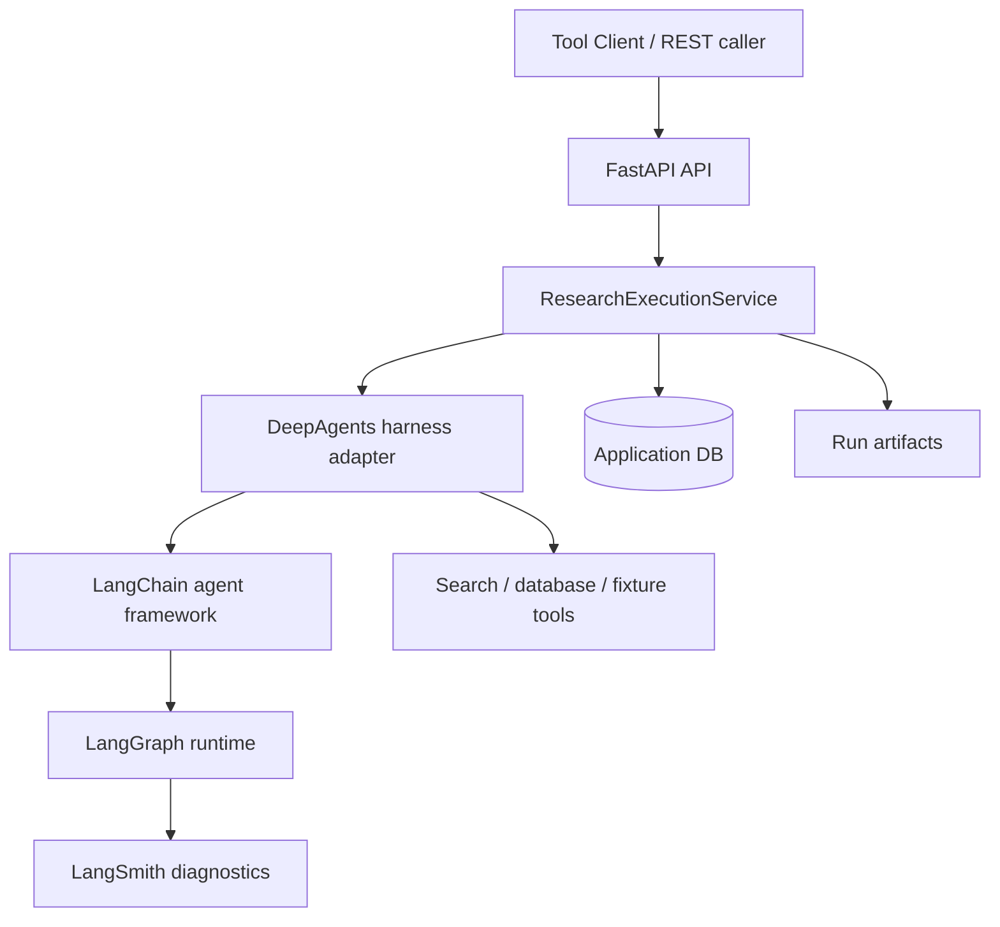

# Architecture: Decision Research Agent

Decision Research Agent is a backend research service with a canonical
run-scoped API, DeepAgents-native execution harness, service-owned persistence,
and deterministic delivery contracts.

## Runtime Layers

Canonical call path: ResearchExecutionService -> AgentHarness -> DeepAgentsHarness.

## Ownership Boundaries

The durable rationale and rejected alternatives are recorded in
[Framework And Runtime Boundaries](decisions/framework-runtime-boundaries.md).
This document summarizes the current implementation.

| Layer | Owns |
|---|---|
| DeepAgents harness | Agent execution, tool filtering, middleware, skills loading, runtime context injection |
| LangChain | Agent framework, model/tool binding, structured output integration |
| LangGraph | Workflow runtime, recursion limits, checkpoint-compatible execution |
| Service layer | ResearchRun, EvidenceLedger, review state, verification decisions, publication state, canonical result delivery |
| LangSmith | Trace and diagnostics only |

Terminology contract: LangChain = Agent Framework; DeepAgents = research
harness; LangGraph = durable workflow runtime; LangSmith = privacy-first
tracing/evaluation; Application DB = business authority.

LangSmith and LangGraph checkpoints are not business ledgers. Service-owned
tables remain the source of truth for delivery, review, evidence verification,
and publication decisions.

## Profile Execution

Generic research uses the DeepAgentsHarness path with framework-owned virtual
workspace behavior, read-only Skills, compiled researcher delegation, middleware
budgets, tool filtering, and runtime context injection. The service observes
the execution and persists only validated outcome, evidence, telemetry, and
artifact state.

Talent Hiring Signal uses a bounded direct LangChain structured-output path
inside the profile compiler. It intentionally does not load generic Skills,
arbitrary filesystem tools, upload tools, or broad workspace access. Talent
readiness is decided by service-owned schema, evidence-reference, review
bundle, and publication contracts.

## Data Flow

1. Caller starts a run with `POST /api/runs`.
2. API creates `run_id` and initial run/segment records.
3. `ResearchExecutionService` executes the profile through the DeepAgents
   harness adapter.
4. Tools and agent output are captured into evidence and run outcome snapshots.
5. The service finalizes the run through a fenced terminal transaction.
6. Generic runs persist a canonical report artifact; Talent runs persist
   structured packets, review bundles, publications, and decision briefs.
7. Callers retrieve bounded delivery through `GET /api/runs/{run_id}/result`.

## Deployment Boundary

The repository currently ships a backend-and-CLI release plus a React static
demo console for operator-facing explanation. The demo console does not add
backend state or call live APIs in PR1. Future live UI work should consume the
same canonical API and WebSocket contracts rather than reintroducing a parallel
runtime.

Delivery is Markdown-only delivery in v0.1.0. The result endpoint returns
canonical Markdown artifacts and does not generate PDF files.

Controlled durable review and evidence verification are supported only within
the documented single-node SQLite boundary unless a later architecture decision
expands the deployment model.

The main generic research path does not resume an interrupted tool call after
process death. Durable recovery is currently scoped to the controlled review
gate and its checkpoint database, not arbitrary research execution.
