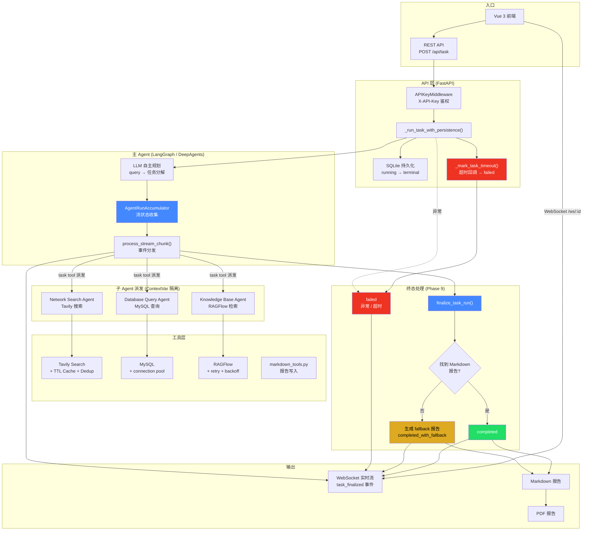

# Deep Search Agent — 项目答辩文档

> 面试 3 分钟讲述用。纯技术事实，所有数据来自实际运行。

## 一句话概括

**自主规划 + 多子代理协作 + 确定性终态的 Multi-Agent 搜索报告系统。**

282 单元测试全过，DeepSeek API 驱动，ContextVar 会话隔离，Fallback 兜底保证终态。

## 架构全景图

## 关键指标

| 指标 | 数值 | 说明 |
|------|------|------|
| 单元测试 | 282 passed, 0 failed | pytest -q |
| API 覆盖 | 7 个 REST + 1 个 WebSocket | 含鉴权、持久化、token 追踪 |
| 子代理类型 | 3 种 | Network Search / Database Query / Knowledge Base |
| 会话隔离 | ContextVar | 并发请求零串扰 |
| 终态确定性 | 3 种终态 | completed / completed_with_fallback / failed |
| 前端 | Vue 3 + TypeScript | Vite 构建 ~100ms |
| CI/CD | GitHub Actions | push/PR → pytest + build |
| Docker | 完整部署 | 含 WeasyPrint 系统依赖 |

> E2E Benchmark 数据待当前运行完成后补充。（5 问 × deepseek-chat，预计 ~30 分钟）

## 核心设计决策

### 1. ContextVar 会话隔离（非多进程）

并发请求共享 Python 进程。全局变量会串扰 —— thread_id、workspace path、LLM callbacks。

**为什么不用多进程？** 单机部署不需要进程隔离的复杂度。`contextvars.ContextVar` 将状态绑定到 async task，请求 A 的 workspace 永远不碰请求 B 的文件。零额外依赖，python 标准库。

### 2. 确定性终态（Phase 9）

Phase 8 收口时发现：同一 query 跑多次，有时生成报告、有时不写文件、有时 token 爆炸（459K→3M）。根源是 DeepSeek 模型行为随机。

**方案：抽离「报告是否生成」的决策**
- 流最后有 Markdown → `completed`
- 流正常但无 Markdown → 后端自动生成 fallback 报告 → `completed_with_fallback`
- 异常/超时 → `failed`

Fallback 报告不是空的，包含线程 ID、生成时间、原始 query、最后 agent 输出、诊断事件列表。即使没产出正式报告，问题排查也有迹可循。

### 3. DeepSeek 而非 GPT-4

**成本**：deepseek-chat $0.27/M input tokens，比 GPT-4 低两个数量级。

**代价**：模型随机性（同 query 不同 run 的 token 消耗可差 6-8x）。

**抵消**：Fallback 机制保证终态确定性，随机性不影响系统可用性。每次 run 要么 `completed` 要么 `completed_with_fallback`，没有「跑完不知道结果」的灰色地带。

### 4. YAML Prompt + SQLite + WebSocket（技术栈一致性）

| 选择 | 代替方案 | 理由 |
|------|---------|------|
| YAML prompt | Python 字符串 | 非开发人员可编辑，git diff 可审计 |
| SQLite | Redis | Python 内置，单机够用，迁移 PostgreSQL 零成本 |
| WebSocket | 轮询 | Agent 产生 10-50 个中间事件，推送比轮询省带宽 |
| API Key | JWT | 个人部署不需要多用户/登录/refresh |

## 3 分钟叙事线

### 第一段：问题（~30 秒）

「Deep Search Agent 是一个自主搜索报告系统。用户用自然语言问一个问题，系统自动规划、搜索多个信息源、综合成 Markdown/PDF 报告。」

### 第二段：架构（~60 秒）

「核心架构是主 Agent + 3 种子 Agent。主 Agent 基于 LangGraph，负责自主分解任务、派发子 Agent、综合结果。子 Agent 分别是网络搜索（Tavily）、数据库查询（MySQL）、知识库检索（RAGFlow）。三个子 Agent 通过 ContextVar 实现会话隔离 —— 并发请求共享同一进程，但永远不会串扰。」

**此处指向架构图的三个 Agent 分支。**

### 第三段：工程深度（~60 秒）

「工程上做了几件事。一个是确定性终态 —— DeepSeek 模型有随机性，同一 query 有时生成报告有时不生成。Phase 9 把「报告是否生成」的决策从 agent 手中抽出来，变成后端确定性逻辑：有报告就 completed，没报告就自动生成 fallback 报告变成 completed_with_fallback，异常就 failed。每次 run 都有明确结果。

另外做了 API Key 鉴权、SQLite 持久化、搜索去重和 TTL 缓存、Tavily/RAGFlow 的指数退避重试。加起来 282 个单元测试全过。」

### 第四段：取舍（~30 秒）

「选了 DeepSeek 没选 GPT-4 —— 成本低两个数量级，代价是模型随机性。但这个随机性恰好被 fallback 机制兜住了，反而成了工程深度的证明。」

## 已知边界（诚实标注）

- **随机性不隐藏**：DeepSeek 不暴露 seed 参数，同 query 不同 run 的 token 消耗可差 6-8x。证据表中标注「单次快照，非统计采样」
- **知识库/数据库依赖**：evidence-004 和 evidence-005 的可用性依赖外部服务状态，本身是对 graceful degradation 的测试
- **不在 CI 中跑 E2E**：真实 LLM 调用不进 CI，只在手动触发时运行
- **不做 5 问取中位数**：当前是单次快照，不声称统计显著性
