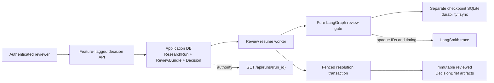
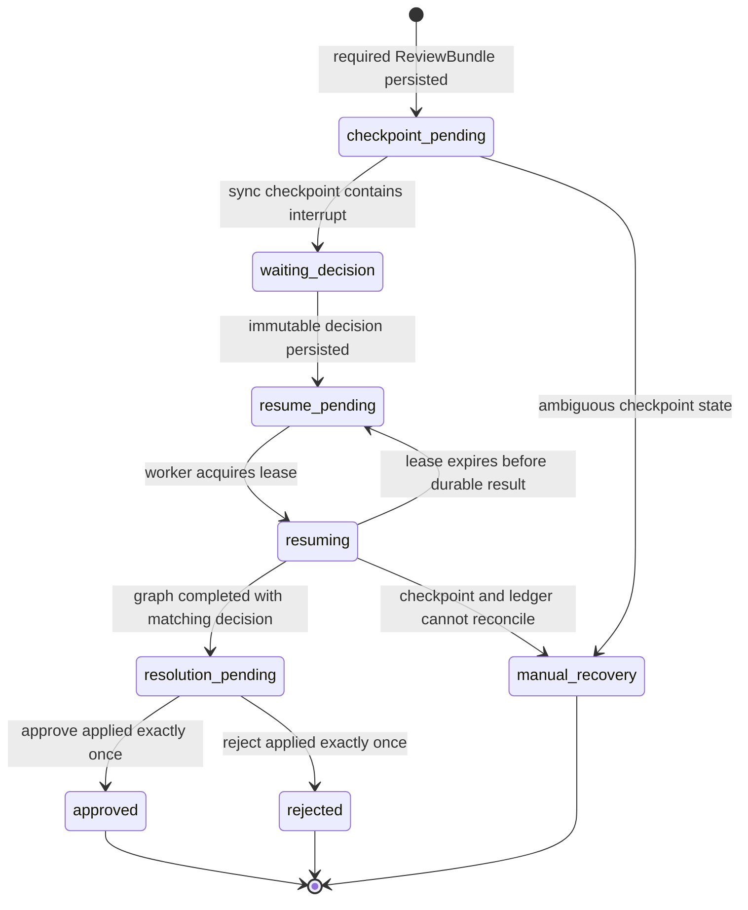
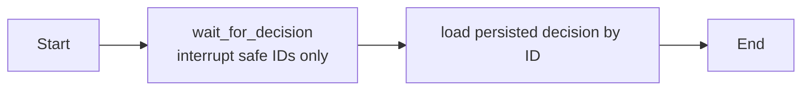

# P1B Durable HITL Feasibility Design

**Status:** Approved design

**Date:** 2026-06-19

**Scope:** Product-shaped feasibility spike, disabled by default

**Decision owner:** Project owner

## Summary

P1B will test whether Decision Research Agent can pause a Talent review workflow,
persist an immutable human decision, survive process and container restarts, and
resume exactly once without corrupting `ResearchRun`, `ReviewBundle`,
`EvidenceLedger`, or delivery state.

The spike will use a real, authenticated HTTP decision path and a persistent
LangGraph checkpointer, but the capability remains disabled by default. It is not
publicly supported until all thirteen durable gates pass. P1B supports only
bundle-level `approve` and `reject`.

P1B is a feasibility milestone, not a general workflow platform. It does not add
claim editing, new research, UI, Skills, Async Subagents, Agent Server, or a new
delivery channel.

## Decision

Adopt a product-shaped, feature-flagged HITL path:

- persist business review state in the application SQLite database;
- persist LangGraph execution state in a separate SQLite checkpoint database;
- use a small, pure review-gate graph instead of interrupting the research graph;
- expose a real decision endpoint behind
  `DECISION_RESEARCH_AGENT_ENABLE_DURABLE_HITL=false`;
- derive reviewer identity from the authenticated service credential rather than
  trusting a caller-supplied actor field;
- resume through a leased worker with deterministic identities and fenced state
  transitions;
- use `durability="sync"` for initial interrupt and resume;
- regenerate immutable reviewed DecisionBrief artifacts after approval;
- keep LangSmith correlation-only with inputs and outputs hidden;
- stop after four engineering days if any durable gate remains unproven.

## Evidence Classification

### Project Facts

- `research_runs_v2` already separates execution, review, and delivery status and
  fences writes with `state_version`.
- `review_bundles_v2` stores one immutable revision-1 bundle per run.
- `run_artifacts_v2` stores immutable artifacts by `(run_id, artifact_id)`.
- Talent runs already persist `ResearchPacket`, `ReviewBundle`, DecisionBrief JSON,
  DecisionBrief Markdown, and evidence atomically.
- The backend uses FastAPI, process-local `asyncio` task tracking, SQLite WAL, and
  named Docker volumes for `/app/data` and `/app/output`.
- The repository has no persistent LangGraph checkpointer dependency or review
  resume worker.
- The existing global API middleware permits unauthenticated development traffic
  when `API_SECRET` is absent.
- The constraints file declares `deepagents==0.6.10` and `langgraph==1.2.5`; the
  existing local `.venv` currently resolves older versions. CI and Docker install
  from `requirements.txt` with `constraints.txt`.
- The current baseline is `534 passed, 5 warnings`.

### Official Documentation Facts

- LangGraph interrupt/resume requires a checkpointer and the same checkpoint
  `thread_id`.
- `Command(resume=...)` resumes from the persisted checkpoint.
- Durable execution can replay nodes after a checkpoint, so side effects must be
  idempotent or isolated after the interrupt.
- `durability="sync"` persists checkpoint changes before advancing to the next
  step, trading throughput for a smaller durability window.
- A persistent SQLite or Postgres saver is required for restart recovery;
  in-memory savers are development-only.

### Design Inferences

- A pure review-gate graph is safer than embedding `interrupt()` in the Talent
  researcher because expensive research and provider calls must not replay during
  review recovery.
- Application state and checkpoint state cannot share one atomic transaction.
  The design therefore requires deterministic identities, reconciliation, and an
  explicit `manual_recovery` state instead of pretending the two databases commit
  atomically.
- SQLite is acceptable for this single-deployment feasibility spike because the
  project already uses it and active concurrency is bounded. Failure under the
  durable gates produces a P1B NO-GO; it does not trigger an automatic Postgres or
  Agent Server migration.

## Goals

1. Record one immutable bundle-level `approve` or `reject` decision.
2. Make duplicate submission idempotent and conflicting submission a `409`.
3. Create and recover a persistent interrupt checkpoint.
4. Resume through a lease that can expire and be reclaimed.
5. Apply the accepted decision exactly once.
6. Keep unresolved review artifacts non-deliverable.
7. Produce immutable reviewed DecisionBrief artifacts after approval without
   changing evidence verification status.
8. Preserve all relevant state across process restart, container restart, and
   forced process termination.
9. Return explicit diagnostics or `manual_recovery` for irreconcilable state.
10. Keep all existing APIs and Talent behavior unchanged while the flag is false.

## Non-Goals

- Publicly supported HITL or a P1C release.
- Claim-level approve, reject, or edit.
- Adding, deleting, or replacing evidence during review.
- Automatically marking evidence as `verified`.
- Triggering a new research run after rejection.
- UI, dashboard, ATS, email, spreadsheet, or Tool Client review commands.
- Runtime Skills, Async Subagents, LLM reviewer, long-term memory authority, or
  Agent Server migration.
- Multi-tenant reviewer identity and role-based access control.
- Replacing SQLite with Postgres during this spike.
- Renaming existing API routes, service identifiers, profile IDs, or persisted IDs.

## Approaches Considered

### A. Internal-Only Runner

Fastest to build, but it would not validate the product auth path, API error
contracts, request idempotency, or concurrent HTTP submissions. P1C would need to
rewrite the ingress path.

**Decision:** Rejected.

### B. Feature-Flagged Product Path

Build the real persistence, API, graph, worker, and recovery path but keep it
disabled by default. This provides meaningful durability evidence without
claiming public readiness.

**Decision:** Adopted.

### C. Public HITL in P1B

Expose interrupt/resume as soon as the happy path works.

**Decision:** Rejected. Restart and crash consistency are release requirements,
not follow-up polish.

## Architecture



### Responsibility Boundaries

| Component | Owns | Must Not Own |
|---|---|---|
| `ResearchRun` application DB | Run, review, decision, workflow, lease, segment, artifact, audit state | LangGraph messages or checkpoint internals |
| LangGraph checkpoint DB | Review-gate execution position and resumable graph state | Authoritative decision, delivery status, evidence verification |
| Review decision API | Authentication, validation, idempotent decision persistence | Direct graph execution or artifact mutation |
| Resume worker | Lease, checkpoint creation/resume, reconciliation, fenced resolution | New research or reviewer policy |
| Review-gate graph | Pause and return an opaque persisted decision ID | LLM calls, tools, external side effects, decision authority |
| LangSmith | Trace hierarchy, timing, errors, opaque correlation metadata | Business ledger or recovery authority |

## Data Model

### Existing Tables Retained

- `research_runs_v2`
- `run_segments`
- `evidence_entries_v2`
- `research_packets_v2`
- `review_bundles_v2`
- `run_artifacts_v2`

The revision-1 `ReviewBundle` remains immutable. P1B does not overwrite it.

### `review_decisions_v2`

| Field | Contract |
|---|---|
| `decision_id` | Client-generated bounded idempotency key; primary key |
| `run_id` | Foreign key to `research_runs_v2` |
| `review_id` | Foreign key identity copied from the immutable bundle |
| `review_revision` | Must equal the persisted bundle revision |
| `action` | `approve` or `reject` |
| `reason` | Required and bounded for `reject`; optional and bounded for `approve` |
| `actor_fingerprint` | Server-derived SHA-256 fingerprint of the active API credential; no secret material |
| `request_hash` | Canonical hash of the semantic request for conflict detection |
| `created_at` | UTC timestamp |

Constraints:

- `UNIQUE(review_id, review_revision)` permits one accepted decision per review
  revision.
- Repeating the same `decision_id` and request hash returns the existing result.
- Reusing `decision_id` with different semantics returns `409
  decision_id_conflict`.
- A different decision for an already-decided review returns `409
  review_already_decided`.

### `review_workflows_v2`

One row tracks the cross-database review workflow.

| Field | Contract |
|---|---|
| `workflow_id` | Deterministic hash of `run_id`, `review_id`, and revision |
| `run_id` | Unique run reference |
| `review_id` | Immutable bundle reference |
| `review_revision` | Bundle revision |
| `checkpoint_thread_id` | Deterministic opaque LangGraph thread ID |
| `status` | Workflow status listed below |
| `decision_id` | Nullable until a decision is persisted |
| `post_review_segment_id` | Deterministic segment, created once |
| `lease_owner` | Nullable worker instance ID |
| `lease_expires_at` | Nullable UTC timestamp |
| `attempt_count` | Monotonic claim count |
| `last_error_code` | Stable diagnostic code, not raw secret-bearing text |
| `created_at`, `updated_at` | UTC timestamps |

Workflow statuses:

- `checkpoint_pending`
- `waiting_decision`
- `resume_pending`
- `resuming`
- `resolution_pending`
- `approved`
- `rejected`
- `manual_recovery`
- `failed`

### `review_resume_attempts_v2`

Each lease claim appends one audit row with attempt number, worker ID, start/end
time, outcome, and bounded error code. Retries reuse the workflow and post-review
segment but receive a new attempt row.

### `review_resolutions_v2`

An immutable resolution joins the accepted decision to its result:

- `resolution_id`
- `run_id`
- `review_id`
- `decision_id`
- `action`
- `resolved_review_json`
- `artifact_ids_json`
- `created_at`

Approval writes reviewed JSON and Markdown artifact IDs. Rejection writes no
deliverable artifact IDs.

## Orthogonal Status Rules

The research execution is already complete when human review begins. HITL must not
change `execution_status` back to `running`.

| Outcome | `execution_status` | `review_status` | `delivery_status` |
|---|---|---|---|
| Review required | `completed` | `required` | `review_required` |
| Approved and resolved | `completed` | `resolved` | `ready` |
| Rejected and resolved | `completed` | `resolved` | `blocked` |
| Recovery impossible | `completed` | `required` | `review_required` |

`blocked` is added to `DELIVERY_STATUSES`. `manual_recovery` belongs to the review
workflow, not the execution status. This preserves the fact that research
completed while review delivery could not progress.

## State Machine



## Initial Review Flow

1. Talent research and deterministic artifact construction finish.
2. The existing finalization transaction persists evidence, packet, immutable
   revision-1 ReviewBundle, initial DecisionBrief artifacts, and a deterministic
   `review_workflows_v2` row with `checkpoint_pending`.
3. The worker claims the workflow.
4. It invokes the pure review-gate graph using the deterministic
   `checkpoint_thread_id` and `durability="sync"`.
5. The graph reaches `interrupt()` without performing any prior side effect.
6. The worker verifies the persisted interrupt and transitions the workflow to
   `waiting_decision`.
7. A process failure before step 6 is recovered by scanning
   `checkpoint_pending` and inspecting the deterministic checkpoint thread.

When the feature flag is false, step 2 does not create a workflow. Existing
non-interrupt ReviewBundle behavior remains unchanged.

## Decision API

Experimental route:

```text
POST /api/runs/{run_id}/reviews/{review_id}/decisions
```

Request:

```json
{
  "decision_id": "decision_client_generated_001",
  "review_revision": 1,
  "action": "approve",
  "reason": "Evidence boundaries are acceptable for this delivery.",
  "expected_state_version": 2
}
```

Response for a newly accepted decision:

```json
{
  "status": "resume_pending",
  "run_id": "run_...",
  "review_id": "review_...",
  "decision_id": "decision_client_generated_001",
  "idempotent_replay": false
}
```

The same semantic request returns the same decision with
`idempotent_replay=true`.

For a new decision, one application-DB transaction:

1. checks the expected run `state_version`;
2. inserts the immutable decision;
3. binds the decision to the matching workflow;
4. changes the workflow from `waiting_decision` to `resume_pending`;
5. increments the run `state_version`.

An idempotent replay is resolved before the stale-version check so a safe client
retry can return the original result after the first request has already advanced
the run version.

Validation:

- feature flag must be enabled;
- `API_SECRET` must be configured and the request authenticated;
- run and review must exist and belong to each other;
- profile must be `talent-hiring-signal`;
- review must be `required`;
- revision and expected `state_version` must match;
- action must be `approve` or `reject`;
- rejection reason is mandatory;
- IDs and reason use explicit length and character bounds.

Errors use:

```json
{
  "code": "review_already_decided",
  "problem": "This review revision already has an accepted decision.",
  "cause": "A conflicting decision was submitted.",
  "fix": "Fetch the run and use the persisted decision result.",
  "retryable": false,
  "run_id": "run_...",
  "request_id": "request_..."
}
```

The route returns a feature-disabled error while the flag is false and is marked
experimental in generated API documentation. P1C decides whether to promote it to
a supported interface.

## Authentication and Actor Attribution

The review decision route is stricter than current development-compatible
middleware:

- no `API_SECRET` means fail-closed;
- a wrong or missing `X-API-Key` is rejected;
- the stored actor is a non-reversible fingerprint derived on the server;
- caller-supplied actor identity is not accepted in P1B;
- secrets, request bodies, and reason text are not included in trace metadata or
  diagnostics.

This supports one service credential. Multi-reviewer identity and RBAC require a
separate authentication design.

## Review-Gate Graph

The graph has no model and no tools.



Graph state contains only:

- `run_id`
- `review_id`
- `review_revision`
- `decision_id`
- `action`

The interrupt payload contains only opaque IDs and allowed actions. It excludes
query text, evidence snippets, claims, candidate data, and report content.

On resume, `Command(resume={"decision_id": "..."})` carries only the immutable
decision ID. The graph loads the authoritative action from the application
database and verifies that run, review, revision, and decision match.

## Resume Worker and Lease

- A worker instance receives a random process-scoped `worker_id`.
- Claiming a workflow is a single conditional SQL update.
- The default lease is short and configurable for tests.
- A claim increments `attempt_count` and appends a resume-attempt row.
- The deterministic post-review segment is created once, before resume.
- A reclaimed workflow reuses that segment and appends a new attempt.
- Lease renewal is unnecessary for the bounded review-gate graph; the operation
  must finish well inside the lease or be reclaimed.
- Resolution uses workflow status, `decision_id`, run `state_version`, and unique
  constraints as fences.
- A stale worker cannot overwrite an already resolved workflow.

The worker scans `checkpoint_pending` and `resume_pending` on startup and then at
a bounded interval while the feature is enabled.

## Approval and Rejection Semantics

### Approve

- Persist a resolution with action `approve`.
- Build `decision-brief.reviewed.json` and
  `decision-brief.reviewed.md` deterministically from the original canonical
  brief and immutable decision.
- Set the embedded review summary to resolved and include the decision ID,
  action, `reason_recorded`, and the non-sensitive reviewer kind
  `service_credential`. The reason text remains audit-only in the application
  database.
- Preserve every evidence `verification_status`; approval does not verify a
  source.
- Atomically insert reviewed artifacts and transition the run to
  `review_status=resolved`, `delivery_status=ready`.

### Reject

- Persist a resolution with action `reject` and the mandatory reason.
- Do not create deliverable reviewed artifacts.
- Atomically transition the run to `review_status=resolved`,
  `delivery_status=blocked`.
- Do not rerun research or mutate the original DecisionBrief.

## Cross-Database Recovery

The application DB and checkpoint DB cannot share an atomic commit. Recovery is
based on deterministic IDs and observable state.

| Application state | Checkpoint state | Recovery |
|---|---|---|
| `checkpoint_pending` | absent, no decision | safely create checkpoint |
| `checkpoint_pending` | interrupted | mark `waiting_decision` |
| `waiting_decision` | interrupted | no-op |
| `resume_pending` | interrupted | acquire lease and resume |
| `resuming`, lease expired | interrupted | reclaim and resume same decision |
| `resuming`, lease expired | graph completed with matching decision | mark `resolution_pending`, then apply fenced resolution |
| resolved workflow | any duplicate callback | no-op |
| decision exists | corrupt or mismatched checkpoint after resume attempt | `manual_recovery` |
| checkpoint decision differs from ledger | any | `manual_recovery` |

No recovery path invents a decision or infers approval from checkpoint position.

## Query Projection

`GET /api/runs/{run_id}` remains the canonical read path and adds sanitized
projections for:

- current review workflow status;
- accepted decision ID, action, `reason_recorded`, and timestamp;
- resolution status and reviewed artifact IDs;
- bounded recovery diagnostic code.

The response does not expose decision reason text, credential fingerprint, lease
owner, raw checkpoint payload, checkpoint database path, or internal exception
text.

## Persistence and Migration

- Add one idempotent application DB migration after
  `003_run_identity_backbone`.
- Update schema verification to require new tables, indexes, foreign keys, and
  migration checksum.
- Use the existing backup-apply-verify-restore workflow.
- Store the checkpoint database at a separate configurable path under
  `/app/data`.
- Back up and restore the application and checkpoint databases independently.
- Container verification must confirm the named `backend_data` volume retains
  both databases.
- Rollback disables the feature first. Schema additions remain additive; existing
  run reads and writes continue to work.

## Dependency Gate

Before implementation behavior tests:

1. create a clean Python 3.11 environment;
2. install with `pip install -r requirements.txt -c constraints.txt`;
3. add and pin the official SQLite checkpoint package required by the selected
   saver;
4. verify actual versions match constraints;
5. run a compatibility smoke proving persistent interrupt, process reopen, and
   `Command(resume=...)` with `durability="sync"`.

The existing older local `.venv` is not evidence for this gate. CI, Docker, and
the P1B verification environment must use the same constrained set.

## LangSmith Boundary

Trace metadata may include:

- `research_run_id`
- `review_id`
- `review_workflow_id`
- `segment_id`
- `profile_id`
- application version and environment

Trace metadata must not include decision reasons, claims, evidence snippets,
query text, report content, API key material, or actor fingerprint.

`LANGSMITH_HIDE_INPUTS=true` and `LANGSMITH_HIDE_OUTPUTS=true` remain the default.
LangSmith failure must not block or change the authoritative review workflow.

## Feature Flag and Product Boundary

```dotenv
DECISION_RESEARCH_AGENT_ENABLE_DURABLE_HITL=false
```

When false:

- no review workflow or checkpoint is created;
- no resume worker starts;
- the decision route refuses use;
- existing non-interrupt ReviewBundle behavior is byte-for-byte compatible where
  deterministic timestamps are fixed;
- no public documentation claims durable HITL support.

Passing P1B permits a separate P1C release decision. It does not automatically
enable the flag.

## Failure Handling

| Failure | Required behavior |
|---|---|
| Checkpoint package incompatible | Stop P1B, keep flag false |
| Checkpoint creation fails | Keep review required, persist bounded diagnostic, retry safely |
| Duplicate decision | Return persisted result |
| Conflicting decision | Return `409`, preserve first accepted decision |
| Worker crashes before resume | Lease expiry permits reclaim |
| Worker crashes after graph completion | Reconciler applies matching fenced resolution |
| Checkpoint missing before any resume | Recreate from ledger |
| Checkpoint corrupt after resume attempt | Enter `manual_recovery` |
| Artifact generation fails | Roll back resolution transaction and retry safely |
| Auth missing | Fail closed |
| LangSmith unavailable | Continue authoritative workflow |

## File-Level Scope

Expected new files:

- `api/review_models.py`
- `api/review_repository.py`
- `api/review_gate.py`
- `api/review_worker.py`
- `api/review_api.py`
- `tests/unit/test_review_repository.py`
- `tests/unit/test_review_gate.py`
- `tests/unit/test_review_worker.py`
- `tests/integration/test_durable_review_api.py`
- `tests/integration/test_durable_review_restart.py`
- `tests/integration/test_durable_review_kill9.py`
- `scripts/durable_hitl_gate_runner.py`
- `docs/operations/durable-hitl-feasibility.md`

Expected modified files:

- `requirements.txt`
- `constraints.txt`
- `.env.example`
- `api/run_repository.py`
- `api/run_migrations.py`
- `api/server.py`
- `api/talent_artifacts.py`
- `docker-compose.yml`
- `spec/api-contract.md`
- `spec/data-models.md`
- `TODOS.md`

`api/server.py` only registers the router and manages worker lifecycle. Decision
logic, persistence, graph execution, and recovery must not be implemented inline
in the server module.

## Test Strategy

### Unit

- schema validation and reject reason;
- deterministic workflow, checkpoint, segment, and resolution IDs;
- decision idempotency and conflict detection;
- state-version fencing;
- lease claim, expiry, reclaim, and stale worker rejection;
- status combination validation;
- reviewed artifact determinism and unchanged verification status;
- error envelope redaction.

### Integration

- feature disabled preserves current behavior;
- missing auth fails closed;
- decision route validates run/review ownership and revision;
- duplicate HTTP submission is idempotent;
- concurrent conflicting decisions produce one winner and one `409`;
- persistent graph interrupts and resumes with the same checkpoint thread;
- process restart recovers `checkpoint_pending`, `waiting_decision`, and
  `resume_pending`;
- container restart preserves both databases, output, decision, and artifacts;
- checkpoint corruption produces `manual_recovery`;
- approved review creates reviewed artifacts and ready delivery;
- rejected review creates no deliverable artifact and blocks delivery.

### Forced-Crash Harness

Subprocess tests expose test-only stage hooks outside production configuration.
The parent process waits for a stage marker and sends `SIGKILL`. Required crash
points:

1. application finalization committed, checkpoint not created;
2. checkpoint interrupted, workflow not marked waiting;
3. decision committed, resume not started;
4. lease acquired, graph resume not invoked;
5. graph resume completed, resolution transaction not committed.

After restart, every case must converge to one documented state without duplicate
decision, segment, resolution, or artifact.

## Thirteen Durable Gates

P1B passes only if all gates pass:

1. Pending review is queryable and recoverable after process restart.
2. Backend container restart preserves application DB, checkpoint DB, output,
   review decision, and reviewed artifact.
3. Duplicate semantic decision is idempotent.
4. Decision committed before resume survives restart and completes.
5. Replay creates no duplicate external or application side effect.
6. Concurrent conflicting decisions return one success and one `409`.
7. Missing, corrupt, or mismatched checkpoint converges to safe recovery or
   explicit `manual_recovery`.
8. Migration, verification, backup, restore, and rollback tests pass.
9. Missing or incorrect auth fails closed.
10. Unresolved required review cannot become deliverable.
11. Expired worker lease can be reclaimed without duplicate segment, resolution,
    or artifact.
12. `durability="sync"` restart and replay tests pass using the constrained
    dependency set.
13. All five forced `SIGKILL` windows converge without unexplained dual state.

Any failed gate means P1B NO-GO and the feature flag remains false.

## Four-Day Kill Gate

| Day | Deliverable | Stop condition |
|---|---|---|
| 0 | Clean constrained environment, checkpoint compatibility smoke, migration design | Stop if persistent interrupt/resume is incompatible |
| 1 | Review schema, repository, idempotency, feature-flagged authenticated API | Stop scope expansion; preserve non-interrupt flow |
| 2 | Pure review graph, checkpoint persistence, worker lease/reclaim | Stop if replay cannot be made side-effect-free |
| 3 | Restart, container, forced-crash matrix, docs, gate report | NO-GO if any gate remains unproven |

The implementation may merge behind the disabled flag if it is safe and useful,
but P1C cannot begin until the gate report records thirteen passes.

## Acceptance

- Existing full backend suite remains green.
- New focused unit and integration suites pass.
- Frontend build remains green even though no UI changes are planned.
- Dependency versions match constraints in local P1B verification, CI, and Docker.
- The disabled flag preserves existing API behavior.
- The gate runner emits a machine-readable pass/fail result for all thirteen gates.
- No secret, decision reason, report body, claim, or evidence content enters logs
  or LangSmith metadata.
- Documentation states whether the result is P1B PASS or NO-GO and does not imply
  public HITL support.

## Follow-On Boundary

Only a recorded thirteen-gate PASS permits P1C planning. P1C may then decide:

- whether to enable the endpoint in a supported configuration;
- how callers discover and poll review status;
- how Tool Client or UI review surfaces should work;
- whether reviewer identity requires a multi-key or external identity provider;
- whether rejected reviews can request a new research run.

Those decisions are intentionally absent from P1B.
