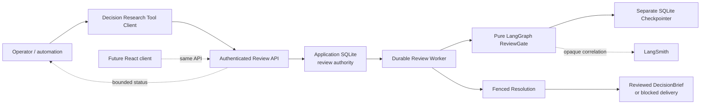

# P1C Controlled Review Workflow Design

**Status:** Approved design

**Date:** 2026-06-20

**Scope:** Supported single-node backend and CLI review workflow

**Decision owner:** Project owner

## Summary

P1C will promote the P1B durable review feasibility path into a controlled,
documented operator workflow for the Talent Hiring Signal profile.

The release will let an authenticated operator:

1. discover reviews that are waiting for a decision;
2. inspect the immutable `ReviewBundle` and current workflow state;
3. submit one bundle-level `approve` or `reject` decision;
4. wait for the durable worker to resolve the decision;
5. retrieve the reviewed artifact or the blocked delivery state; and
6. diagnose `manual_recovery` without unsafe force-resume operations.

P1C remains single-node and feature-flagged. It does not modify the existing Vue
frontend. A future React frontend will consume the same API instead of defining
a second review contract.

## Decision

Adopt a narrow, backend-first controlled release:

- keep `DECISION_RESEARCH_AGENT_ENABLE_DURABLE_HITL=false` by default;
- support the feature only with one backend replica, one application SQLite
  database, one separate SQLite checkpoint database, and persistent storage;
- derive one reviewer identity from the configured `API_SECRET`;
- expose authenticated review list and detail endpoints;
- promote the existing decision endpoint from experimental/deprecated to the
  supported P1C contract when the feature is enabled;
- add `review list`, `review show`, `review approve`, `review reject`, and
  `review wait` Tool Client commands;
- treat `approve` and `reject` as immutable terminal decisions for one review
  revision;
- require a new `run_id` for corrected or repeated research after rejection;
- preserve `manual_recovery` as an explicit operator-visible terminal condition;
- add startup validation, `doctor` checks, an operator runbook, and a documented
  rollout and rollback procedure; and
- keep Skills, Async Subagents, claim editing, multi-user identity, UI work, and
  multi-instance deployment out of scope.

## Evidence Classification

### Project Facts

- P1A passed the fixed Talent value gate and produces an immutable
  `ReviewBundle` plus canonical DecisionBrief artifacts.
- P1B merged behind a disabled feature flag and passed all thirteen durability
  gates, including restart, container restart, decision idempotency, lease
  reclaim, synchronous checkpoint durability, and five forced `SIGKILL` windows.
- The application database is authoritative for the run, review, decision,
  workflow, lease, resolution, and artifact metadata.
- A separate LangGraph SQLite checkpointer is authoritative only for the pure
  review-gate execution position.
- The current decision endpoint already authenticates with `X-API-Key`, derives
  an actor fingerprint from `API_SECRET`, and accepts immutable `approve` or
  `reject` decisions.
- `GET /api/runs/{run_id}` already returns a bounded workflow, decision, and
  resolution projection and does not expose decision reason, actor fingerprint,
  lease owner, checkpoint path, or checkpoint payload.
- The Tool Client currently supports `doctor`, run creation, run waiting, and run
  result retrieval, but has no review discovery or decision commands.
- The existing Vue frontend has no durable review workflow.
- There are no open pull requests or issues that conflict with this scope.

### Official Documentation Facts

- Deep Agents human-in-the-loop support is built on LangGraph interrupts and
  requires a checkpointer.
- Resume must use the same checkpoint thread identity.
- Durable graph execution may replay work around checkpoint boundaries, so side
  effects must be idempotent or isolated.
- Deep Agents `interrupt_on` primarily governs sensitive tool calls. It does not
  provide an application review ledger, reviewer identity model, immutable
  decision semantics, operator queue, or product API.

### Design Inferences

- The thirteen-gate P1B PASS is sufficient to plan a controlled single-node
  workflow, but not sufficient to claim multi-instance or general production
  readiness.
- Review discovery and inspection must use the same strict authentication as
  decision submission because the `ReviewBundle` can contain claims and evidence
  references.
- Immutable terminal decisions are safer than withdrawal or amendment because
  they preserve idempotency and make recovery deterministic.
- A rejected review should not mutate the completed research or silently start a
  new run. New research requires an explicit new `run_id`.
- Stable backend contracts should precede a React migration so the frontend can
  remain a replaceable consumer.

## Goals

1. Provide one complete backend and CLI path from pending review discovery to
   approved artifact or rejected delivery.
2. Preserve the P1B durability, idempotency, privacy, and authority boundaries.
3. Make supported deployment prerequisites machine-checkable where possible.
4. Make every operator-visible failure actionable without exposing secrets or
   sensitive exception text.
5. Keep the existing run and non-interrupt review behavior unchanged while the
   feature flag is false.
6. Define a stable review API that a future React client can consume unchanged.

## Non-Goals

- Modifying or replacing the Vue frontend.
- Starting the React migration.
- Multi-user login, RBAC, SSO, OAuth, or an external identity provider.
- Multiple backend replicas or distributed worker coordination.
- PostgreSQL or Agent Server migration.
- Claim-level approval, rejection, editing, or evidence replacement.
- Withdrawing or changing an accepted decision.
- Automatically verifying evidence.
- Automatically starting new research after rejection.
- A force-resume, force-approve, or database-editing operator command.
- Runtime Skills, Async Subagents, LLM review, or long-term memory authority.
- Public internet exposure or an SLA claim.

## Approaches Considered

### A. Promote Only the Existing Decision Endpoint

Keep the existing run API and add CLI wrappers for decision submission. Operators
would need to track `run_id` values outside the service and manually inspect full
run responses.

**Decision:** Rejected. It is small but does not provide review discovery,
bounded inspection, or a usable operator workflow.

### B. Controlled Backend and CLI Workflow

Add authenticated queue and detail APIs, stable CLI commands, startup validation,
operations documentation, and a controlled rollout while retaining the P1B
ledger and worker.

**Decision:** Adopted. It completes the smallest useful product workflow without
creating UI, identity, or distributed systems work.

### C. Full Review Product

Add a new frontend, user accounts, role permissions, claim editing, evidence
verification, decision amendment, and distributed deployment.

**Decision:** Rejected for P1C. It combines several independent products, would
duplicate work before the React migration, and would materially delay the core
delivery.

## Operator Journey

```text
doctor
-> review list
-> review show
-> review approve | review reject
-> review wait
-> result / artifact
```

Example:

```bash
python tools/decision_research_agent_tool.py doctor

python tools/decision_research_agent_tool.py review list \
  --status waiting_decision

python tools/decision_research_agent_tool.py review show \
  --run-id run_example

python tools/decision_research_agent_tool.py review approve \
  --run-id run_example

python tools/decision_research_agent_tool.py review wait \
  --run-id run_example

python tools/decision_research_agent_tool.py result \
  --run-id run_example
```

Rejection reads its reason from a file or standard input so the reason does not
need to appear in shell history:

```bash
python tools/decision_research_agent_tool.py review reject \
  --run-id run_example \
  --reason-file rejection.txt
```

The API key remains environment-only. The CLI must not accept it as a command-line
argument.

## Architecture



### Responsibility Boundaries

| Component | Owns | Must Not Own |
|---|---|---|
| Review list/detail API | Authenticated discovery and bounded inspection | Decision mutation outside the repository |
| Decision API | Validation and immutable decision acceptance | Graph execution or artifact generation |
| Application database | Business review truth and audit state | LangGraph message history |
| Review worker | Lease, resume, reconciliation, resolution | Reviewer policy or new research |
| ReviewGate/checkpointer | Interrupt and resume position | Decision authority or delivery truth |
| Tool Client | Operator workflow and stable request construction | Secrets, local business persistence, or force recovery |
| Future React client | Presentation and user interaction | Independent workflow or decision semantics |

## Authentication and Reviewer Identity

P1C retains a single service credential:

- `API_SECRET` is required whenever durable HITL is enabled.
- Review endpoints require `X-API-Key` even if the global development middleware
  would otherwise allow unauthenticated traffic.
- The server derives `actor_fingerprint` from the active credential.
- Caller-supplied actor names or identities are rejected or ignored.
- The fingerprint is persisted for audit correlation but is not returned by list,
  detail, run, or CLI output.

This identity means “the configured controlled reviewer credential,” not a human
user account. Multi-user attribution is deferred until a separate identity and
React design.

## API Contract

All P1C review endpoints:

- return `404 durable_hitl_disabled` when the feature is disabled;
- retain `503 review_auth_not_configured` as defense in depth if runtime
  configuration drifts after startup, although normal startup validation rejects
  an enabled service without a secret;
- return `401 invalid_api_key` for a missing or invalid credential;
- use the existing structured error envelope; and
- never return checkpoint payloads, lease owner, raw exception text, or actor
  fingerprint.

### `GET /api/reviews`

Lists durable review workflows.

Query parameters:

- `status`: optional exact workflow status; default `waiting_decision`;
- `limit`: 1-100, default 20; and
- `cursor`: optional opaque cursor based on `(created_at, workflow_id)`.

The response is deterministic by `created_at DESC, workflow_id DESC`.

```json
{
  "reviews": [
    {
      "workflow_id": "rwf_...",
      "run_id": "run_...",
      "review_id": "review_...",
      "review_revision": 1,
      "profile_id": "talent-hiring-signal",
      "workflow_status": "waiting_decision",
      "review_status": "required",
      "delivery_status": "review_required",
      "state_version": 2,
      "created_at": "2026-06-20T00:00:00Z",
      "updated_at": "2026-06-20T00:00:01Z",
      "last_error_code": null
    }
  ],
  "next_cursor": null
}
```

The list response excludes query text, claim text, evidence content, decision
reason, and artifacts. Operators use the detail endpoint for review content.

### `GET /api/runs/{run_id}/reviews/{review_id}`

Returns the authenticated review detail:

- immutable `ReviewBundle`;
- bounded workflow projection;
- current run state version;
- decision action, decision ID, bounded reason, and timestamp after a decision is
  accepted;
- resolution and artifact IDs when available; and
- stable `last_error_code` plus operator guidance for `manual_recovery`.

The endpoint does not return actor fingerprint, request hash, lease owner,
checkpoint identity/path/payload, raw exception text, or secret-bearing metadata.

Returning the decision reason here is intentional: this route is strictly
review-authenticated, unlike the general run projection.

### `GET /api/reviews/health`

Returns the bounded P1C runtime readiness needed by `doctor`:

```json
{
  "status": "ok",
  "feature_enabled": true,
  "worker_running": true,
  "application_schema_ready": true,
  "checkpoint_compatible": true,
  "gate_report_status": "PASS"
}
```

The endpoint is strict-authenticated and returns no filesystem paths, secret
values, worker IDs, checkpoint IDs, or exception text. When the feature is
disabled it returns the standard `404 durable_hitl_disabled`; `doctor` reports
that as an intentional disabled state rather than a failed default installation.
When the feature is enabled, any false required readiness field makes the
endpoint return `503 review_runtime_not_ready`.

### `POST /api/runs/{run_id}/reviews/{review_id}/decisions`

The existing P1B route becomes the supported P1C mutation contract:

- remove the deprecated marker;
- retain the same request schema and idempotency rules;
- accept only `approve` or `reject`;
- require `reason` for rejection;
- validate `review_revision` and `expected_state_version`;
- return `202` for new and idempotent accepted decisions; and
- return `409` for a stale, conflicting, amended, or second decision.

The route does not wait for graph resolution. Clients poll review detail or use
`review wait`.

## CLI Contract

Add one nested command group:

```text
review list
review show
review approve
review reject
review wait
```

### Common Behavior

- Read URL, API key, and per-request timeout from canonical environment variables.
- Keep legacy environment aliases only through the existing compatibility window.
- Output stable JSON to standard output.
- Output structured failures to standard output and exit non-zero.
- Never print API keys, actor fingerprints, checkpoint paths, or raw tracebacks.
- URL-encode every caller-provided identifier.

### `review list`

Arguments:

- `--status`, default `waiting_decision`;
- `--limit`, default 20; and
- `--cursor`, optional.

### `review show`

Arguments:

- `--run-id`, required; and
- `--review-id`, optional.

When `--review-id` is omitted, the CLI reads the current review identity from the
run projection. It fails if the run has no durable review.

### `review approve`

Arguments:

- `--run-id`, required;
- `--review-id`, optional;
- `--decision-id`, optional; and
- `--wait`, optional.

The CLI fetches the current revision and state version before submission.

### `review reject`

Arguments:

- the same identity and wait arguments as approve; and
- exactly one of `--reason-file` or `--reason-stdin`.

The CLI does not add a plain `--reason` argument because shell history is an
unnecessary disclosure surface.

### Stable Decision IDs

When `--decision-id` is omitted, the CLI derives a bounded deterministic ID from:

- run ID;
- review ID;
- review revision;
- action; and
- canonical reason hash.

This makes a network retry idempotent without requiring the operator to capture a
random ID before submission. An explicit `--decision-id` remains available for
external automation.

### `review wait`

Arguments:

- `--run-id`, required;
- `--review-id`, optional;
- `--poll-seconds`, default 1; and
- `--wait-timeout-seconds`, default 120.

Terminal workflow states:

- `approved`;
- `rejected`;
- `manual_recovery`.

Approved and rejected are successful workflow resolutions and return exit code 0.
Timeout, `manual_recovery`, auth failure, and transport failure return
non-zero with structured JSON.

## State and Decision Semantics

### Approval

- The accepted decision is immutable.
- The worker resumes the pure review gate exactly once.
- Resolution creates immutable reviewed DecisionBrief artifacts.
- `review_status=resolved`.
- `delivery_status=ready`.
- Evidence verification status remains unchanged.

### Rejection

- A bounded reason is required and persisted.
- The accepted decision is immutable.
- Resolution creates no deliverable reviewed artifact.
- `review_status=resolved`.
- `delivery_status=blocked`.
- The service does not restart research.

### Correction After Rejection

P1C does not amend the rejected run. A caller creates a new research run with a
new `run_id`, optionally retaining the same `thread_id` for grouping. The old run
remains an immutable audit record.

### Conflicting Decisions

- Repeating the same semantic request is idempotent.
- Reusing a decision ID with different semantics returns
  `409 decision_id_conflict`.
- A second decision for an already-decided review returns
  `409 review_already_decided`.
- A stale run version returns `409 stale_state_version`.

## Manual Recovery

`manual_recovery` is visible but not mutable through P1C APIs.

The review detail response and CLI show:

- `workflow_status=manual_recovery`;
- stable `last_error_code`;
- whether the application decision is preserved;
- whether a resolution exists; and
- a documentation URL for the matching operator procedure.

P1C does not provide:

- force resume;
- force resolution;
- checkpoint deletion;
- direct database editing; or
- automatic conversion from `manual_recovery` to approved/rejected.

The operator runbook requires:

1. disable the feature flag;
2. preserve and back up both databases and output;
3. capture redacted status and logs;
4. classify whether the state matches a documented recoverable case; and
5. restore or escalate through a separately reviewed repair procedure.

This keeps ambiguous state fail-closed.

## Supported Configuration

P1C is supported only when all are true:

- `DECISION_RESEARCH_AGENT_ENABLE_DURABLE_HITL=true`;
- `API_SECRET` is non-empty;
- `TASKS_DB_PATH` is a persistent file path, not `:memory:`;
- `DECISION_RESEARCH_AGENT_CHECKPOINT_DB_PATH` is a different persistent file
  path, not `:memory:`;
- both database parent directories and output storage are writable;
- exactly one backend replica owns the review worker; and
- the thirteen-gate report remains PASS for the constrained dependency set.

When the feature is enabled with an invalid required configuration, backend
startup fails. It must not start a server with a non-running review worker.

`doctor` gains a durable review section that checks:

- feature flag;
- strict auth configuration;
- separate database paths;
- writable storage;
- schema and migration version;
- worker availability;
- checkpoint compatibility; and
- the recorded gate report.

When the feature is disabled, `doctor` reports the durable review section as
`disabled` without failing the general doctor command. When enabled, every
required durable review check must be `ok` or the command exits non-zero.

`doctor` does not claim that a filesystem path is truly durable storage. The
operator runbook retains that deployment responsibility.

## Rollout

1. Run focused and full tests with the flag false.
2. Run the thirteen-gate P1B suite again under the locked dependency set.
3. Configure persistent paths and `API_SECRET` in a controlled single-node
   environment.
4. Run `doctor`; every required review check must pass.
5. Enable the flag with no external caller.
6. Run one synthetic approve canary and verify the reviewed artifact.
7. Run one synthetic reject canary and verify blocked delivery with no new
   artifact.
8. Restart the backend and confirm terminal results remain queryable.
9. Permit only the first-party Tool Client to submit decisions.
10. Record the supported configuration and actual verification output.

## Rollback

Rollback is configuration-first:

1. set `DECISION_RESEARCH_AGENT_ENABLE_DURABLE_HITL=false`;
2. restart the backend;
3. verify review endpoints return `durable_hitl_disabled`;
4. preserve application DB, checkpoint DB, output, decisions, and unresolved
   workflows; and
5. continue using non-interrupt ReviewBundle inspection.

Disabling the feature does not delete or rewrite review state. Re-enabling the
same compatible version may resume persisted workflows after `doctor` and
reconciliation pass.

Rolling code back across a review schema or checkpoint compatibility boundary
requires the existing backup/restore procedure. P1C does not automate downgrade
migrations.

## Error and Privacy Handling

- Stable error codes are authoritative; raw exception messages are not persisted
  or returned.
- Queue responses contain only bounded metadata.
- Review detail is strict-auth only.
- Decision reason never appears in logs, LangSmith metadata, list responses, or
  general run responses.
- LangSmith remains correlation-only with hidden inputs and outputs.
- Review endpoints apply bounded limits to status, cursor, IDs, and reason.
- Unknown status filters and malformed cursors return actionable `422` errors.
- Review APIs do not expose filesystem paths.

## File-Level Scope

Expected modified files:

- `api/review_api.py`
  - shared strict review authentication;
  - list/detail/health routes;
  - promote decision route to P1C contract.
- `api/review_models.py`
  - bounded query and response models;
  - supported configuration validation.
- `api/review_repository.py`
  - deterministic cursor-based listing;
  - authenticated detail projection;
  - no decision mutation semantics change.
- `api/server.py`
  - fail-closed startup validation;
  - worker health exposure for `doctor`.
- `tools/decision_research_agent_tool.py`
  - nested review commands, stable decision IDs, bounded polling, reason input.
- `spec/api-contract.md`
- `spec/data-models.md`
- `README.md`
- `docs/AGENT_INTEGRATION.md`
- `TODOS.md`

Expected new files:

- `docs/operations/controlled-review-workflow.md`
- focused P1C API and CLI tests if existing files would become unfocused.

Expected test extensions:

- `tests/unit/test_review_models.py`
- `tests/unit/test_review_repository.py`
- `tests/unit/test_decision_research_agent_tool.py`
- `tests/integration/test_durable_review_api.py`
- `tests/integration/test_durable_review_lifecycle.py`
- `tests/integration/test_durable_review_restart.py`

No file under `frontend/` is in scope.

## Test Matrix

| Area | Required proof |
|---|---|
| Disabled compatibility | Existing run/review behavior unchanged; all P1C routes fail closed |
| Startup validation | Enabled + missing secret, memory DB, or shared DB path refuses startup |
| Review authentication | List, detail, decision, and wait fail closed without valid key |
| Queue listing | Status filter, stable ordering, cursor pagination, and bounds |
| Review detail | Bundle and bounded decision visible; sensitive internals absent |
| CLI discovery | `review list/show` construct correct encoded requests |
| CLI decision | Approve/reject use current revision and state version |
| Decision ID | Equivalent CLI retries derive the same ID; changed semantics differ |
| Reason safety | Reject requires file/stdin; reason absent from logs and command output |
| Immutable terminal state | Approve/reject cannot be amended or withdrawn |
| Wait behavior | Approved/rejected succeed; timeout/manual recovery fail explicitly |
| Restart | CLI-visible state survives backend restart |
| Rollback | Disable/re-enable preserves data and resumes only after reconciliation |
| Manual recovery | Visible diagnostic, no mutation or force endpoint |
| P1B regression | All thirteen durable gates remain PASS |
| Full regression | Backend suite and frontend build remain green |

## P1C Acceptance Gate

P1C is complete only when:

1. the feature remains disabled by default;
2. invalid enabled configuration fails backend startup;
3. list, detail, and decision endpoints require strict review auth;
4. the CLI completes one approve and one reject lifecycle;
5. equivalent CLI retries are idempotent;
6. reject remains blocked and creates no reviewed deliverable artifact;
7. `manual_recovery` is visible and cannot be force-mutated;
8. disable/re-enable preserves review data;
9. all thirteen P1B gates remain PASS;
10. the full backend suite and frontend build pass; and
11. the operator runbook records the supported single-node boundary.

Any failed item keeps the feature disabled outside tests and prevents a supported
P1C release claim.

## Time and Scope Gate

Target implementation is two focused PRs:

1. authenticated list/detail API, startup validation, repository queries, and
   tests;
2. CLI workflow, operator documentation, canary verification, and release
   closure.

The target is three engineering days. Stop scope expansion if implementation
requires:

- a database replacement;
- a frontend;
- a second identity model;
- claim editing;
- a new research workflow; or
- distributed worker coordination.

Those are separate product decisions, not P1C blockers.

## Follow-On Boundary

After P1C:

- a React migration may implement a review UI over these APIs;
- identity/RBAC must be designed before exposing review to multiple people;
- multi-instance deployment requires a shared database and worker coordination
  design;
- rejected-run follow-up may be designed as an explicit new-run workflow; and
- P2 Skills or Async Subagent spikes still require evidence of a specific
  limitation they solve.

P1C completion does not automatically authorize any of those stages.

## References

- `docs/superpowers/specs/2026-06-19-p1b-durable-hitl-feasibility-design.md`
- `docs/evidence/durable-hitl-gate-report.json`
- `docs/operations/durable-hitl-feasibility.md`
- [Deep Agents human-in-the-loop](https://docs.langchain.com/oss/python/deepagents/human-in-the-loop)
- [LangGraph interrupts](https://docs.langchain.com/oss/python/langgraph/interrupts)
- [LangGraph persistence](https://docs.langchain.com/oss/python/langgraph/persistence)
