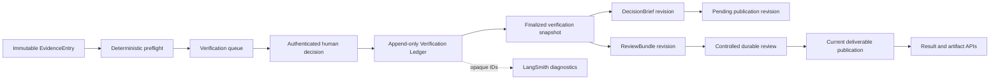
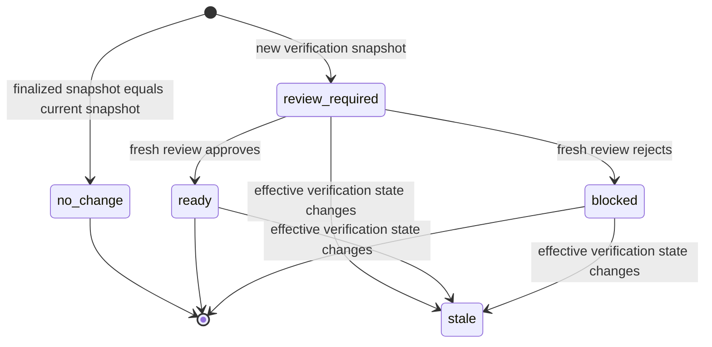

# P2A Evidence Verification and Real-Source Proof Design

**Status:** Proposed implementation design

**Date:** 2026-06-21

**Scope:** Controlled single-node evidence verification, derived artifact
revisioning, and bounded real-source product proof

**Decision owner:** Project owner

## Summary

P2A closes the gap between source collection and verified delivery.

The current service preserves source-like observations in an immutable
EvidenceLedger, but ordinary network evidence remains `unverified`. P2A adds a
separate append-only Verification Ledger in which deterministic server checks
establish eligibility and an authenticated human explicitly grants or rejects
verification for one exact evidence fingerprint.

Verification does not mutate the collected EvidenceEntry, approve a claim, or
reuse an earlier review decision. A finalized verification snapshot produces a
new deterministic DecisionBrief and ReviewBundle revision. The existing
controlled review workflow must approve that revision before it becomes the
current deliverable.

The milestone ends with a bounded proof using real public sources. It does not
add runtime Skills, Async Subagents, LLM verification, a frontend, or distributed
deployment.

Naming cleanup follows a gradual fade rather than a separate product milestone.
New P2A code, configuration, examples, and active documentation use only the
canonical `decision-research-agent` identity. Existing runtime aliases, the
legacy Tool Client shim, the health service ID, historical documents, and
public portfolio entry remain unchanged during PR1. Do not create a dedicated
PR, feature claim, or prominent release narrative for this cleanup.

Runtime compatibility removal is deferred to the later UI and public portfolio
maintenance batch, after first-party consumers have moved to canonical
identifiers. Historical specs, links, trace project names, and changelog records
remain as history rather than being rewritten.

## Decision

Adopt a narrow human-authoritative verification workflow:

- keep `evidence_entries_v2` immutable;
- add deterministic preflight checks that do not fetch arbitrary URLs;
- require a human decision to grant `human_verified`;
- store every verification decision as an immutable revision;
- bind each decision to `run_id`, `evidence_id`, and
  `evidence_fingerprint`;
- derive current verification state from the latest valid decision for that
  exact fingerprint;
- preserve legacy declared benchmark fixtures as
  `verification_origin=declared_fixture`, not `human_verified`;
- invalidate the current publication when its effective verification snapshot
  changes;
- create a new DecisionBrief, ReviewBundle, and publication revision;
- require a fresh controlled review decision before the new revision is
  deliverable;
- keep old artifacts and decisions queryable as immutable history;
- use the existing strict service credential for the first controlled
  single-node release; and
- keep all P2 framework expansion deferred until this proof demonstrates a
  specific limitation.

## Evidence Classification

### Project Facts

- `evidence_entries_v2` stores a stable `evidence_id`, source identity, snippet,
  fingerprint, citation status, and a legacy verification status.
- Evidence IDs are run-scoped and fingerprints are derived from normalized
  source identity plus normalized persisted snippet content.
- Ordinary tool evidence starts as `unverified`.
- Declared Talent benchmark aggregate evidence is currently promoted to
  `verified` during controlled preload.
- DecisionBrief rendering already excludes unresolved or unverified evidence
  from its verified snapshot.
- `review_bundles_v2` contains a revision field, but the current schema permits
  only one bundle per run.
- The durable review workflow stores immutable decisions and exactly-once
  resolutions, but its current schema also permits only one workflow and one
  resolution per run.
- P1C provides strict authenticated review APIs and CLI operations inside a
  feature-flagged single-node SQLite boundary.
- Approval permits delivery but intentionally does not change evidence
  verification status.
- LangSmith is correlation-only and is not a business ledger.

### Design Inferences

- Directly updating `EvidenceEntry.verification_status` would erase decision
  history and make stale-content detection impossible.
- A server-side URL fetcher would add SSRF, redirect, DNS rebinding, payload
  size, content-type, and webpage drift risks that are not required for the
  first useful workflow.
- Human verification must describe a bounded assertion about the persisted
  evidence snapshot, not a universal truth claim about the source or claim.
- An old review decision cannot approve a newly derived brief because the
  evidence eligibility and rendered content may have changed.
- Review bundle and workflow revisioning must be generalized before a revised
  artifact can become deliverable.

## Verification Meaning

`human_verified` means:

> An authenticated reviewer confirmed that the persisted snippet represented by
> this exact evidence fingerprint is consistent with the identified source at
> the time recorded in the verification decision.

It does not mean:

- the complete source is true;
- every statement on the source is current;
- the source supports claims not explicitly referencing this evidence;
- a claim is logically valid;
- a hiring recommendation is correct;
- the source will remain unchanged; or
- an earlier or later fingerprint is also verified.

`rejected` means the evidence snapshot must not be treated as verified for the
current run. A bounded reason code and optional note explain why.

## Goals

1. Provide an auditable path from collected evidence to human verification.
2. Prevent stale or changed evidence from inheriting a prior verification.
3. Keep verification, claim review, and delivery approval as separate
   authorities.
4. Deterministically rebuild canonical artifacts from one finalized
   verification snapshot.
5. Reuse the existing controlled review workflow without weakening its
   durability or idempotency guarantees.
6. Produce a repository-visible real-source proof with explicit sample and
   claim boundaries.

## Non-Goals

- Automatic fact checking or truth scoring.
- LLM evidence review or LLM authority over verification status.
- Server-side fetching, crawling, browser automation, or page archiving.
- Editing EvidenceEntry source URLs, snippets, or fingerprints.
- Claim editing or claim-level approval.
- Treating review approval as evidence verification.
- Treating a declared fixture as human-verified evidence.
- React, Vue, or any other review UI work.
- Multi-user identity, RBAC, SSO, or external identity providers.
- PostgreSQL, multiple backend replicas, or distributed worker coordination.
- Runtime Skills, Async Subagents, Agent Server migration, or long-term memory
  authority.
- General market accuracy, recall, production SLA, or hiring outcome claims.
- Removing runtime legacy identifiers or updating the personal portfolio/UI
  during P2A PR1.

## Approaches Considered

### A. Mutate EvidenceEntry Status

Update `evidence_entries_v2.verification_status` after human review.

**Decision:** Rejected. This loses history, cannot prove which fingerprint was
reviewed, and makes corrections indistinguishable from silent overwrites.

### B. Append-Only Verification Ledger

Keep evidence immutable, store deterministic preflight results and immutable
human decisions, derive the current state, and create versioned publications.

**Decision:** Adopted. It preserves provenance, supports corrections without
history loss, and separates collection from verification and delivery.

### C. Automatic LLM or Remote Verification

Fetch sources and ask a model or remote service to grant verification.

**Decision:** Deferred. It introduces a new trust boundary and cannot grant the
human-authoritative state required by this milestone.

## Architecture



### Authority Boundaries

| Component | Owns | Must Not Own |
|---|---|---|
| EvidenceLedger | What the run collected | Human verification decisions |
| Preflight service | Deterministic eligibility checks | Network retrieval or truth judgment |
| Verification Ledger | Human decision history for exact fingerprints | Claim review or delivery approval |
| Verification snapshot | Effective state used for one rebuild | Mutable current truth |
| ReviewBundle | Risks and required delivery review for one revision | Evidence verification authority |
| Controlled review workflow | Delivery approval or rejection | Evidence mutation |
| Publication pointer | Which approved revision is current | Historical artifact deletion |
| LangSmith | Timing, errors, and opaque correlation | Business state or verification authority |

## Verification Origins and States

Public evidence projections add `verification_origin`:

| Origin | Effective state | Meaning |
|---|---|---|
| `none` | `unverified` | No accepted human decision or declared fixture trust |
| `declared_fixture` | `verified` | Controlled benchmark input trusted by its declared fixture contract |
| `human` | `verified` or `rejected` | Latest accepted human decision for the exact fingerprint |

`declared_fixture` preserves the P1A benchmark contract but must never be
rendered or described as human verification.

The compatibility field `evidence_entries_v2.verification_status` remains
stored for existing rows and code paths during migration. It is not the
authoritative mutable state for human verification.

New public projections expose:

- `verification_state`: `unverified`, `verified`, or `rejected`;
- `verification_origin`: `none`, `declared_fixture`, or `human`; and
- `verification_revision`: the latest human revision or zero.

Existing `verification_status` fields in `EvidenceSnapshot` and DecisionBrief
remain `verified` or `unverified`. A rejected evidence record maps to
`verification_status=unverified` and
`verification_state=rejected`. This preserves renderer compatibility without
hiding the rejection.

Claim `verification_status` remains a separate candidate-claim field. Evidence
verification never automatically marks a claim verified.

## Deterministic Preflight

Preflight is a pure service over persisted fields. It performs no network I/O.

Required checks:

1. `run_id` and `evidence_id` resolve to one persisted row.
2. `evidence_id` belongs to the supplied run.
3. The stored fingerprint recomputes from normalized source identity and
   persisted snippet.
4. `source_url` is an absolute `http` or `https` URL.
5. URL userinfo is absent.
6. Hostname is present and syntactically valid.
7. The source is inside the run's declared source boundary when the profile
   defines one.
8. Snippet is non-empty and within the persisted contract bounds.
9. The stored evidence ID matches the deterministic identity for the supplied
   run and fingerprint.
10. The decision request fingerprint exactly matches the persisted immutable
    fingerprint; stale or changed requests are rejected before persistence.

Preflight result:

- `eligible`: all required checks pass;
- `blocked`: at least one required check fails.

Every check has a stable code and bounded public explanation. Raw exceptions,
absolute paths, DNS results, response bodies, and secrets are not persisted or
returned.

## Human Decision Contract

Actions:

- `verify`
- `reject`

Reject reason codes:

- `source_unavailable`
- `content_mismatch`
- `source_out_of_scope`
- `ambiguous_source`
- `insufficient_context`
- `other`

`verify` requires an explicit confirmation flag acknowledging the bounded
verification meaning. `reject` requires a reason code and accepts an optional
bounded note through file or standard input in the CLI.

Each request contains:

- deterministic or caller-stable `verification_id`;
- `run_id`;
- `evidence_id`;
- exact `evidence_fingerprint`;
- expected current verification revision;
- action;
- optional reason code and bounded note.

The server:

- derives the actor fingerprint from `API_SECRET`;
- recomputes preflight before accepting the decision;
- rejects `verify` when preflight is blocked;
- rejects a stale fingerprint;
- uses request hashing for idempotent replay;
- rejects the same ID with different content;
- appends revision `N + 1` without updating prior decisions; and
- fences concurrent writers with the expected revision.

Corrections are allowed only as a new immutable revision. The latest accepted
revision for the same evidence fingerprint is the effective human state.

## Data Model

### `evidence_verification_preflights_v2`

| Column | Contract |
|---|---|
| `preflight_id` | Deterministic primary key |
| `run_id` | FK to `research_runs_v2` |
| `evidence_id` | FK to `evidence_entries_v2` |
| `evidence_fingerprint` | Exact snapshot under review |
| `preflight_version` | Versioned deterministic rule set |
| `status` | `eligible` or `blocked` |
| `checks_json` | Stable bounded check results |
| `preflight_hash` | Hash of canonical preflight input and result |
| `created_at` | UTC timestamp |

Repeated identical preflight inputs reuse the same deterministic identity.

### Evidence baseline origin

Add `baseline_verification_origin` to `evidence_entries_v2`.

- `none` is the default for ordinary evidence.
- `declared_fixture` is written only by the controlled server-bundled aggregate
  preload path.
- `human` is never stored on the immutable Evidence row; it is derived from the
  latest accepted Verification Ledger decision.

Existing Talent fixture rows are backfilled as `declared_fixture` only when the
run is the Talent profile, its persisted scope is aggregate-only
(`allowed_source_types` contains only `provided_aggregate` and every declared
sample has that type), and the legacy row is already `verified`. Mixed-source
runs are not inferred because the current schema does not preserve per-row
aggregate provenance. Legacy `verification_status=verified` alone is
insufficient.

### `evidence_verification_decisions_v2`

| Column | Contract |
|---|---|
| `verification_id` | Primary key and idempotency identity |
| `run_id` | FK to `research_runs_v2` |
| `evidence_id` | FK to `evidence_entries_v2` |
| `evidence_fingerprint` | Exact immutable content binding |
| `revision` | Monotonic per evidence fingerprint |
| `action` | `verify` or `reject` |
| `reason_code` | Required for rejection |
| `reason_note` | Optional bounded text |
| `preflight_id` | Accepted deterministic preflight |
| `actor_fingerprint` | Server-derived, never publicly returned |
| `request_hash` | Idempotency and conflict detection |
| `created_at` | UTC timestamp |

Constraints:

- unique `(run_id, evidence_id, evidence_fingerprint, revision)`;
- one verification ID maps to one request hash;
- revision increments by exactly one;
- a decision cannot target an evidence row from another run.

### `evidence_verification_snapshots_v2`

| Column | Contract |
|---|---|
| `snapshot_id` | Deterministic primary key |
| `run_id` | FK to `research_runs_v2` |
| `revision` | Monotonic publication input revision |
| `snapshot_json` | Sorted effective evidence states and decision IDs |
| `snapshot_hash` | Canonical content hash |
| `created_at` | UTC timestamp |

A snapshot is immutable after finalization. A second finalization with the same
effective state returns the existing snapshot.

### Publication and Review Revision Migration

The existing review tables are generalized without changing existing IDs:

- `review_bundles_v2`: replace `UNIQUE(run_id)` with
  `UNIQUE(run_id, revision)`;
- `review_workflows_v2`: replace `UNIQUE(run_id)` with
  `UNIQUE(run_id, review_revision)`;
- `review_resolutions_v2`: replace `UNIQUE(run_id)` with
  `UNIQUE(run_id, review_id)`.

Existing revision-1 rows retain their IDs and behavior.

Add `run_publications_v2`:

| Column | Contract |
|---|---|
| `publication_id` | Deterministic primary key |
| `run_id` | FK to `research_runs_v2` |
| `revision` | Monotonic per run |
| `verification_snapshot_id` | Snapshot used to rebuild |
| `review_id` | ReviewBundle revision for this publication |
| `status` | `review_required`, `ready`, `blocked`, or `stale` |
| `artifact_ids_json` | Immutable artifact identities |
| `content_hash` | Canonical DecisionBrief hash |
| `supersedes_publication_id` | Prior publication when present |
| `created_at` | UTC timestamp |
| `resolved_at` | UTC timestamp or null |

Constraints:

- unique `(run_id, revision)`;
- at most one non-stale current publication per run;
- historical artifacts and publications are never overwritten or deleted.

The migration backfills one revision-1 publication for each existing Talent run
that has canonical artifacts. Its status is derived from the existing run and
review resolution:

- `ready` when the current delivery is ready;
- `blocked` when the current delivery is blocked;
- `review_required` when review is still required; and
- no publication row when no canonical artifact exists.

Backfill does not invent verification decisions or change existing artifact,
review, workflow, decision, or resolution IDs.

Revisioned artifacts use explicit immutable identities:

```text
decision-brief.r{revision}.json
decision-brief.r{revision}.md
decision-brief.r{revision}.reviewed.json
decision-brief.r{revision}.reviewed.md
```

Existing unversioned revision-1 artifact IDs remain compatibility aliases to
their immutable historical rows. New revisions never overwrite those aliases.

## Publication State Machine



When an accepted verification decision changes effective state, the decision
transaction immediately marks the current publication `stale`. This fail-closed
step can temporarily leave the run without a current deliverable until
finalization and review complete.

When finalization creates a new verification snapshot:

1. confirm that any prior current publication is already `stale`;
2. build a new DecisionBrief using the new derived evidence projection;
3. build a ReviewBundle with a new revision and a mandatory
   `verification_snapshot_changed` trigger;
4. persist revisioned JSON and Markdown artifacts;
5. create a new controlled review workflow; and
6. expose the new publication as `review_required`.

The prior review decision remains valid only for its prior revision. Explicit
historical artifact retrieval continues to work, but current-result APIs do not
present a stale publication as deliverable.

Approval resolves the new publication to `ready`. Rejection resolves it to
`blocked`. Neither action changes any verification decision.

## API Contract

All P2A endpoints:

- require `DECISION_RESEARCH_AGENT_ENABLE_EVIDENCE_VERIFICATION=true`;
- require strict `X-API-Key` authentication;
- require the controlled review runtime to be ready before finalization;
- use bounded error envelopes;
- never return actor fingerprints, request hashes, filesystem paths, raw
  exceptions, or secrets.

### `GET /api/runs/{run_id}/evidence/verifications`

Returns a bounded evidence verification queue containing:

- evidence identity and fingerprint;
- source URL and persisted snippet;
- deterministic preflight status and check codes;
- effective verification status, origin, and revision;
- latest bounded rejection reason code when applicable; and
- current publication impact.

Pagination is capped at 100 records.

### `GET /api/runs/{run_id}/evidence/{evidence_id}/verification`

Returns one evidence snapshot, preflight result, effective state, and immutable
decision history. Actor fingerprints and request hashes are omitted.

### `POST /api/runs/{run_id}/evidence/{evidence_id}/verification-decisions`

Accepts one idempotent `verify` or `reject` decision. It does not rebuild or
publish artifacts.

### `POST /api/runs/{run_id}/evidence/verification-snapshots`

Finalizes the current effective verification state.

- identical state returns the existing snapshot and publication;
- changed state creates a new snapshot, artifacts, review bundle, publication,
  and controlled workflow atomically;
- unavailable controlled review runtime fails closed before persistence;
- partial publication state is not committed.

### Existing Run and Artifact APIs

Run projection adds:

- current publication ID and revision;
- current publication status;
- current verification snapshot hash;
- counts by verification origin and state.

Artifact retrieval remains explicit by `run_id + artifact_id`. Current result
resolution follows the current non-stale publication and never silently falls
back to a stale artifact.

## CLI Contract

Add a nested `evidence` command group:

```text
evidence list
evidence show
evidence verify
evidence reject
evidence finalize
```

Examples:

```bash
python tools/decision_research_agent_tool.py evidence list \
  --run-id run_example

python tools/decision_research_agent_tool.py evidence show \
  --run-id run_example \
  --evidence-id ev_example

python tools/decision_research_agent_tool.py evidence verify \
  --run-id run_example \
  --evidence-id ev_example \
  --confirm-source-match

python tools/decision_research_agent_tool.py evidence reject \
  --run-id run_example \
  --evidence-id ev_example \
  --reason-code content_mismatch \
  --reason-file rejection.txt

python tools/decision_research_agent_tool.py evidence finalize \
  --run-id run_example
```

Security and DX rules:

- API keys remain environment-only.
- Verification notes use file or standard input, not a plain command argument.
- File and stdin reads are bounded and reject truncation.
- `verify` requires explicit confirmation.
- Errors preserve stable server `code`, `problem`, `cause`, and `fix`.
- JSON output is the stable automation contract.

## Configuration and Runtime Boundary

New flag:

```text
DECISION_RESEARCH_AGENT_ENABLE_EVIDENCE_VERIFICATION=false
```

The flag defaults to false.

When enabled:

- `API_SECRET` is required;
- application schema verification must include all P2A tables and constraints;
- output and application DB storage must be writable and persistent;
- durable controlled review must also be enabled and ready before snapshot
  finalization;
- exactly one backend replica remains the supported deployment boundary.

Verification decisions may be inspected while the review worker is temporarily
unavailable, but finalization fails closed because it cannot safely create a
deliverable revision.

## Security and Privacy

- No server-side URL retrieval in P2A.
- URL parsing is syntactic and does not resolve DNS.
- Evidence content is treated as untrusted and rendered as plain text.
- Verification notes are bounded and never interpolated into prompts.
- Strict auth precedes resource existence checks.
- Actor identity is server-derived and private.
- Public list output omits full decision history and private notes by default.
- LangSmith metadata uses opaque IDs only; inputs and outputs remain hidden by
  default.
- Historical rejected or stale artifacts are not exposed through current
  delivery resolution.

## Error and Recovery Semantics

Stable failure codes include:

- `evidence_verification_disabled`
- `evidence_verification_auth_not_configured`
- `evidence_not_found`
- `evidence_preflight_blocked`
- `evidence_fingerprint_mismatch`
- `verification_revision_conflict`
- `verification_id_conflict`
- `verification_reason_required`
- `verification_runtime_not_ready`
- `verification_publication_conflict`
- `verification_schema_not_ready`

Database writes use one immediate transaction for:

- accepting one decision; and
- finalizing one snapshot plus publication and review revision.

An ambiguous or partially migrated state fails startup readiness. P2A adds no
force-finalize or database-editing API. Recovery remains backup, diagnose,
repair through a separately reviewed migration or operator procedure, and
restart.

## Real-Source Product Proof

The proof uses a small declared set of public hiring sources:

- three role directions relevant to the existing Talent profile;
- at least three organizations;
- five to eight evidence records;
- explicit collection and verification timestamps;
- source URLs and persisted snippets;
- no private candidate data;
- no claim that the sample represents the complete market.

For each evidence record, the proof archives:

- run and evidence identity;
- source and fingerprint;
- deterministic preflight result;
- human verification or rejection revision;
- verification origin;
- final snapshot hash;
- resulting DecisionBrief and ReviewBundle revision;
- controlled review resolution; and
- bounded operator timing.

Report raw timing and counts. Do not claim population accuracy, recall, hiring
outcome improvement, production throughput, or P95 from this sample.

## Three-PR Delivery

### PR 1: Verification Authority

- schema migration for preflights, decisions, and snapshots;
- immutable baseline origin on persisted Evidence;
- deterministic preflight service;
- effective verification projection;
- legacy `declared_fixture` origin compatibility;
- repository and unit/integration tests;
- internal append/finalize repository operations only, with no mutation API and
  no artifact rebuild.

Exit condition: current P1A and P1C behavior is unchanged while the feature is
disabled, and the ledger can deterministically represent human decisions.

### PR 2: Controlled Workflow and Revisioned Publication

- strict authenticated API and CLI;
- idempotent human decisions;
- review table revision migration;
- publication state and current pointer;
- deterministic artifact rebuild;
- fresh controlled review workflow for every changed snapshot;
- operator documentation and migration recovery tests.

All new PR2 surfaces use canonical names only. Do not extend the legacy
environment-variable resolver or legacy Tool Client shim for new P2A
configuration and commands.

Exit condition: one evidence change cannot reuse an old review decision, and
only an approved non-stale publication is current.

### PR 3: Real-Source Proof

- fixed public sample manifest;
- real operator verification run;
- deterministic rebuild evidence;
- controlled review resolution;
- evidence report and product boundary documentation;
- no new runtime framework capability.

Exit condition: repository-visible proof demonstrates the complete bounded
workflow without unsupported claims.

## Test Matrix

| Area | Test | Required assertion |
|---|---|---|
| Preflight | fingerprint recomputation | mismatch is blocked |
| Preflight | URL parsing | missing host, userinfo, or unsupported scheme is blocked |
| Preflight | declared source boundary | out-of-scope source is blocked |
| Preflight | no network | DNS/HTTP clients are never invoked |
| Decision | first verify | revision 1 appended |
| Decision | idempotent replay | same ID and request returns same record |
| Decision | ID conflict | same ID with different request returns conflict |
| Decision | concurrent writers | only expected revision wins |
| Decision | stale fingerprint | rejected without persistence |
| Decision | correction | revision 2 supersedes projection, revision 1 remains |
| Decision | effective state change | current publication becomes stale atomically |
| Origin | declared fixture | preserved but not labeled human |
| Origin | ordinary evidence | remains unverified without ledger decision |
| Snapshot | deterministic identity | same state returns same hash and ID |
| Snapshot | changed state | creates next immutable revision |
| Publication | atomicity | DB failure leaves no partial artifact/review/workflow |
| Publication | prior approval | cannot approve the new revision |
| Publication | stale current | stale artifact is not returned as current |
| Review | approve | new publication becomes ready exactly once |
| Review | reject | new publication becomes blocked |
| Review | evidence status | approval does not change verification decisions |
| Migration | existing P1C data | revision-1 rows retain behavior and IDs |
| Migration | backup/restore | failed rebuild restores verified backup |
| API | strict auth order | unauthorized caller cannot probe existence |
| API | bounded projection | private audit fields are absent |
| CLI | note input | missing, non-UTF-8, oversized, or truncated input fails closed |
| Runtime | disabled flag | existing runs and reviews remain unchanged |
| Real proof | complete workflow | every published verified item has a human decision |

## Acceptance Gates

### PR 1 Gate

- Schema migration is idempotent, verified, backed up, and recoverable.
- No human verification is inferred from legacy status alone.
- Every effective state is reproducible from immutable rows.
- Existing P1A benchmark and P1C review tests remain green.

### PR 2 Gate

- Verification decisions, snapshot finalization, artifact revision, and review
  resolution are independently idempotent.
- Accepting a changed effective verification state makes the prior publication
  stale in the same transaction.
- A prior review decision cannot resolve a new publication.
- Current-result resolution exposes only an approved non-stale publication.
- Full backend suite and durable gate pass.
- Feature remains disabled by default.

### PR 3 Gate

- Five to eight real public evidence records are processed.
- Every `human_verified` item has an accepted decision bound to its exact
  fingerprint.
- No unresolved reference or verification-origin ambiguity reaches the current
  DecisionBrief snapshot.
- Rebuilding the same finalized snapshot is byte-stable.
- The new publication receives a fresh controlled review resolution.
- The evidence report states sample, timing, source, and generalization limits.

## Stop Conditions

Stop P2A expansion and retain completed work when any applies:

- PR 1 cannot preserve P1A/P1C compatibility without replacing core tables;
- revision migration weakens immutable review or exactly-once resolution;
- real-source verification requires arbitrary server fetching to be useful;
- the controlled workflow cannot be demonstrated within the bounded sample;
- implementation exceeds three focused PRs without a newly approved scope; or
- the work displaces active interview preparation without producing a
  repository-visible proof.

## Deferred Work

- Automated source retrieval and archived page snapshots.
- Domain-specific verification adapters.
- LLM-assisted preflight suggestions.
- Multi-reviewer consensus and RBAC.
- React verification and review UI.
- PostgreSQL and multi-instance coordination.
- Skills and Async Subagents.
- Statistical market coverage or accuracy evaluation.
- Runtime removal of `DEEP_SEARCH_AGENT_*`,
  `tools/deep_search_agent_tool.py`, and `service=deep-search-agent`, bundled
  with the later UI/personal-portfolio identity refresh after first-party
  consumer verification.

These items require separate evidence, design, and approval.
