# P2A Bounded Real-Source Proof Design

**Status:** Proposed implementation design

**Date:** 2026-06-23

**Parent design:** `docs/superpowers/specs/2026-06-21-p2a-evidence-verification-design.md`

**Scope:** P2A PR3 only: a bounded, repository-visible proof that real public
source observations can move through human Evidence verification, deterministic
publication rebuild, fresh controlled review, and current delivery.

## Summary

P2A PR1 established immutable Evidence verification authority. P2A PR2 exposed
that authority through default-disabled authenticated API and CLI operations,
revisioned publications, and fresh durable review.

PR3 proves the completed product path with five to eight manually captured
observations from current official public career pages:

```text
public source page
  -> bounded manual observation manifest
  -> ordinary persisted Evidence
  -> authenticated human verify or reject decision
  -> immutable verification snapshot
  -> deterministic DecisionBrief publication revision
  -> fresh controlled review
  -> current ready publication
  -> repository-visible proof report
```

PR3 adds no new verification authority, network fetcher, Agent capability,
database schema, public API, UI, or deployment model. The proof must exercise
the same canonical CLI and service contracts that an operator would use.

## Current Project Facts

- PR1 and PR2 are merged on `main`.
- Ordinary public-source Evidence starts with
  `baseline_verification_origin=none`.
- A human decision is bound to one exact
  `run_id + evidence_id + evidence_fingerprint` tuple.
- An accepted non-idempotent verification decision stales the current
  publication and supersedes its active review workflow.
- Finalization creates or reuses an immutable verification snapshot and builds
  a revisioned DecisionBrief, ReviewBundle, publication, and workflow.
- Only a current publication with status `ready` is deliverable.
- The synthetic Docker canary proves runtime mechanics but does not prove that
  a human operated the workflow against real public sources.
- The controlled runtime remains default-disabled, single-node, and
  SQLite-backed.

## Goals

1. Demonstrate the complete Evidence verification and publication workflow
   against real public source observations.
2. Keep the sample small enough for one reviewer to inspect every source and
   persisted observation.
3. Preserve exact hashes, IDs, decisions, timing, and result boundaries without
   committing private credentials or mutable runtime databases.
4. Produce a repeatable operator procedure and machine-checkable proof summary.
5. Close P2A without adding another runtime framework capability.

## Non-Goals

- Automatic page retrieval, crawling, browser automation, or page archiving.
- Proving that the source page, employer, market, or hiring claim is universally
  true.
- Measuring market coverage, recall, accuracy, P95, or hiring outcomes.
- LLM-based verification or source scoring.
- Adding a new Agent tool, Skill, subagent, profile, API, CLI command, schema,
  or verification state.
- React or Vue work.
- RBAC, multiple reviewers, PostgreSQL, multiple replicas, or production
  deployment.
- Removing existing legacy compatibility identifiers or health-service
  compatibility behavior.

## Approaches Considered

### A. Manual Manifest Through Existing Runtime

Capture short factual observations from official public career pages, seed them
as ordinary Evidence through a bounded proof harness, and operate the existing
CLI workflow.

**Decision:** Adopted. It proves the product boundary without adding network or
Agent behavior.

### B. Reuse Server-Bundled Benchmark Fixtures

Run the controlled workflow against `provided_aggregate` benchmark Evidence.

**Decision:** Rejected. Those rows have `declared_fixture` origin and cannot
prove the ordinary real-source human-verification path.

### C. Add a Server-Side Source Fetcher

Let the service retrieve URLs before accepting a verification decision.

**Decision:** Rejected for PR3. This adds SSRF, redirect, DNS rebinding,
content-type, payload-size, robots, copyright, and source-drift responsibilities
that are not required to prove the existing workflow.

## Source Sample Contract

The committed manifest contains five to eight observations selected using these
rules:

- source URL is an official employer career page or its official applicant
  tracking page;
- page is publicly accessible without authentication when captured;
- sample spans at least three organizations;
- source content concerns AI Agent, applied AI, evaluation, reliability,
  infrastructure, or closely related engineering work;
- every observation is independently understandable and relevant to a Talent
  Hiring Signal brief;
- no personal applicant data, account data, cookies, tokens, or private job
  tracking information is included; and
- no source is included solely because it supports a desired conclusion.

Each manifest record contains:

```json
{
  "sample_id": "real_source_001",
  "source_url": "https://official.example/careers/role",
  "source_title": "Public role title",
  "organization": "Organization",
  "observed_at": "2026-06-23T00:00:00Z",
  "observation": "A short factual observation written by the operator.",
  "source_type": "public_job_posting"
}
```

`observation` is an operator-written factual summary, not a copied page body.
It is limited to 500 Unicode code points. The manifest does not preserve raw
HTML, screenshots, page metadata, salary details unrelated to the research
question, or long verbatim excerpts.

The manifest has a canonical SHA-256 hash over sorted JSON. The proof records
that hash and the exact git commit used for execution.

## Authority and Truth Boundary

For each manifest record, the operator must open the source URL and decide:

- `verify`: the persisted observation is consistent with the identified source
  at decision time; or
- `reject`: the source is unavailable, mismatched, out of scope, ambiguous, or
  lacks enough context.

`human_verified` remains the existing bounded assertion. It does not assert
that:

- the complete source is true or current;
- the organization will keep the role open;
- the observation generalizes to the hiring market;
- every derived claim is valid; or
- the reviewer recommends a hiring or application decision.

A rejected or unavailable sample remains valid proof of fail-closed behavior,
but the final current DecisionBrief may reference only Evidence that satisfies
the existing artifact contract.

## Components

### Real-source manifest

Create one versioned JSON file under `benchmarks/real-source-proof/`. It is the
only committed source input and contains no secrets or raw page archive.

### Offline seed command

Add a narrowly scoped script under `scripts/` that:

1. validates the manifest schema and canonical hash;
2. rejects duplicate IDs, URLs, empty observations, unsupported schemes,
   overlong observations, and non-official-looking hostnames declared outside
   the manifest allowlist;
3. creates one Talent run with a matching declared scope;
4. persists every record as ordinary Evidence with origin `none`;
5. creates the initial ResearchPacket and canonical revision-one artifacts
   deterministically; and
6. prints only bounded JSON containing run, Evidence, artifact, and manifest
   identities.

The script performs no HTTP requests and does not make verification decisions.
It is proof infrastructure, not a new service API or production ingestion path.

### Proof runner

Add an operator-facing runner that orchestrates existing commands without
embedding credentials:

1. run `doctor`;
2. seed the bounded manifest;
3. list and show each Evidence record;
4. pause for the operator to inspect the real source;
5. invoke the existing `evidence verify` or `evidence reject` operation;
6. finalize the verification snapshot;
7. wait for the fresh review workflow;
8. invoke the existing review approval or rejection operation;
9. fetch the current publication and artifacts;
10. repeat finalization and artifact construction to test idempotency and
    byte stability; and
11. emit a machine-readable proof result.

The runner never decides verification or review actions automatically. A test
mode may inject deterministic decisions against synthetic fixtures, but the
repository-visible real proof must identify its decision mode as
`human_operator`.

### Proof report

Commit a generated JSON report and concise Markdown explanation under
`docs/evidence/` after the real run. They include:

- manifest hash and source count;
- organization and source-type counts;
- opaque run, snapshot, publication, review, and decision IDs;
- per-record verification action, revision, fingerprint, and bounded reason
  code;
- final verification-state and origin counts;
- publication and review revisions;
- deterministic artifact hashes;
- byte-stability and idempotent replay results;
- explicit sample and generalization limits.

The machine-readable report is deterministic for one persisted proof state. It
does not include capture or execution timestamps, git commit, command versions,
per-stage elapsed time, or skipped checks because those values describe the
operator session rather than the persisted proof state. Record them separately
in the Markdown evidence narrative, PR verification, or command output when
they are relevant to review.

The report excludes API keys, actor fingerprints, request hashes, local
absolute paths, raw exceptions, SQLite files, checkpoint payloads, and full
source-page content.

## Data Flow

```mermaid
flowchart LR
    Page["Official public career page"] --> HumanCapture["Manual bounded observation"]
    HumanCapture --> Manifest["Versioned manifest and hash"]
    Manifest --> Seed["Offline deterministic seed"]
    Seed --> Evidence["Ordinary Evidence origin none"]
    Evidence --> HumanVerify["Authenticated human verify or reject"]
    HumanVerify --> Ledger["Append-only verification decision"]
    Ledger --> Snapshot["Immutable effective snapshot"]
    Snapshot --> Publication["Revisioned DecisionBrief publication"]
    Publication --> FreshReview["Fresh controlled review"]
    FreshReview --> Ready["Current ready publication"]
    Ready --> Report["Bounded proof report"]
```



## Failure Handling

- A malformed manifest fails before creating a run.
- A duplicate sample ID or URL fails before persistence.
- A source that disappears during review is rejected with the existing bounded
  reason contract; it is not silently skipped or auto-verified.
- A fingerprint or revision mismatch fails closed and requires a fresh detail
  read.
- A partial verification set cannot be reported as complete.
- A stale publication cannot become current through an earlier review.
- A runner interruption preserves application state and prints the exact
  canonical resume command without exposing credentials.
- Report generation writes to a temporary file and atomically replaces the
  final report only after schema and completeness checks pass.

## Test Strategy

### Unit tests

- manifest schema, canonical hash, ordering, duplicate, size, and URL checks;
- bounded proof result and redaction contract;
- deterministic Evidence and ResearchPacket construction;
- no-network guard for seed and report generation;
- incomplete or mixed decision modes fail the real-proof gate.

### Integration tests

- synthetic manifest traverses seed, decision, snapshot, publication, and fresh
  review using the existing repositories and API;
- ordinary Evidence remains origin `none` before human decision and becomes
  origin `human` only through the decision ledger projection;
- old publication and review cannot become current after verification change;
- repeated finalization returns the same snapshot/publication;
- rebuilt JSON and Markdown hashes are byte-stable;
- rejected Evidence cannot appear as verified in the current publication.

### Real proof

Run once with five to eight current public-source observations and a human
operator. The proof is accepted only when:

- every manifest record has an explicit human decision;
- every verified decision is bound to the exact persisted fingerprint;
- the final snapshot contains no origin ambiguity;
- all current DecisionBrief Evidence references resolve;
- the changed publication receives a fresh controlled review resolution;
- repeated build hashes match;
- the durable 13-item gate remains `PASS`;
- the complete backend suite passes; and
- the committed report passes its schema and redaction checks.

## File-Level Scope

Expected additions:

- `benchmarks/real-source-proof/talent-agent-hiring-signals-v1.json`
- `scripts/real_source_proof.py`
- `tests/unit/test_real_source_proof.py`
- `tests/integration/test_real_source_proof.py`
- `docs/evidence/p2a-real-source-proof.json`
- `docs/evidence/p2a-real-source-proof.md`
- `docs/operations/real-source-proof-workflow.md`
- `docs/superpowers/plans/2026-06-23-p2a-real-source-proof.md`

Expected modifications:

- `docs/README.md`
- `docs/evidence/README.md`
- `docs/decisions/evidence-verification-authority.md`

No change is expected in:

- `agent/` runtime behavior;
- public API routes or schemas;
- Evidence, verification, review, or publication database schemas;
- `frontend/`;
- LangSmith behavior;
- Skills or subagent configuration;
- legacy compatibility resolvers, Tool Client shim, or health payload.

If implementation requires modifying those surfaces, stop and return to design
review rather than expanding PR3.

## Acceptance Criteria

PR3 is complete only when:

1. five to eight observations from at least three official public-source
   organizations are represented;
2. every record begins as ordinary Evidence with origin `none`;
3. every final `human_verified` record has an accepted immutable decision for
   its exact fingerprint;
4. rejected or unavailable records remain explicit and fail closed;
5. finalization produces one current publication bound to the effective
   verification snapshot;
6. the publication receives a fresh controlled review resolution;
7. repeating the same finalized state is idempotent and artifact hashes are
   byte-stable;
8. the proof report exposes no secrets, private audit fields, absolute paths,
   raw page bodies, or unsupported claims;
9. focused tests, the full backend suite, the durable 13-item gate, and the
   existing controlled Docker canary pass;
10. feature flags remain disabled by default; and
11. no new runtime capability or legacy identifier is introduced.

## Stop Conditions

Stop PR3 and retain PR1/PR2 when:

- useful proof requires automatic server-side retrieval;
- the source sample cannot be manually reviewed within one focused session;
- the current CLI cannot complete the workflow without a new public contract;
- source licensing or privacy requires committing raw page content;
- the proof cannot distinguish `declared_fixture` from `human` authority;
- the change grows beyond proof tooling, tests, evidence, and documentation; or
- completing it would displace active interview preparation without producing
  a repository-visible result.

## Compatibility Naming Boundary

PR3 continues the gradual identity migration:

- all new files, commands, examples, report fields, and documentation use the
  canonical project identity and canonical environment variables;
- no new code reads, emits, or exports legacy compatibility identifiers;
- the existing health compatibility response remains unchanged;
- historical files are not renamed; and
- final removal remains a separate breaking-change decision after consumer
  inventory and release gates are satisfied.
