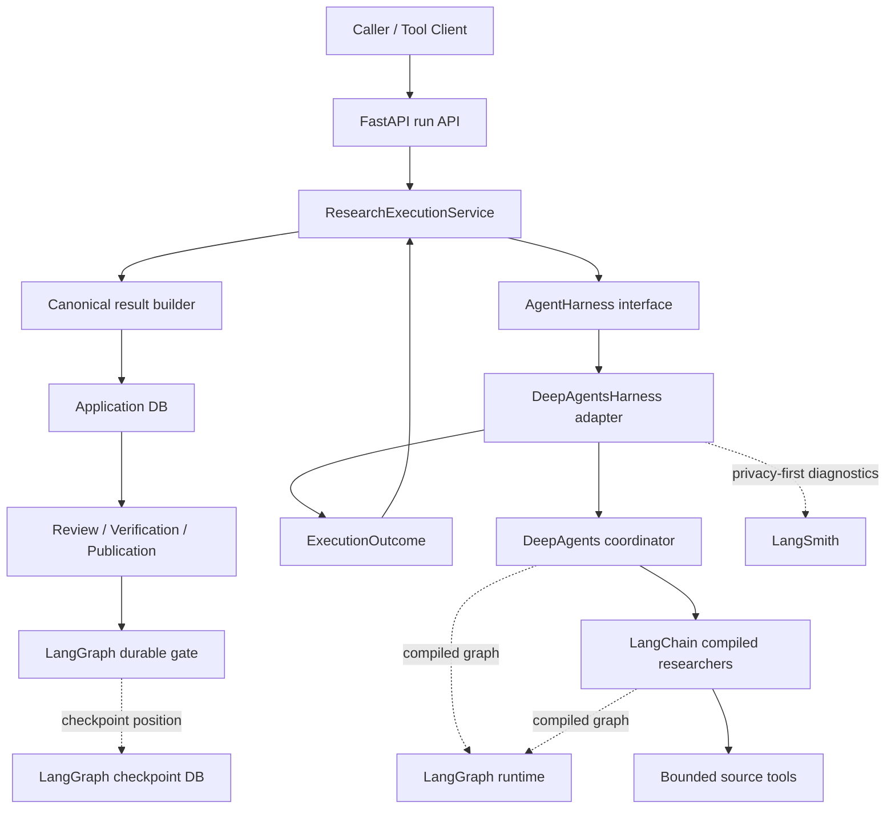
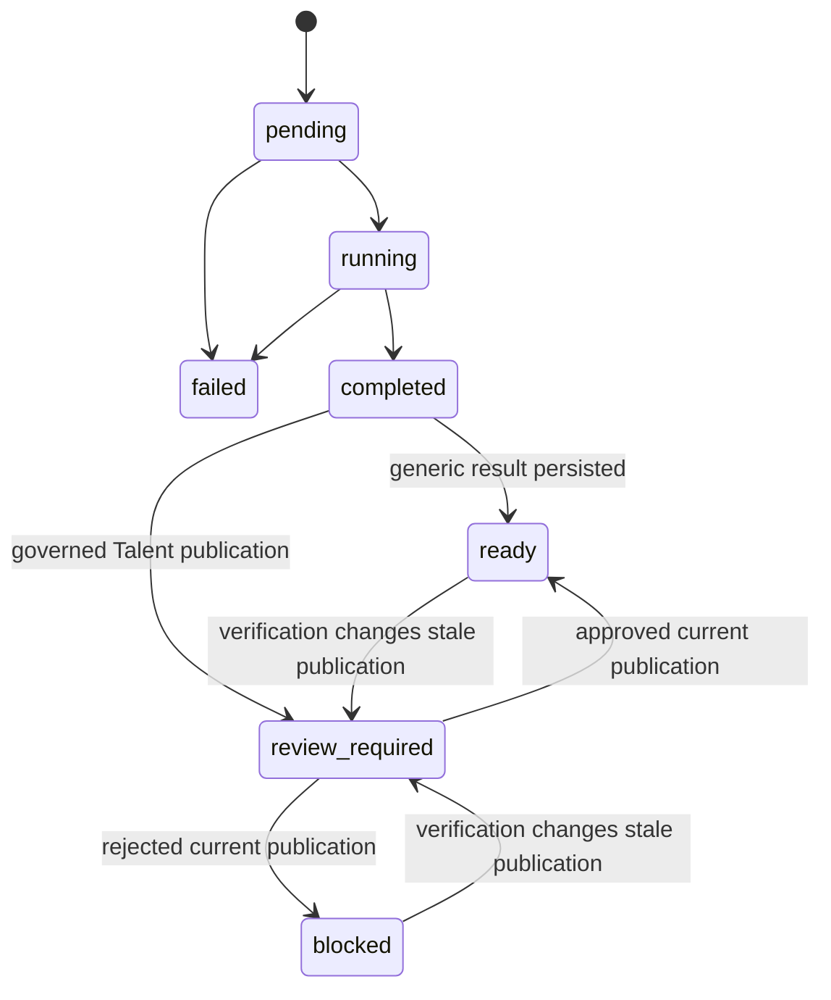

# v0.1.0 Canonical Runtime And Release Design

**Status:** Revised approved design, awaiting written-spec review

**Date:** 2026-06-25

**Release target:** `v0.1.0`

**Scope:** DeepAgents-native research harness, canonical run delivery, legacy
runtime removal, frontend retirement, technical-identifier cleanup,
documentation correction, and first release hardening.

## Summary

Decision Research Agent has already moved beyond its original task-oriented
deep-search implementation. The current authoritative product model is:

```text
ResearchRun
  -> EvidenceLedger
  -> immutable result artifacts
  -> optional durable review
  -> optional Evidence verification
  -> revisioned publication
```

The repository still carries a second execution model and several obsolete
compatibility surfaces:

- thread-scoped `/api/task` execution and task persistence;
- thread-scoped WebSocket, telemetry, token, and research-run projections;
- a Vue frontend that depends on those endpoints and is scheduled for
  replacement rather than migration;
- legacy product identifiers, environment aliases, database names, and Tool
  Client commands;
- hand-written Agent wrappers and compatibility aliases that predate current
  LangChain and DeepAgents APIs; and
- current documentation that describes the old architecture more prominently
  than the implemented run, review, verification, and publication system.

`v0.1.0` is the boundary at which these surfaces are retired. It is a
backend-and-CLI release with one canonical execution path. It does not preserve
runtime aliases for the former product identity or task model.

The release also makes the framework layering explicit:

- **LangChain** is the Agent framework and Middleware layer.
- **DeepAgents** is the complex-research harness and coordinator.
- **LangGraph** is the durable workflow runtime.
- **LangSmith** is the privacy-first tracing and evaluation plane.
- The application database remains authoritative for ResearchRun, Evidence,
  review, verification, publication, and delivery facts.

The framework adoption is deliberately bounded. The application calls an
application-owned `AgentHarness` interface. A DeepAgents adapter implements
that interface and returns an application-owned `ExecutionOutcome`; API,
repositories, Evidence, review, verification, publication, and delivery code
do not consume DeepAgents graph state.

The work is delivered through four reviewable PRs. No tag or release is
created until all four are merged and the complete release gate passes.

## Current Project Facts

### Runtime and storage

- `POST /api/runs` creates an isolated `ResearchRun` with `thread_id`,
  `run_id`, and `segment_id`.
- `research_runs_v2`, `run_segments`, and `evidence_entries_v2` are the
  canonical execution and Evidence records.
- `run_artifacts_v2` already stores immutable content and hashes.
- Talent runs already create canonical JSON and Markdown DecisionBrief
  artifacts.
- generic runs do not yet persist one canonical result artifact through the
  run transaction.
- `/api/task` still writes `tasks`, `research_runs`, and `evidence_entries`
  through `api/persistence.py` and `api/task_finalizer.py`.
- the old and new execution paths therefore have different finalization,
  timeout, concurrency, artifact, and persistence semantics.

### Agent framework

- the generic coordinator uses `deepagents.create_deep_agent`;
- the Talent researcher directly uses `langchain.agents.create_agent`;
- Talent structured output uses `ToolStrategy(ResearchPacket)`;
- malformed structured tool calls are repaired by a custom LangChain
  `after_model` Middleware;
- tools, messages, callbacks, models, and runnables use LangChain Core;
- durable review uses explicit LangGraph `StateGraph`, checkpointing,
  `interrupt`, and resume; and
- DeepAgents and LangChain agents compile to LangGraph graphs.

The current generic subagents still use custom `BaseAgent` and `AgentConfig`
wrappers, module-level singleton instances, and a `_resolve_subagent`
compatibility adapter. Current DeepAgents supports `CompiledSubAgent`, and
both LangChain `create_agent` and DeepAgents accept Middleware directly.

### First-party consumers

- the canonical Tool Client already supports `run`, `result`, review, and
  Evidence verification commands;
- it also retains task-oriented commands and legacy environment resolution;
- one first-party external integration still calls the former Tool Client,
  repository path, environment variables, and task commands; and
- the Vue frontend calls `/api/task` and `/ws/{thread_id}`.

### Release state

- the repository has no Git tags or GitHub releases;
- `VERSION` is currently `0.0.1.0`, which is not the selected release version;
- release evidence must come from a clean environment installed from
  `requirements.txt` plus `constraints.txt`;
- a developer environment that differs from the constraints file is not valid
  release evidence; and
- the pre-design baseline is `828 passed, 5 warnings`, including four expected
  legacy-environment warnings.

## Decision Basis

This design distinguishes evidence types:

- **Project fact:** the current code, schemas, tests, constraints, merged
  features, and baseline listed above.
- **Official framework fact:** current DeepAgents backend, Skills, subagent and
  profile contracts; LangChain Agent, Middleware, runtime-context and
  structured-output contracts; LangGraph persistence and durable-execution
  contracts; and LangSmith environment-controlled tracing.
- **Course and external inspiration:** planning, context engineering,
  filesystem-as-context, narrow Skills, provenance, and storage-layer
  separation. These sources suggest design patterns but do not prove current
  project capability.
- **Architecture decision:** the `AgentHarness` boundary, selected Skills,
  explicit budgets, four-PR order, and deferred features. These are approved
  engineering choices, not current implementation facts.

Primary official references:

- [DeepAgents backends](https://docs.langchain.com/oss/python/deepagents/backends)
- [DeepAgents Skills](https://docs.langchain.com/oss/python/deepagents/skills)
- [DeepAgents subagents](https://docs.langchain.com/oss/python/deepagents/subagents)
- [LangChain agents](https://docs.langchain.com/oss/python/langchain/agents)
- [LangChain Middleware](https://docs.langchain.com/oss/python/langchain/middleware)
- [LangChain runtime context](https://docs.langchain.com/oss/python/langchain/runtime)
- [LangGraph persistence](https://docs.langchain.com/oss/python/langgraph/persistence)
- [LangGraph durable execution](https://docs.langchain.com/oss/python/langgraph/durable-execution)
- [LangSmith observability](https://docs.langchain.com/langsmith/observability)

## Goals

1. Establish one public execution path based on `ResearchRun`.
2. Persist a canonical deliverable result artifact for every successful run.
3. Remove task-oriented execution, persistence, concurrency, and projection
   code.
4. Remove active references to the former product identity and aliases.
5. Retire the Vue frontend instead of preserving backend contracts for it.
6. Replace custom harness plumbing with current LangChain and DeepAgents
   contracts where the framework now provides the required primitive.
7. Use DeepAgents-native planning, run-scoped virtual filesystem, context
   management, selected Skills, and compiled subagents without transferring
   business authority to the harness.
8. Keep business authority, Evidence constraints, and durable workflow safety
   in application-owned code behind stable interfaces.
9. Publish a coherent backend-and-CLI `v0.1.0` release with current
   documentation and reproducible verification.

## Non-Goals

- Build the React frontend.
- Add persistent long-term Agent memory, Async Subagents, or LLM review.
- Add ContextSeek, OceanBase, SeekDB, AgentSeek, or AgentSeek API as runtime
  dependencies.
- Make Skills writable at runtime or allow Skills to become business authority.
- Replace the application ledger with LangGraph checkpoints or LangSmith.
- Replace the existing durable review system with generic HITL Middleware.
- Add RBAC, multi-instance workers, PostgreSQL, tenancy, or public deployment.
- Change `thread_id`, `run_id`, `segment_id`, profile IDs, benchmark IDs,
  Evidence IDs, review IDs, publication IDs, or verification semantics.
- Rewrite historical plans, archived changes, evidence records, Git history,
  or historical LangSmith traces.
- Automatically delete an operator's historical database.
- Claim production readiness or stable public API compatibility beyond the
  explicitly documented `v0.1.0` surface.

## Approaches Considered

### A. Rename only and keep task/Vue compatibility

**Rejected.** It would remove visible branding debt while preserving the
duplicated runtime, finalization, persistence, and delivery architecture that
caused the maintenance burden.

### B. Keep compatibility tombstones that reject old calls

**Rejected.** Deprecated environment resolvers, forwarding endpoints, import
shims, and error-only aliases still remain permanent active code and allow old
contracts to return.

### C. Canonical run reset before the first release

**Adopted.** Migrate known first-party consumers, complete run-scoped result
delivery, remove the old runtime and frontend, then publish the first tagged
version.

### D. Rewrite the complete Agent and durable workflow architecture

**Rejected.** ResearchRun, Evidence, review, verification, and publication
boundaries are already coherent and tested. Rewriting them would add risk
without removing the actual duplicated surfaces.

### E. Adopt an external harness, context, or database stack

**Rejected for `v0.1.0`.** AgentSeek, AgentSeek API, ContextSeek, and
`langchain-oceanbase` contain useful design ideas, but adopting them would add a
second harness, a second API/runtime contract, or a new storage authority before
the current product boundary is clean. They are references, not dependencies.

### F. Isolate a DeepAgents-native harness behind an application port

**Adopted.** Use current DeepAgents and LangChain primitives inside one adapter,
preserve an application-owned `ExecutionOutcome`, and prevent framework graph
state from leaking into domain repositories or public API contracts.

## Locked Architecture

### Framework layering



Responsibilities:

| Layer | Authority |
|---|---|
| LangChain | Agent creation, Middleware, structured output, tools, model abstraction |
| DeepAgents adapter | planning, run-scoped VFS, context management, Skills, subagent dispatch |
| LangGraph | graph execution, streaming, checkpoints, interrupt and resume |
| Application services | run lifecycle, outcome normalization, finalization and delivery policy |
| Application DB | ResearchRun, Evidence, artifact, review, verification, publication and delivery truth |
| LangSmith | privacy-first diagnostic traces and evaluation only |

LangGraph is not described as an incidental dependency. It is the durable
workflow runtime. LangChain is not omitted as a transitive implementation
detail because the project directly uses its Agent and Middleware APIs.

### Framework isolation boundary

The application depends on a narrow `AgentHarness` port, not on
`create_deep_agent` or LangGraph state dictionaries:

```text
ResearchExecutionService.execute(ExecutionRequest)
  -> AgentHarness.execute(HarnessRequest)
  -> ExecutionOutcome
```

`HarnessRequest` contains only application-approved execution inputs:

- query;
- `thread_id`, `run_id`, and `segment_id`;
- selected profile ID;
- server-owned source and aggregate policy;
- bounded upload/workspace references when the profile permits them; and
- tracing metadata that contains no private payload by default.

`ExecutionOutcome` remains application-owned and carries:

- terminal execution status or bounded failure kind;
- normalized final text or structured packet;
- frozen Evidence snapshot;
- value-free diagnostics;
- token and call usage;
- report candidates represented as virtual paths plus content, not host paths;
  and
- timestamps required by fenced finalization.

`ResearchExecutionService` creates the run accumulator before invoking the
harness. The profile compiler gives source tools a narrow application-owned
Evidence sink; tool results are normalized into that sink during execution.
The adapter freezes the sink into `ExecutionOutcome`, and only the application
finalizer writes the Evidence ledger. The sink exposes no repository methods
to the model, Skills, or DeepAgents filesystem.

Only the adapter and Agent factory modules may import DeepAgents. API routes,
repositories, result builders, Evidence services, review, verification, and
publication modules must not:

- read DeepAgents graph state directly;
- store DeepAgents message objects as business records;
- infer delivery state from a checkpoint;
- write Evidence through a Skill or VFS side effect; or
- make public contracts depend on DeepAgents internal node names.

This boundary allows a future DeepAgents upgrade or replacement without
rewriting the application ledger. It does not create a permanent dual stack:
the legacy custom harness is deleted after parity is proven.

### Agent composition

The generic coordinator remains a DeepAgent created through the adapter.

The three specialized generic researchers are compiled as LangChain agents and
registered as DeepAgents `CompiledSubAgent` values:

```text
DeepAgents coordinator
  -> CompiledSubAgent(network researcher)
  -> CompiledSubAgent(database researcher)
  -> CompiledSubAgent(knowledge-base researcher)
```

Each researcher has:

- an explicit prompt;
- an explicit tool allowlist;
- no inherited general-purpose filesystem access;
- profile-owned call budgets;
- framework Middleware assembled by one server-side policy compiler; and
- stateless per-invocation execution unless a later approved design proves a
  need for subagent checkpoint state.

The generic coordinator disables the injected general-purpose subagent. Only
the three named researchers are available through the synchronous DeepAgents
`task` dispatch contract.

Delete the custom `BaseAgent`, `AgentContext`, `AgentConfig`, module-level
subagent singleton compatibility exports, and `_resolve_subagent` adapter when
the compiled-subagent path has equivalent tests.

The Talent researcher remains a direct LangChain agent because it is a bounded
structured-output researcher, not a general-purpose DeepAgent. It retains
`ToolStrategy(ResearchPacket)`, receives declared Evidence through
application-owned preloading, and has no Skills, VFS, arbitrary memory, or
subagent dispatch.

### DeepAgents backend and virtual filesystem

The generic harness uses one `CompositeBackend`:

```text
CompositeBackend
  default -> StateBackend
  /skills/ -> read-only FilesystemBackend(virtual_mode=True)
```

`StateBackend` owns run-scoped working files, plans, intermediate notes, and
report drafts. This keeps the virtual workspace inside graph state and prevents
host filesystem paths from becoming application contracts.

The `/skills/` route exposes only the checked-in repository Skills directory.
The `FilesystemBackend` is created with `virtual_mode=True`; filesystem
permissions apply first-match-wins rules in this order:

1. deny writes to `/skills/**`;
2. allow reads from `/skills/**`;
3. allow reads and writes under `/workspace/**`;
4. deny reads and writes for `/**`.

The coordinator prompt and report builder use `/workspace/` as the only
mutable VFS root. Permissions are a defense for DeepAgents built-in filesystem
tools only; custom source tools continue to enforce their own domain policy.

The VFS replaces the custom process-wide `SharedContext` fact store. Named
researchers return bounded task results to the coordinator; the coordinator may
write working notes under `/workspace/`. Source-tool results are still captured
by the application-owned run accumulator, so removing `publish_fact` and
`query_facts` does not remove Evidence.

The built-in filesystem `write_file` contract replaces the host-writing
`generate_markdown` Agent tool. PDF conversion is removed from the Agent tool
surface for `v0.1.0`; the canonical deliverable is Markdown. A future PDF
export, if required, is a deterministic application service over a ready
artifact, not an autonomous Agent side effect.

Generic uploads are ingested before graph execution:

1. the application validates the upload identity and filename;
2. bounded parsers extract supported content without exposing a host path;
3. the adapter seeds normalized content under `/workspace/uploads/`; and
4. the Agent reads it with the built-in filesystem tools.

The host-reading `read_file_content` Agent tool is removed after equivalent
Markdown, text, PDF, Word, and spreadsheet ingest tests pass. Talent continues
to receive no uploads.

No persistent `StoreBackend` is introduced in `v0.1.0`. Cross-run memory,
user-scoped namespaces, semantic retrieval, and automatic memory evolution
require a separate authority and privacy design.

The application finalizer reads report candidates from the adapter outcome.
It never scans arbitrary host directories and never treats VFS content as
Evidence unless a bounded source tool already published the corresponding
Evidence entry through the application accumulator.

### Runtime context

Define one immutable runtime context schema for framework-facing execution:

```text
ResearchRuntimeContext
  thread_id
  run_id
  segment_id
  profile_id
  allowed_source_domains
  allowed_source_types
  allowed_aggregate_ids
```

The adapter passes this object through `context_schema`. Tools and Middleware
read it through `ToolRuntime` or the LangGraph runtime rather than module-level
lookups.

This replaces ContextVars only for framework invocation context. ContextVars
that still bridge non-framework callbacks or compatibility-free monitoring may
remain temporarily until their consumers accept explicit run identity. The
release criterion is no cross-run leakage, not a mechanical ban on
`ContextVar`.

Request payloads cannot widen runtime context. The profile compiler derives
source domains, source types, aggregates, tools, Skills, permissions, and
budgets from server-owned policy.

### Controlled Skills

`v0.1.0` introduces two checked-in, read-only DeepAgents Skills for the generic
coordinator:

```text
skills/research-planning/SKILL.md
skills/evidence-synthesis-and-reporting/SKILL.md
```

`research-planning` teaches decomposition, source-selection discipline, and
when to delegate to each named researcher.

`evidence-synthesis-and-reporting` teaches how to organize findings, expose
gaps and limitations, and write the canonical Markdown report candidate to
`/workspace/research-report.md`.

Skills may influence planning and presentation. They may not:

- create or mutate ResearchRun, Evidence, review, verification, publication, or
  delivery records;
- declare a source verified;
- override profile tools, permissions, or call budgets;
- write to their own Skill files;
- contain private Career context, credentials, local absolute paths, or
  unverified metrics; or
- become the only definition of a public contract.

Skill content is versioned with the repository and covered by tests that load
the real files through the configured backend.

### Middleware policy

Framework Middleware is preferred for provider-agnostic Agent mechanics.
Application code remains responsible for domain authority.

The generic DeepAgent explicitly relies on and compatibility-tests the
DeepAgents built-in harness stack provided by the pinned version:

- `TodoListMiddleware` for planning state;
- `FilesystemMiddleware` for VFS tools;
- `SummarizationMiddleware` for long-context compression;
- `SubAgentMiddleware` for synchronous named-researcher dispatch; and
- `PatchToolCallsMiddleware` for incomplete tool-call repair.

The adapter does not reimplement these capabilities. A dependency upgrade must
pass a compatibility test for their presence, relative ordering, exposed tools,
and profile exclusions before the constraints file changes.

Application-owned profile assembly adds:

- existing malformed structured-output recovery Middleware;
- `ModelCallLimitMiddleware` for run-level model budgets;
- `ToolCallLimitMiddleware` for coordinator delegation and bounded researcher
  tool budgets; and
- profile-owned Middleware assembly so limits cannot be widened by request
  payloads.

Initial limits are conservative release defaults and must remain configurable
only in server-owned policy:

| Agent | Model run limit | Tool run limit |
|---|---:|---:|
| generic coordinator | 40 | 40 global; `task` delegation 8 |
| network researcher | 20 | `internet_search` 12 |
| database researcher | 20 | SQL/data tools 12 global |
| knowledge-base researcher | 20 | RAG tools 12 global |
| Talent researcher | 12 | no tools exposed |

These values exceed the highest checked-in historical successful generic model
call count while creating an explicit failure boundary. They are release
defaults, not performance claims.

`recursion_limit` remains only as a final graph safety ceiling. It does not
duplicate normal model/tool budgeting.

Call-limit Middleware uses `exit_behavior="error"`. The
application maps framework limit failures to a stable
`call_budget_exceeded` failure kind and persists the terminal run through the
same fenced failure path as other execution failures.

Do not add generic retry Middleware over tools that already have bounded,
tool-specific retry and backoff. Do not add model fallback Middleware over the
existing provider compatibility wrapper until it can preserve the
`thinking × tool_choice` contract.

Defer additional `ContextEditingMiddleware`, `PIIMiddleware`, dynamic tool
selection, and generic retry/fallback Middleware until a measured problem
justifies them. Do not use generic `HumanInTheLoopMiddleware` to replace the
durable review ledger and gate.

### Long-task and durability semantics

For `v0.1.0`, "long-task research Agent" means:

- asynchronous run execution;
- bounded multi-agent delegation;
- planning and run-scoped VFS;
- automatic context summarization;
- frozen Evidence on failure, timeout, or cancellation;
- durable application-owned terminal state; and
- auditable result/review/verification/publication state.

It does not mean that an interrupted generic research graph resumes from the
exact last model or tool call after process death. The existing durable
LangGraph gate remains specific to controlled review. Main-research
kill-and-resume requires a later design covering side-effect replay,
idempotency, checkpointer ownership, and tool re-execution.

Async Subagents are deferred. In the current DeepAgents contract they target
deployed or remote graph IDs, add another operations surface, and increase
parallel model cost. Synchronous compiled researchers remain the replacement
boundary for the current custom subagents.

### External design references

The following projects are reviewed as design references only:

| Project | Borrow | Do not adopt for `v0.1.0` |
|---|---|---|
| [AgentSeek](https://github.com/ob-labs/agentseek) | harness/plugin separation, runtime tape concepts | second harness, Bub runtime, package dependency |
| [AgentSeek API](https://github.com/ob-labs/agentseek-api) | thread/run API ergonomics | overlapping server/runtime and not-production-ready surface |
| [ContextSeek](https://github.com/ob-labs/contextseek) | scope isolation, provenance, controlled memory evolution | semantic memory authority or automatic store/compact/dream |
| [langchain-oceanbase](https://github.com/oceanbase/langchain-oceanbase) | Checkpointer/Store/Vector separation | new database infrastructure without a proven requirement |

No external reference may become a transitive business authority. Future
adoption requires an ADR, a benchmark or operational requirement, migration
and rollback design, and proof that Evidence and publication authority remain
application-owned.

### LangSmith observability boundary

LangSmith tracing remains environment-controlled and privacy-first by default:

```text
LANGSMITH_HIDE_INPUTS=true
LANGSMITH_HIDE_OUTPUTS=true
```

Trace metadata may include opaque run identity, profile ID, timing, model/tool
names, bounded failure codes, and Middleware hierarchy. It must not include
query text, Evidence content, review reasons, uploaded content, credentials, or
host paths.

Tracing failure never changes execution, review, verification, publication, or
delivery state. Evaluations may read canonical artifacts and bounded run
projections, but they do not write business authority back through LangSmith.
Historical trace projects remain historical records and are not migrated.

### Canonical execution API

The public execution surface after PR2 is:

| Method | Path | Purpose |
|---|---|---|
| `POST` | `/api/runs` | create one isolated execution |
| `GET` | `/api/runs/{run_id}` | read canonical run projection |
| `GET` | `/api/runs/{run_id}/result` | resolve the current deliverable result |
| `GET` | `/api/runs/{run_id}/artifacts/{artifact_id}` | fetch one immutable artifact |
| `GET` | `/api/profiles/{profile_id}` | read server-owned profile contract |
| `GET` | `/api/telemetry/runs/{run_id}` | read run telemetry |
| `GET` | `/api/token-usage/runs/{run_id}` | read run token usage |
| `WS` | `/ws/runs/{run_id}` | receive run-scoped events |

Existing review and Evidence verification routes remain unchanged.

Remove:

- `POST /api/task`;
- `GET /api/tasks/{thread_id}`;
- `GET /api/research/runs`;
- `GET /api/research/runs/{thread_id}`;
- `GET /api/telemetry/{thread_id}`;
- `GET /api/token-usage/{thread_id}`; and
- `WS /ws/{thread_id}`.

Removed routes return normal `404`; there is no forwarding route or
compatibility error endpoint.

### Result artifact contract

Every successful run has exactly one current deliverable result selected by
application policy.

#### Generic profile

The canonical finalizer:

1. reads the exact `/workspace/research-report.md` candidate captured in
   `ExecutionOutcome`;
2. rejects empty, non-text, or UTF-8 content larger than 1 MiB;
3. if the candidate is absent or rejected, builds a bounded fallback Markdown
   artifact from
   `last_agent_text`, query, and value-free diagnostics;
4. never scans a host directory or exposes a workspace path;
5. stores the content in `run_artifacts_v2`;
6. computes a SHA-256 content hash;
7. writes artifact and terminal run state in the same fenced transaction; and
8. emits the result artifact ID in the run projection.

Artifact IDs and kinds:

| Condition | Artifact ID | Kind |
|---|---|---|
| report produced | `research-report.md` | `research_report_markdown` |
| no report produced | `research-report.md` | `research_report_fallback_markdown` |

The fallback kind is explicit. A fallback run is not silently represented as a
normal report.

#### Talent profile

The result resolver follows current publication authority:

- if no review is required, resolve the canonical DecisionBrief Markdown;
- if review or verification is required, return a stable non-deliverable error
  until the current publication is `ready`;
- if rejected or blocked, return a stable blocked error;
- if ready, resolve the current reviewed publication Markdown; and
- never select artifacts by newest timestamp or filename ordering.

#### Result endpoint

`GET /api/runs/{run_id}/result` returns JSON:

```json
{
  "run_id": "run_...",
  "execution_status": "completed",
  "delivery_status": "ready",
  "artifact": {
    "artifact_id": "research-report.md",
    "kind": "research_report_markdown",
    "media_type": "text/markdown",
    "content_hash": "sha256...",
    "content": "# Report"
  }
}
```

Non-ready states use bounded structured errors:

| State | HTTP | Code |
|---|---:|---|
| pending/running | `409` | `run_not_terminal` |
| failed | `409` | `run_failed` |
| review required | `409` | `run_review_required` |
| blocked/rejected | `409` | `run_delivery_blocked` |
| artifact missing/corrupt | `409` | `run_result_unavailable` |
| unknown run | `404` | `run_not_found` |

Errors never expose local paths, database errors, raw exceptions, checkpoint
payloads, review reasons, or credentials.

### Canonical Tool Client

Keep:

- `healthcheck`;
- `doctor`;
- `run [--wait]`;
- `result --run-id`;
- review commands; and
- Evidence verification commands.

Remove:

- `start-task`;
- `get-task`;
- `token-usage --thread-id`;
- `research-run --thread-id`;
- `research-runs`; and
- all corresponding Python functions and tests.

`result` calls the canonical result endpoint rather than returning only the run
projection. A caller that needs telemetry uses the run-scoped API.

The Tool Client reads only:

- `DECISION_RESEARCH_AGENT_URL`;
- `DECISION_RESEARCH_AGENT_API_KEY`; and
- `DECISION_RESEARCH_AGENT_TIMEOUT_SECONDS`.

There is no legacy resolver, warning deduplication, alias, or deprecated import
module.

### Persistence authority and database name

Rename the application database setting:

```text
TASKS_DB_PATH -> DECISION_RESEARCH_AGENT_DB_PATH
data/tasks.db -> data/decision_research_agent.db
```

No runtime fallback to `TASKS_DB_PATH` is retained.

All canonical repositories, review configuration, fixtures, scripts, Docker,
tests, and operations docs use the new setting.

Rename active MySQL defaults:

```text
MYSQL_DATABASE=decision_research
MYSQL_USER=decision_research
```

The password remains operator-supplied. Do not publish a product-derived
default password in release configuration.

Rename internal connection-pool labels such as `deep_search_pool`.

New installations create only canonical v2 application tables and later
authoritative tables. They do not create:

- `tasks`;
- legacy `research_runs`; or
- legacy `evidence_entries`.

Existing databases are never modified destructively during normal startup.

Provide an explicit migration/retirement command:

1. verify the source database;
2. create a byte-for-byte backup;
3. verify the canonical v2 and durable schemas;
4. export legacy tables to a separate archival SQLite file before any drop;
5. require an explicit `--drop-legacy-tables` flag before dropping;
6. verify canonical schema and foreign keys after the transaction; and
7. restore the backup on verification failure.

The release does not require dropping historical tables. Runtime cleanliness is
defined by no code path reading or writing them.

### Frontend retirement

Delete:

- `frontend/`;
- `Dockerfile.frontend`;
- `nginx.conf`;
- the Compose frontend service;
- frontend CI;
- Vue-specific documentation and screenshots; and
- frontend-only dependency/security instructions.

`v0.1.0` is explicitly a backend-and-CLI release.

The future React UI starts from the canonical run/result/review/verification
contracts. It does not inherit thread-scoped state, local output paths, or the
old Vue component model.

### Technical identity cleanup

Active runtime, configuration, tests, current docs, and deployment files use:

```text
Decision Research Agent
decision-research-agent
DECISION_RESEARCH_AGENT_*
decision_research_agent
```

Remove active occurrences of:

```text
deep-search-agent
Deep Search Agent
deep_search_agent
deep_search
DEEP_SEARCH_AGENT_*
deep_search_agent_tool
```

The exact health response becomes:

```json
{"status":"ok","service":"decision-research-agent"}
```

Historical Git, archived OpenSpec changes, historical evidence, historical
Superpowers documents, prior release notes, and historical trace project names
remain unchanged when the old identifier is part of the recorded fact.

Current index pages must not embed old filenames in visible current-product
guidance. They may link to a neutral historical directory index.

### Legacy-regression guard

Add a deterministic repository check covering active surfaces:

- `agent/`, `api/`, `tools/`, `scripts/`, `tests/`;
- root configuration and Docker files;
- `.github/`;
- current README, AGENTS, `spec/`, operations docs, and active OpenSpec;
- current examples and benchmark instructions.

The check rejects old product identifiers, old environment variables, removed
routes, task persistence imports, Vue build entrypoints, and compatibility
resolver symbols.

Historical exceptions are path-specific. Current ADR and CHANGELOG migration
records use exact expected occurrences. Do not allow broad wildcard exceptions
that could hide new runtime compatibility.

## First-Party Consumer Cutover

Consumer cutover is a hard prerequisite for removing provider compatibility.

Before PR3 removes the old runtime:

1. rotate the local API key without printing it;
2. update the first-party integration to the canonical repository, Tool
   Client, environment variables, and `run`/`result` commands;
3. update its Skill documentation and tests;
4. run focused consumer tests;
5. start the canonical backend with the matching secret;
6. verify canonical health;
7. start one bounded run;
8. poll by `run_id`;
9. retrieve the result artifact; and
10. verify logs and diffs contain no secret.

Consumer migration is private operational work. Private paths, credentials, or
job-search context never enter the public repository.

If the smoke fails, do not merge PR2 or start PR3. Fix the canonical consumer
or result contract; do not reintroduce legacy aliases.

## State Machine



Result delivery:

```text
execution_status != completed -> no result
generic + completed + artifact -> ready
Talent + current publication ready -> ready
Talent + review_required -> no delivery
Talent + blocked -> no delivery
```

## Delivery Plan

### PR1: DeepAgents-Native Harness

Purpose: replace custom harness plumbing behind a stable application boundary
without changing public API, persistence, or delivery semantics.

Key changes:

- introduce `AgentHarness`, `HarnessRequest`, and `ExecutionOutcome`;
- implement the DeepAgents adapter and route `ResearchExecutionService`
  through the port;
- compile the three researchers with LangChain `create_agent` and register
  them as DeepAgents `CompiledSubAgent` values;
- configure the run-scoped `CompositeBackend`, immutable runtime context,
  permissions, built-in DeepAgents Middleware, and profile call budgets;
- add the two read-only generic Skills;
- disable the injected general-purpose subagent;
- replace `SharedContext`, host report writes, and the upload-reading Agent tool
  with VFS task results, built-in filesystem tools, and bounded upload ingest;
- keep Talent on its direct bounded LangChain path;
- prove output, Evidence, timeout, cancellation, telemetry, and tool-boundary
  parity; and
- delete custom subagent wrappers and singleton compatibility exports after
  parity passes.

PR1 must not change the public API or application database schema. The old
task runtime remains temporarily available, but both canonical and legacy
callers use the same application-owned execution outcome boundary.

During PR1 and PR2 only, the legacy task finalizer may materialize its existing
task output from the normalized report content in `ExecutionOutcome`. It may
not restore host workspace access to the Agent. This transition ends when PR3
deletes the legacy finalizer and task persistence.

### PR2: Canonical Run Delivery And Consumer Cutover

Purpose: make the canonical run path complete and prove first-party consumers
before deleting the old path.

Key changes:

- generic run result artifact and result resolver;
- `GET /api/runs/{run_id}/result`;
- canonical Tool Client `run` and `result`;
- atomic artifact and terminal-state finalization;
- first-party consumer migration, key rotation, focused tests, and bounded
  smoke completed before PR readiness; and
- current API, Tool Client, and integration documentation updated with the
  canonical result contract.

PR2 does not remove old endpoints, legacy aliases, or Vue. It continues to use
the existing application-database setting so it does not create split-brain
storage while the old runtime remains present.

### PR3: Legacy Runtime And Frontend Removal

Purpose: remove all duplicated runtime and active old identity surfaces after
the canonical replacement and consumer smoke are proven.

Key changes:

- remove task/thread-scoped endpoints;
- remove old task persistence and finalization;
- remove process-local thread guard;
- remove old Tool Client commands and import shim;
- remove old environment resolution;
- atomically rename the application-database setting and default filename
  across all repositories, scripts, Docker configuration, tests, and
  operations docs;
- rename health, database, MySQL, script, and active documentation identifiers;
- remove Vue, frontend Docker/Nginx/Compose/CI;
- add the legacy-regression guard;
- provide explicit database archive/drop tooling; and
- update active contracts and ADRs.

PR3 must not add a compatibility tombstone or retain a hidden legacy feature
flag.

### PR4: Release Hardening And Documentation

Purpose: prove the clean architecture and publishable repository state.

Key changes:

- install from constraints in a clean Python environment;
- record actual package versions used for verification;
- audit and remove dependencies only when imports, tests, and build evidence
  prove they are unused;
- update README, architecture, state machine, data model, Tool Client guide,
  operations docs, PRD, OpenSpec config, and docs index;
- document the LangChain/DeepAgents/LangGraph/LangSmith layering and the
  `AgentHarness` isolation boundary;
- update `VERSION` to `0.1.0`;
- rewrite `CHANGELOG` Unreleased as the `v0.1.0` release entry;
- update security and installation instructions;
- refresh public metrics from actual commands;
- run documentation drift and legacy scans; and
- produce release notes and migration instructions.

PR4 contains no React implementation.

## File-Level Change Boundary

### Expected deletion candidates

```text
agent/runtime_env.py
agent/shared_context.py
agent/sub_agents/base.py
agent/sub_agents/database_query_agent.py
agent/sub_agents/knowledge_base_agent.py
agent/sub_agents/network_search_agent.py
api/persistence.py
api/task_finalizer.py
tools/markdown_tools.py
tools/pdf_tools.py
tools/shared_context_tools.py
tools/upload_file_read_tool.py
tools/deep_search_agent_tool.py
tests/unit/test_runtime_env.py
tests/unit/test_deep_search_agent_tool.py
tests/unit/test_agent_context.py
tests/unit/test_database_query_agent.py
tests/unit/test_knowledge_base_agent.py
tests/unit/test_network_search_agent.py
tests/unit/test_persistence.py
tests/unit/test_shared_context.py
tests/unit/test_shared_context_integration.py
tests/unit/test_sub_agent_shared_context.py
tests/unit/test_task_finalizer.py
tests/integration/test_agent_delegation.py
tests/integration/test_report_generation.py
tests/integration/test_task_finalization_flow.py
tests/integration/test_research_api.py
frontend/
Dockerfile.frontend
nginx.conf
```

Additional old-path tests are deleted or rewritten according to whether they
test a removed contract or a still-authoritative run contract.

### Expected new or extracted modules

| File | Required responsibility |
|---|---|
| `agent/harness_contracts.py` | define application-owned `AgentHarness`, request and outcome contracts with no DeepAgents imports |
| `agent/deepagents_harness.py` | implement the only DeepAgents adapter and normalize framework output |
| `agent/runtime_context.py` | define immutable `ResearchRuntimeContext` for `context_schema` and `ToolRuntime` |
| `agent/profile_middleware.py` | construct profile-owned framework Middleware, with no API imports |
| `agent/research_agents.py` | compile LangChain researchers and DeepAgents `CompiledSubAgent` registrations |
| `api/research_execution_service.py` | own run execution orchestration through `AgentHarness` |
| `api/upload_ingest.py` | validate and extract approved uploads into bounded VFS seed content |
| `api/database.py` | resolve the single canonical application database path |
| `api/run_result_service.py` | build generic artifacts and resolve deliverable results without HTTP concerns |
| `scripts/retire_legacy_database.py` | verify, back up, export, optionally drop, and restore legacy database tables |
| `scripts/check_canonical_identity.py` | enforce active-surface identifier and removed-contract rules in CI |

### Expected checked-in Skills

```text
skills/research-planning/SKILL.md
skills/evidence-synthesis-and-reporting/SKILL.md
```

These files are public product instructions, not private career prompts. They
are loaded read-only by the generic DeepAgents harness and are absent from the
Talent profile.

### Expected current-document updates

```text
README.md
README_CN.md
AGENTS.md
CHANGELOG.md
VERSION
.env.example
docker-compose.yml
docs/README.md
docs/AGENT_INTEGRATION.md
docs/observability.md
docs/prd.md
docs/decisions/product-naming.md
docs/operations/*
spec/README.md
spec/api-contract.md
spec/architecture.md
spec/data-models.md
spec/state-machine.md
openspec/config.yaml
active openspec change documents
```

Historical documents are not bulk rewritten.

## Migration And Rollback

### Configuration migration

Operators must set canonical variables before upgrading. The release does not
read old aliases.

At minimum:

```dotenv
DECISION_RESEARCH_AGENT_URL=http://127.0.0.1:8000
DECISION_RESEARCH_AGENT_API_KEY=...
DECISION_RESEARCH_AGENT_TIMEOUT_SECONDS=10
DECISION_RESEARCH_AGENT_DB_PATH=/app/data/decision_research_agent.db
```

### Database migration

- copy the existing application database to the canonical path before startup;
- run the explicit verifier/migration command;
- do not point old and new service versions at the same writable database
  concurrently;
- keep the pre-upgrade backup through the rollback window; and
- do not drop legacy tables unless the operator explicitly requests it.

### Rollback

Rollback to pre-`v0.1.0` code requires:

- restoring the old code;
- restoring the old environment variable names;
- restoring the pre-upgrade database path or backup;
- restoring the old first-party consumer configuration; and
- not reusing post-upgrade writes with old code unless schema verification
  proves compatibility.

This is a breaking release. Rollback is an operator procedure, not runtime
dual-write or alias behavior.

## Test Matrix

### Framework and Agent composition

| Test | Required result |
|---|---|
| application service uses `AgentHarness` port | no DeepAgents import outside adapter/factory modules |
| adapter returns `ExecutionOutcome` | application-owned schema, no leaked graph state |
| coordinator compiles through DeepAgents | pass |
| researchers compile through LangChain `create_agent` | pass |
| researchers are registered as `CompiledSubAgent` | pass |
| injected general-purpose subagent | disabled |
| `CompositeBackend` routes | `StateBackend` default and read-only virtual `/skills/` route |
| VFS isolation | concurrent runs cannot read or overwrite each other's files |
| VFS report creation | built-in filesystem tools create the report candidate without host writes |
| Skill loading | both generic Skills load from real checked-in files |
| Skill immutability | writes to `/skills/**` fail closed |
| upload ingest | supported files seed bounded `/workspace/uploads/` content |
| upload path privacy | Agent messages, outcome and telemetry contain no host path |
| unsupported or malformed upload | bounded failure, no partial VFS seed |
| Talent Skill/VFS boundary | no Skills, filesystem tools, memory or subagent dispatch |
| runtime context | correct identity/policy through `context_schema` and `ToolRuntime` |
| runtime context concurrency | no cross-run policy or identity leakage |
| built-in DeepAgents Middleware | expected presence, order and exposed tools for pinned version |
| profile tools and filesystem boundaries | exact server-owned allowlist and catch-all deny behavior |
| profile call limits | exact contract assertions with server-owned values |
| model limit exceeded | bounded failure outcome, later runs unaffected |
| tool limit exceeded | bounded failure outcome, no silent continuation |
| structured-output recovery | existing RED/GREEN behavior retained |
| retries | no duplicate generic and tool-specific retry layers |
| custom subagent wrappers | absent after parity tests pass |
| custom `SharedContext` | absent; task outputs and VFS cover working context |
| Evidence authority | no Skill, VFS or checkpoint writes Evidence directly |
| LangSmith disabled | execution and business persistence remain correct |
| LangSmith privacy defaults | inputs and outputs hidden |
| trace metadata | no query, Evidence, review reason, upload content, secret or host path |

### Canonical run delivery

| Test | Required result |
|---|---|
| generic report produced | immutable `research-report.md` artifact |
| generic report absent | explicit fallback artifact kind |
| stale pre-run workspace file | never selected |
| timeout/cancellation | frozen Evidence preserved, no ready result |
| run finalization race | one fenced terminal writer |
| result endpoint before terminal | `run_not_terminal` |
| failed run result | `run_failed` |
| Talent review required | `run_review_required` |
| Talent blocked | `run_delivery_blocked` |
| ready Talent publication | current reviewed Markdown only |
| artifact corruption/missing row | `run_result_unavailable` |
| restart | result remains queryable from application DB |
| path privacy | no absolute path in run/result projection |

### Legacy removal

| Test | Required result |
|---|---|
| removed task routes | `404` |
| removed thread WebSocket | rejected as nonexistent route |
| old Tool Client file | absent |
| old env only | old value is never read; canonical default or required-setting failure applies |
| old DB env only | startup/readiness fails with bounded fix guidance |
| old task tables | never read or written by new runtime |
| repository scan | no forbidden active identifiers |
| Vue/frontend | absent from source, Compose, CI and docs |

### Consumer cutover

| Test | Required result |
|---|---|
| consumer unit tests | canonical repo/tool/env/commands only |
| health smoke | canonical service ID |
| bounded run smoke | terminal run ID |
| result smoke | artifact content retrieved |
| secret scan | no key in stdout, stderr, logs, diff or committed files |

### Durable and verification regression

| Test | Required result |
|---|---|
| full backend suite | pass |
| durable HITL gate | `13/13 PASS` |
| durable Docker compatibility | pass |
| Evidence verification Docker canary | pass |
| real-source proof checker | valid |
| migration backup/restore | pass |
| kill/restart recovery | pass |
| current publication selection | unchanged |

### Release verification

| Test | Required result |
|---|---|
| clean constraints install | pass |
| installed version report | matches constraints |
| `python -m pytest -q` | pass |
| `git diff --check` | pass |
| Docker backend build | pass |
| backend health | canonical payload |
| Tool Client doctor | pass or documented disabled checks |
| dependency audit | no unsupported deletion |
| documentation link check | pass |
| legacy scan | pass |
| GitHub CI and CodeQL | pass |

No frontend build is required because the frontend is intentionally removed.

## Release Acceptance Criteria

`v0.1.0` may be tagged only when all conditions hold:

1. application orchestration depends on `AgentHarness`, and DeepAgents imports
   are confined to adapter/factory modules.
2. the generic harness uses the approved DeepAgents VFS, built-in Middleware,
   named compiled researchers, immutable runtime context, and two read-only
   Skills.
3. custom `SharedContext`, host-writing report tools, and the host-reading
   upload Agent tool are absent from the active harness.
4. Talent remains bounded with no Skills, filesystem, memory, or subagents.
5. framework output is normalized to application-owned `ExecutionOutcome`
   before persistence or delivery decisions.
6. `POST /api/runs` is the only execution creation endpoint.
7. every successful run has one resolvable canonical result artifact.
8. generic and Talent delivery behavior is explicitly tested.
9. task persistence and task finalization code are absent.
10. thread-scoped execution, telemetry, token, research, and WebSocket routes
   are absent.
11. the Vue frontend and its build/deployment pipeline are absent.
12. active runtime and current docs contain no unapproved former identity.
13. canonical Tool Client and first-party consumer smoke pass.
14. LangChain, DeepAgents, LangGraph, and LangSmith responsibilities are
    accurately documented.
15. framework Middleware owns generic call budgets without duplicate manual
    counters.
16. application-owned Evidence, review, verification, publication, and
    delivery authority remains unchanged.
17. existing historical data is protected by backup and explicit migration.
18. clean constraints installation and the full test matrix pass.
19. `VERSION` and release notes identify `0.1.0`.
20. the user separately authorizes push, merge, tag, and GitHub Release.

## Documentation And Career Boundary

Repository documentation is public and product-focused. It explains verified
capabilities, architecture, operation, migration, and limitations.

Private career materials are updated only after the release is complete and
must use actual merged behavior and verification evidence. They should reflect
the implemented ecosystem layering:

```text
LangChain = Agent Framework
DeepAgents = research harness
LangGraph = durable workflow runtime
```

This layering is an architectural fact, not keyword insertion. Resume and
interview materials must still explain why application-owned ledgers remain
authoritative.

## Final Decision

Proceed with the four-PR canonical runtime reset and publish no release until
the final release gate passes.

The design explicitly refuses compatibility code for the former product
identity, task runtime, or Vue frontend. Historical records are preserved as
history, not kept alive as active runtime branches. The DeepAgents-native
harness is adopted behind an application boundary so framework upgrades do not
rewrite the Evidence-governed business architecture.
