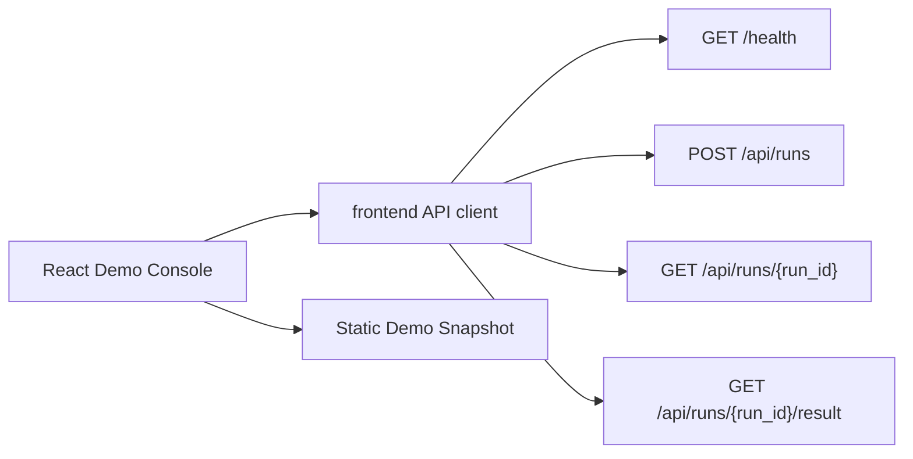

# React Demo Console Live Flow Design

## Goal

Add a bounded Live Demo Mode to the React demo console so an interview operator can prove the UI consumes the real Decision Research Agent backend contract without turning the UI into a new runtime or business authority.

## Scope

The console keeps Static Demo Mode as the default fallback and adds a controlled live path:

- Probe `GET /health`.
- Start a generic run through `POST /api/runs`.
- Poll `GET /api/runs/{run_id}` until terminal state or a client deadline.
- Fetch `GET /api/runs/{run_id}/result`.
- Render the observed service state beside the existing lifecycle, evidence, review, verification, and canonical result panels.

## Non-Goals

- No chat input, message bubbles, or conversational UI.
- No run cancellation, interrupt, edit-in-place, or multi-turn task control.
- No login, RBAC, multi-tenant model, public online execution, PDF export, or deployment change.
- No backend schema, API, database, runtime, review, verification, LangGraph, DeepAgents, or LangSmith changes.
- No new package dependency unless the existing React/Vite stack cannot test the behavior.

## User Experience

The console exposes a small mode switch:

- `Static Demo`: deterministic bundled snapshot, works with no backend.
- `Live Backend`: user can configure a base URL, verify health, start a bounded demo run, and retrieve the canonical result.

The UI language remains Chinese by default with the existing English toggle. Live mode must explain failures with bounded operator guidance, not raw stack traces.

## Architecture



The frontend API client owns browser fetch details, timeout-free bounded parsing, and public error normalization. React components own presentation and state transitions. The application database and backend APIs remain the business authority.

React implementation follows the current official `useEffect` cleanup pattern for async requests: stale async responses must be ignored when the selected backend URL or mode changes.

## Data Contract

The frontend accepts only the fields it renders:

- Health: `status`, `service`.
- Run creation: `status`, `thread_id`, `run_id`, `segment_id`.
- Run projection: terminal status fields when present, plus safe pass-through display for unknown bounded fields.
- Result: canonical payload returned by `/api/runs/{run_id}/result`, rendered as JSON plus Markdown/content preview when available.

Unexpected response shapes are displayed as `invalid_response` and do not crash the console.

## Error Handling

Errors are normalized to:

```ts
{
  code: string;
  problem: string;
  fix: string;
  retryable: boolean;
}
```

The UI must not display local file paths, raw tracebacks, API keys, or full exception objects.

## Testing

Use frontend unit tests with mocked `fetch`:

- Static mode remains available and remains the safe default.
- Health success transitions the console to backend available.
- Health failure displays bounded recovery guidance.
- `start -> poll -> result` renders the returned `run_id` and canonical result.
- Poll timeout returns a bounded operator message and preserves the safe `run_id`.
- Stale async responses cannot overwrite the currently selected backend state.

Run:

```bash
cd frontend
npm run test
npm run lint
npm run build
```

Also run `python -m pytest tests/unit/test_frontend_retirement.py -q` to keep old frontend coupling retired.
