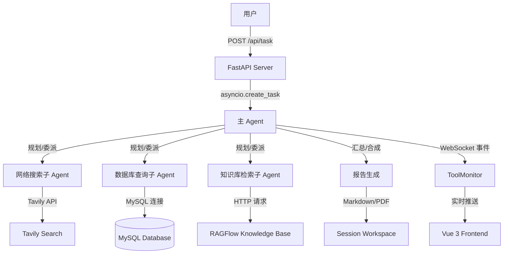

# 架构文档：Deep Search Agent

## 系统概览

Deep Search Agent 采用 **星型协调架构（Star Coordinator）**：主 Agent 接收用户任务，自主规划后委派给三个数据源子 Agent，汇总结果并生成报告。

## 架构图



## 模块职责

### 主 Agent（`agent/main_agent.py`）

- 接收用户自然语言查询
- 使用 LangGraph 进行任务规划和子 Agent 委派
- 汇总子 Agent 返回结果，合成最终报告
- 通过 `task` 工具调用子 Agent

### 子 Agent（`agent/sub_agents/`）

| 子 Agent | 数据源 | 文件 |
|----------|--------|------|
| Network Search | Tavily Search API | `sub_agents/network_search_agent.py` |
| Database Query | MySQL | `sub_agents/database_query_agent.py` |
| Knowledge Base | RAGFlow | `sub_agents/knowledge_base_agent.py` |

### 工具层（`tools/`）

| 工具 | 用途 | 文件 |
|------|------|------|
| Tavily 搜索 | 网络搜索结果 | `tools/tavily_tools.py` |
| MySQL 操作 | 数据库查询 | `tools/mysql_tools.py` |
| RAGFlow 检索 | 企业知识库检索 | `tools/ragflow_tools.py` |
| Markdown 转换 | 报告转 Markdown | `tools/markdown_tools.py` |
| PDF 生成 | 生成 PDF 报告 | `tools/pdf_tools.py` |
| 文件读写 | 会话工作空间文件操作 | `tools/file_read_tools.py` |

### API 层（`api/`）

| 组件 | 职责 | 文件 |
|------|------|------|
| FastAPI Server | REST + WebSocket 端点 | `api/server.py` |
| ContextVar 会话隔离 | 多请求并发工作目录隔离 | `api/context.py` |
| ToolMonitor | 工具调用事件推送（WebSocket） | `api/monitor.py` |

## 数据流

1. 用户提交查询 → `POST /api/task`
2. Server 创建 session 工作目录，设置 `ContextVar`
3. `asyncio.create_task(run_deep_agent())` 启动异步任务
4. 主 Agent 调用 `main_agent.astream()` 进入 LangGraph 图
5. 主 Agent 分解任务 → 通过 `task` 工具委派子 Agent
6. 子 Agent 执行 → 调用对应工具 → 结果返回主 Agent
7. 流式事件通过 `monitor.report_*()` 推送到 WebSocket
8. 主 Agent 汇总结果 → 生成 Markdown/PDF 到 session workspace
9. 前端通过 WebSocket 接收实时事件，通过 REST 获取文件

## 关键设计模式

### ContextVar 会话隔离

使用 `ContextVar` 隔离每个请求的工作目录，防止并发请求间的数据污染。所有文件读写工具通过 `get_current_session_workspace()` 获取当前工作目录。

### 单例 ToolMonitor

全局 `monitor` 单例提供 `report_start()` / `report_running()` / `report_end()` 方法，工具调用时自动上报进度。

### YAML 提示词配置

Agent 系统提示词存放在 `prompt/prompts.yml`，由 `agent/prompts.py` 加载。不在代码中硬编码提示词。

## 部署拓扑

```
┌─────────────┐     ┌─────────────┐     ┌─────────────┐
│   Frontend  │────>│   Backend   │────>│   MySQL     │
│  Vue 3 SPA  │<────│  FastAPI    │<────│  Database   │
└─────────────┘     └──────┬──────┘     └─────────────┘
                           │
                     ┌─────┴─────┐     ┌─────────────┐
                     │  External │────>│   Tavily    │
                     │  Services │────>│   RAGFlow   │
                     │           │────>│  DeepSeek   │
                     └───────────┘     └─────────────┘
```

## 变更记录

| 日期 | 变更 |
|------|------|
| 2026-05-19 | 初始架构文档 |
