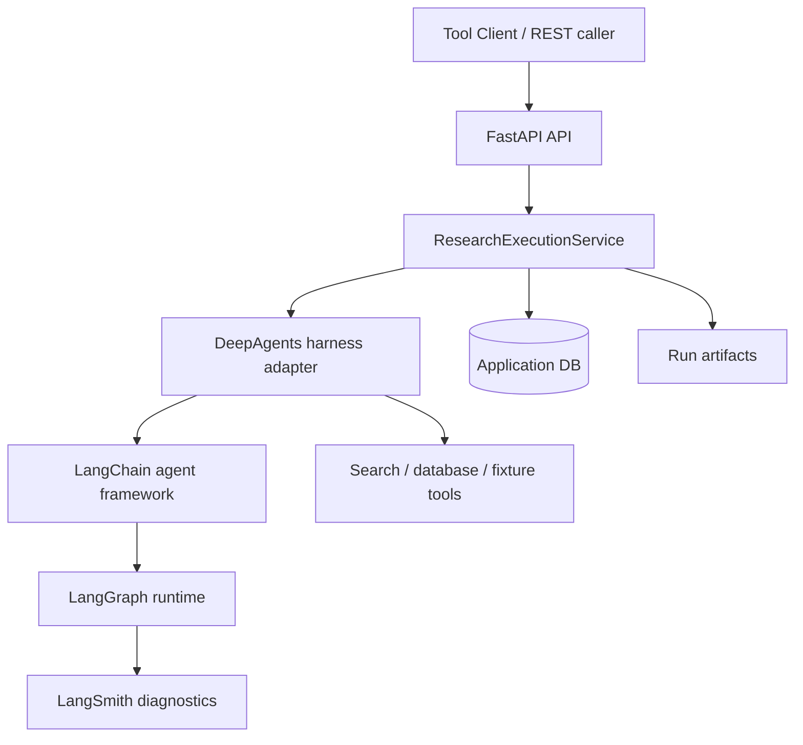

# Architecture: Decision Research Agent

Decision Research Agent is a backend research service with a canonical
run-scoped API, DeepAgents-native execution harness, service-owned persistence,
and deterministic delivery contracts.

## Runtime Layers

## Ownership Boundaries

| Layer | Owns |
|---|---|
| DeepAgents harness | Agent execution, tool filtering, middleware, skills loading, runtime context injection |
| LangChain | Agent framework, model/tool binding, structured output integration |
| LangGraph | Workflow runtime, recursion limits, checkpoint-compatible execution |
| Service layer | ResearchRun, EvidenceLedger, review state, verification decisions, publication state, canonical result delivery |
| LangSmith | Trace and diagnostics only |

LangSmith and LangGraph checkpoints are not business ledgers. Service-owned
tables remain the source of truth for delivery, review, evidence verification,
and publication decisions.

## Data Flow

1. Caller starts a run with `POST /api/runs`.
2. API creates `run_id` and initial run/segment records.
3. `ResearchExecutionService` executes the profile through the DeepAgents
   harness adapter.
4. Tools and agent output are captured into evidence and run outcome snapshots.
5. The service finalizes the run through a fenced terminal transaction.
6. Generic runs persist a canonical report artifact; Talent runs persist
   structured packets, review bundles, publications, and decision briefs.
7. Callers retrieve bounded delivery through `GET /api/runs/{run_id}/result`.

## Deployment Boundary

The repository currently ships a backend service, CLI Tool Client, tests,
operator scripts, and documentation. It does not ship a frontend. Future UI
work should consume the same canonical API and WebSocket contracts rather than
reintroducing a parallel runtime.

Controlled durable review and evidence verification are supported only within
the documented single-node SQLite boundary unless a later architecture decision
expands the deployment model.
