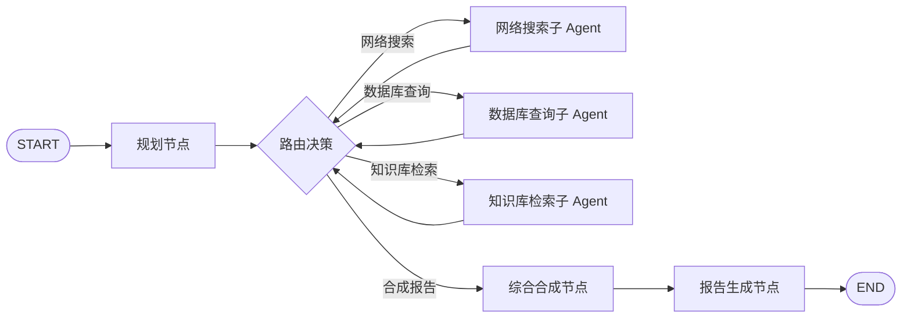

# Agent 状态机文档

## LangGraph 图结构

Decision Research Agent 使用 **星型协调图（Star Coordinator Graph）**。



## 节点定义

### 规划节点（Planner）

- **输入**: 用户自然语言查询
- **输出**: 任务分解计划（子任务列表 + 每个任务的执行策略）
- **LLM**: DeepSeek V4 Pro（fallback: DeepSeek V4 Flash）
- **决策内容**: 需要哪些数据源？子任务之间的依赖关系？

### 路由决策节点（Router）

- **输入**: 当前待执行的子任务
- **输出**: 选择哪个子 Agent 执行
- **决策内容**: 该子任务需要网络搜索、数据库查询还是知识库检索？

### 子 Agent 节点

每个子 Agent 是独立的 LangGraph 子图：

| 节点 | 内部状态 |
|------|----------|
| 网络搜索子 Agent | 查询构建 → Tavily 调用 → 结果过滤 → 返回 |
| 数据库查询子 Agent | SQL 生成 → 执行查询 → 结果格式化 → 返回 |
| 知识库检索子 Agent | 查询编码 → RAGFlow 调用 → 结果排序 → 返回 |

### 综合合成节点（Synthesizer）

- **输入**: 所有子 Agent 的返回结果
- **输出**: 结构化报告数据
- **决策内容**: 去重、冲突解决、信息优先级排序

### 报告生成节点（ReportGen）

- **输入**: 结构化报告数据
- **输出**: Markdown + PDF 文件写入 workspace
- **步骤**: 生成 Markdown → 转换为 PDF → 写入 workspace

## SharedContext 字段

Agent 间共享的事实层（Phase 3 引入）：

**模块位置**: `agent/shared_context.py`（SharedContext 类），工具封装在 `tools/shared_context_tools.py`
**初始化**: `agent/main_agent.py:38` 创建模块级单例 `shared_context`
**清理**: 任务结束时 `finally` 块调用 `shared_context.clear_facts(thread_id)`

| 字段 | 类型 | 说明 |
|------|------|------|
| `task_query` | string | 用户原始查询 |
| `research_results` | array | 所有子 Agent 的研究结果 |
| `task_plan` | object | 任务分解计划 |
| `current_phase` | string | 当前执行阶段标识 |
| `findings` | object | 已发现的事实汇总 |

## 状态流转

1. `planning` → 规划节点执行，输出任务计划
2. `routing` → 路由节点选择下一个子 Agent
3. `executing` → 子 Agent 执行，结果写入 SharedContext
4. `synthesizing` → 综合所有结果，生成报告结构
5. `generating` → 生成 Markdown/PDF 文件
6. `complete` → 任务结束

## Canonical Run Delivery 状态

v0.1.0 的 canonical path 以 `run_id` 为执行身份。Legacy task/thread
状态机暂时保留到后续 removal 阶段，但第一方 run/result consumer 使用以下
application-owned 状态：

```text
pending -> running -> completed
pending -> running -> failed

completed + generic artifact persisted -> delivery ready
completed + Talent review required -> delivery review_required
review approve/resolution -> delivery ready
review reject/resolution -> delivery blocked
failed/timeout/cancelled -> delivery failed
```

Generic completed run 在 fenced terminal transaction 内持久化
`research-report.md`。`GET /api/runs/{run_id}/result` 只在
`execution_status=completed` 且 `delivery_status=ready` 时返回 artifact；
非终态、失败、review required、blocked 或 artifact 缺失均返回稳定 409/404
错误码。

## 异常路径

| 异常 | 处理方式 |
|------|----------|
| 子 Agent 返回空结果 | 记录为"无数据"，继续其他子任务 |
| 子 Agent 超时/失败 | 错误记录到 SharedContext，标记失败，继续 |
| LLM 调用失败 | 重试 3 次后返回错误信息 |
| 所有子 Agent 失败 | 生成包含错误说明的报告 |

## 变更记录

| 日期 | 变更 |
|------|------|
| 2026-05-19 | 初始状态机文档 |
